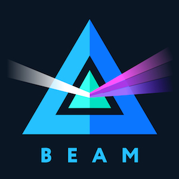

.. _root:

Welcome to Beam documentation!
==============================

.. _rules_signature:

.. note:: Beam is currently in Mainnet.

	Rules Signature: ed91a717313c6eb0

	Download binaries from: `Beam Downloads Page <https://beam.mw/downloads>`_

	Source code: `Beam Github <https://github.com/BeamMW/beam>`_

Current release
===============

**Bright Boson 2.0.4739**

This is the first maintenance Mainnet release for Bright Boson.

**Features:**

[desktop wallet, node] Аfter being offline node sync will be lightning-fast, for both standalone node and integrated into the desktop wallet, see technical documentation. `#454 <https://github.com/BeamMW/beam/issues/454>`_

[desktop wallet, cli wallet] For desktop wallet, upon successful transaction completion a sender will receive a proof, signed by the receiver, for cli wallet, the proof will be generated once а handshake between the wallets has been accomplished, see user manual and technical documentation. `#415 <https://github.com/BeamMW/beam/issues/415>`_

**Improvements:**

[desktop wallet] When sending beams, the Sender’s wallet will wait longer for Receiver to come online, namely 12 hours instead of 2. `#473 <https://github.com/BeamMW/beam/issues/473>`_

[desktop wallet] No more security warnings. The apps are signed now on both Mac and Windows. `#37 <https://github.com/BeamMW/beam/issues/37>`_

[cli wallet] Transaction history will display Kernel ID from now on. `#418 <https://github.com/BeamMW/beam/issues/418>`_

[wallet] Wallet application and Wallet API became much more responsive due to reworked request service architecture. `#407 <https://github.com/BeamMW/beam/issues/407>`_     

**Fixes:**

[desktop wallet] Deleted transaction re-appears with “receiving” status. `#554 <https://github.com/BeamMW/beam/issues/554>`_     

[cli wallet] Fixed incorrect amounts in transaction history for certain locales. `#480 <https://github.com/BeamMW/beam/issues/480>`_

[cli wallet, node] Fixed inconsistent params names. `#249 <https://github.com/BeamMW/beam/issues/249>`_

[desktop wallet] Fixed crash, happened in rare cases when wallet was switched from remote to local node and restarted. `#573 <https://github.com/BeamMW/beam/issues/573>`_
                  
**Misc**

The work on Atomic Swap is well in the process.

**TL;DR**

:ref:`I want to Mine Beam<mining_beam>`

:ref:`I want to learn how to use Beam Desktop Wallet<desktop_wallet_guide>`

:ref:`I want to learn how to use Beam Command Line Wallet<command_line_wallet_user_guide>`

What is Beam?
--------------

`Beam <https://beam.mw/>`_ is a next generation scalable, confidential cryptocurrency based on an elegant and innovative `Mimblewimble protocol <https://scalingbitcoin.org/papers/mimblewimble.txt>`_.

Things that make BEAM special include:

* Users have complete control over privacy - a user decides which information will be available and to which parties, having complete control over his personal data in accordance to his will and applicable laws.

* Confidentiality without penalty - in BEAM confidential transactions do not cause bloating of the blockchain, avoiding excessive computational overhead or penalty on performance or scalability while completely concealing the transaction value.

* No trusted setup required.

* Blocks are mined using Equihash Proof-of-Work algorithm.

* Limited emission using periodic halving.

* No addresses are stored in the blockchain - no information whatsoever about either the sender or the receiver of a transaction is stored in the blockchain.

* Superior scalability through compact blockchain size using the “cut-through” feature of Mimblewimble.

* No premine. No ICO. Backed by a treasury, emitted from every block during the first five years.

* Implemented from scratch in C++.

.. _start:

Getting Started
---------------

The simplest way to get started with Beam is by visiting the `Beam website <https://beam.mw>`_, reading and understanding the materials posted there and joining `Beam Community <https://t.me/BeamPrivacy>`_ on Telegram for updates and discussions.

.. danger:: Beam is extremely new and experimental technology. No guarantees can be provided by anyone whatsoever. Use it at your own risk. Make sure you know what you are doing, especially if there is money involved.

Just like any other cryptocurrency, using Beam requires learning and understanding what this all is about. If real money is involved, it also requires concern with security of the process.

.. hint:: That said, you can always safely play with Beam by connecting to the permanent Testnet.

To lean more about how cryptocurrencies work in general and Beam in particular please visit our :ref:`Resources` page

Once you familiarized yourself with key ideas and concepts, it is recommended to start from connecting to our Testnet. The simplest way to do that is by downloading and installing our Desktop Wallet and following instructions in :ref:`desktop_wallet_guide`.

Important differences from other cryptocurrencies
-------------------------------------------------

Mimblewimble has several important differences from most other existing cryptocurrencies which are very important to understand. Please review the following information carefully.

**The concept of Address is completely different**

In most cryptocurrencies Address is a hashed public key for which the owner of that Address knows the corresponding private key. In order to transfer funds, the Sender should only know the Address of the Receiver in order to create a unilateral transaction. *The Sender is not aware of whether the Receiver is online or not or whether it even exists*. Once transaction to an Address is complete and added to the blockchain, Receiver that can prove knowledge of the private key corresponding the Address can control this UTXO (short for Unspent Transaction Output).

In Mimblewimble there are no addresses at all and transaction are created **interactively** by both Sender and Receiver wallets. This means that in order to create a transaction, both wallets have to participate in the creation process and eventually co-sign the transaction before it is sent to the blockchain. 

.. attention:: In Beam it is not possible to create a transaction unilaterally. Both Sender and Receiver have participate in transaction creation.

To allow Sender and Receiver wallets to create transactions without having to be online at the same time and directly connected to each other, Beam added a module called :ref:`SBBS<sbbs>` that allows wallets to securely communicate using encrypted messages to create a transaction. SBBS Addresses are merely private / public key pairs used to encrypt and decrypt these messages. 

.. important:: SBBS Addresses are not recorded in the blockchain and are not used to control funds

You are encouraged to create a new SBBS Address for each transaction.

**Wallet and Node concepts are slightly different**

Beam documentation mentions terms Wallet and Node quite a lot and it sometimes causes confusion with users of other cryptocurrencies. 

Beam Wallet is a *light client* which stores information about UTXO that belong to it and has an ability to create new transactions by connecting to other wallets via :ref:`SBBS<sbbs>`. It does not store or verify the entire blockchain and can thus only work if connected to a Node.

Beam Node, is a *full node* that downloads, validates and updates the entire blockchain state. 

.. note:: Beam Desktop Wallet, provides options to run both as just the Wallet (connected to a remote node) and as a full node.

.. attention:: It is always recommended to run a full node

**Information that can be restored from the blockchain is completely different**

In most blockchains, information about current UTXOs and the transaction history can be recovered from the blockchain using only the :ref:`Seed Phrase<seed phrase>`. 

In Beam, only UTXOs can be recovered from the blockchain. All other information, including transaction history and any other meta data are only stored locally in the Beam Wallet database and encrypted by :ref:`Wallet Password<wallet password>`. 

This means that if you run Beam Wallet on two different machines, transaction history **WILL NOT** be synchronized.

This also means, that to preserve transaction history, or any additional meta data, it is necessary to regularly backup Beam Wallet database file.

For more information about backup and restore procedure see :ref:`backup and restore`

Reporting Issues and Getting Support
------------------------------------

To report issues and get support please perform the following steps:

1. Gather all relevant information including:

   * Detailed description of the problem you have encountered and steps to reproduce it
   * Version of the binaries you are running
   * Logs (see :ref:`log locations` for information where to find the logs files)
   * Relevant configuration files (please check for private information before sending)
   * Your system configuration
   * Screen shots or any additional information you think is relevant

2. Send an email to support@beam.mw (or testnet@beam.mw for testnet related issues).

   You can also open an issue in github and follow the provided template.

.. attention:: Providing all the information described above will allow us to quickly and efficiently analyze and resolve the issue for you and everyone else.

.. toctree::
   :caption: User's Guide
   :hidden:

   rtd_pages/user_desktop_wallet_guide.rst
   rtd_pages/user_mobile_wallet_guide.rst
   rtd_pages/user_cli_wallet_guide.rst
   rtd_pages/user_beam_node_guide.rst
   rtd_pages/user_backup_restore.rst
   rtd_pages/user_mining_beam.rst
   rtd_pages/user_blockchain_explorer.rst
   rtd_pages/user_supported_platforms.rst
   rtd_pages/user_files_and_locations.rst
   rtd_pages/user_testnet_and_mainnet.rst
   rtd_pages/user_reporting_issues.rst
   rtd_pages/user_troubleshooting.rst
   rtd_pages/user_resources.rst
   rtd_pages/user_glossary.rst

.. toctree::
   :caption: Developer's guide
   :hidden:

   rtd_pages/dev_building_beam.rst
   rtd_pages/dev_understanding_logs.rst
   rtd_pages/dev_consensus_rules.rst
   rtd_pages/dev_local_setup.rst

