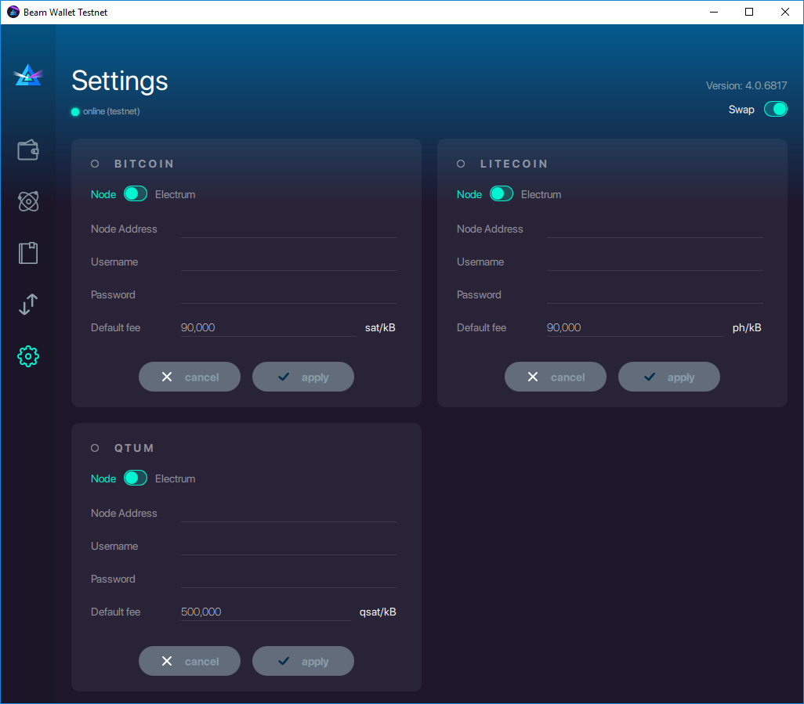
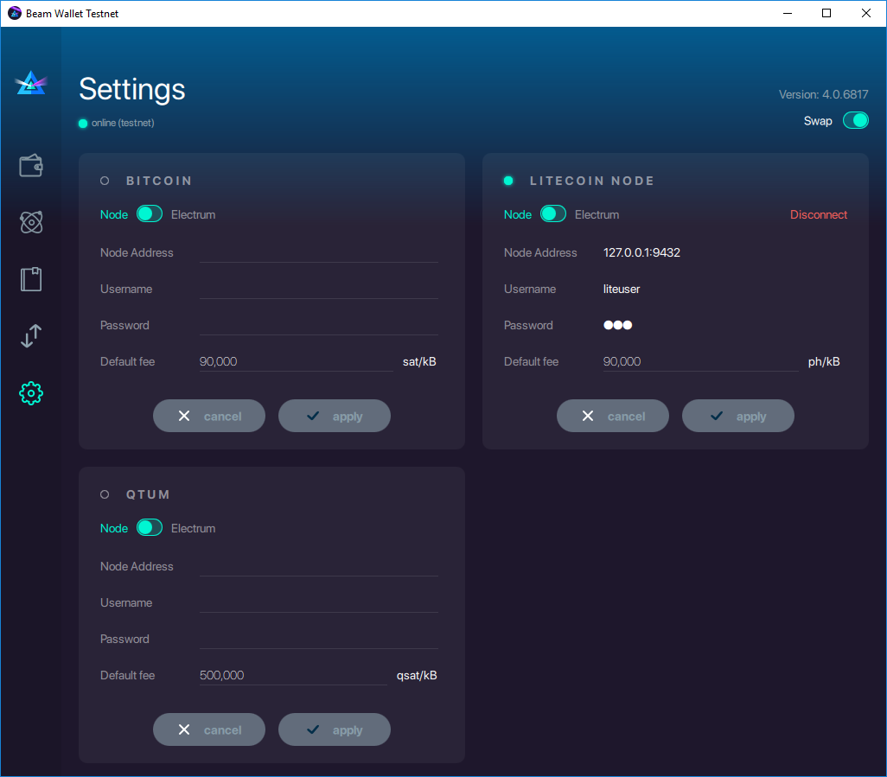
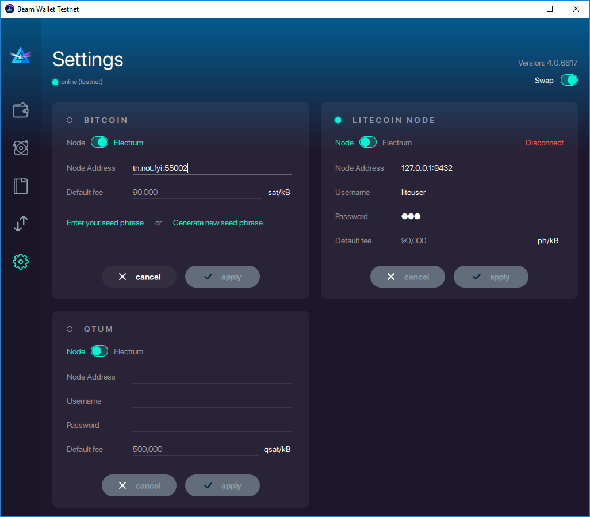
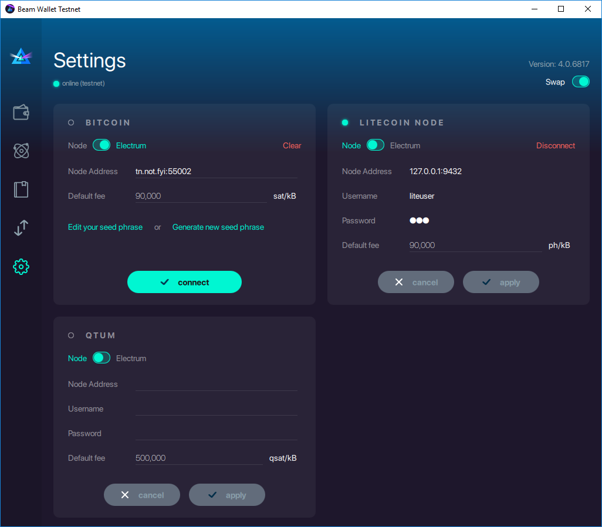
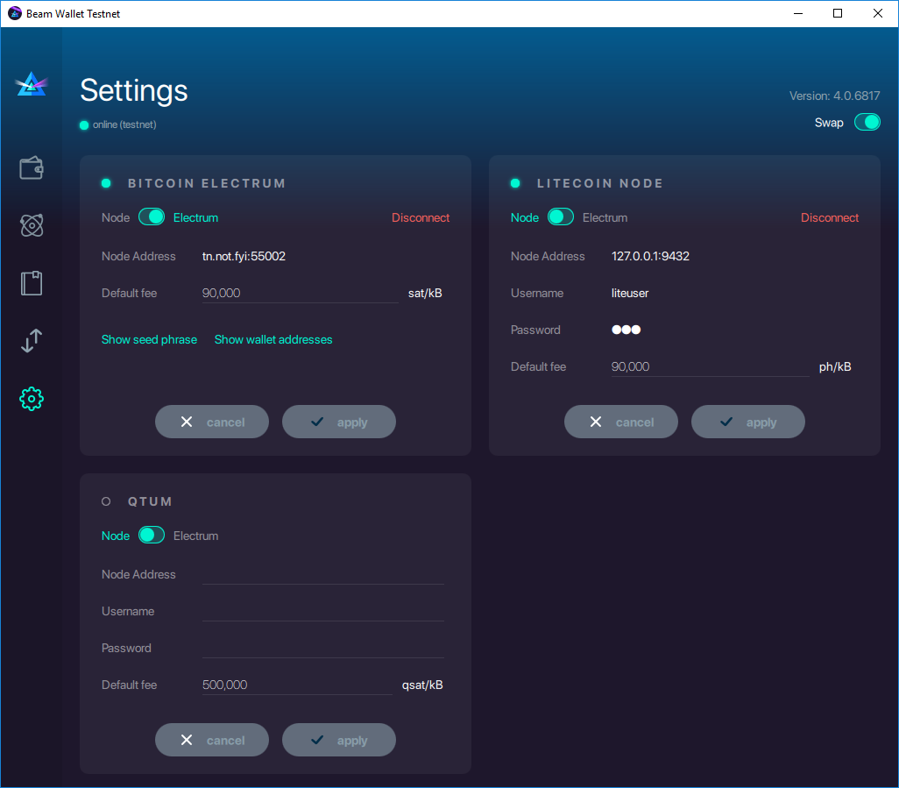
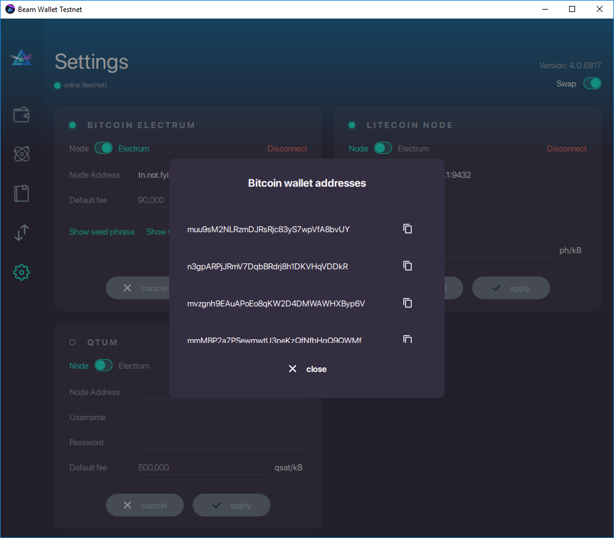
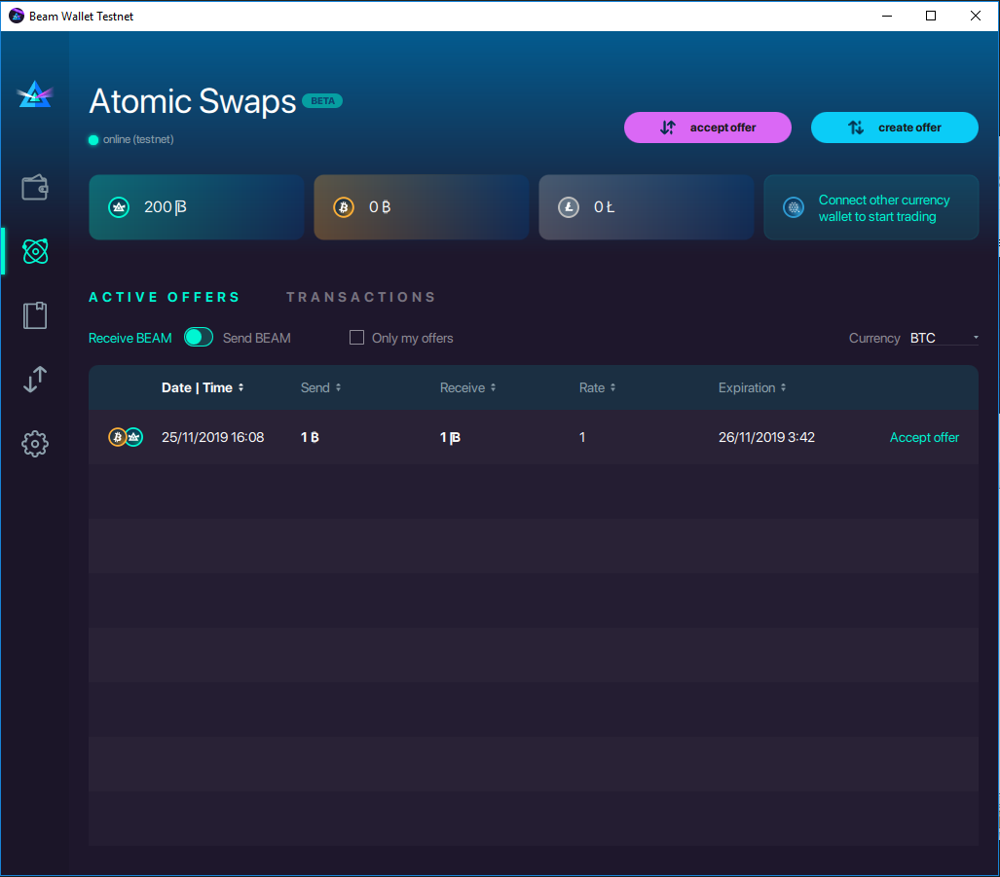
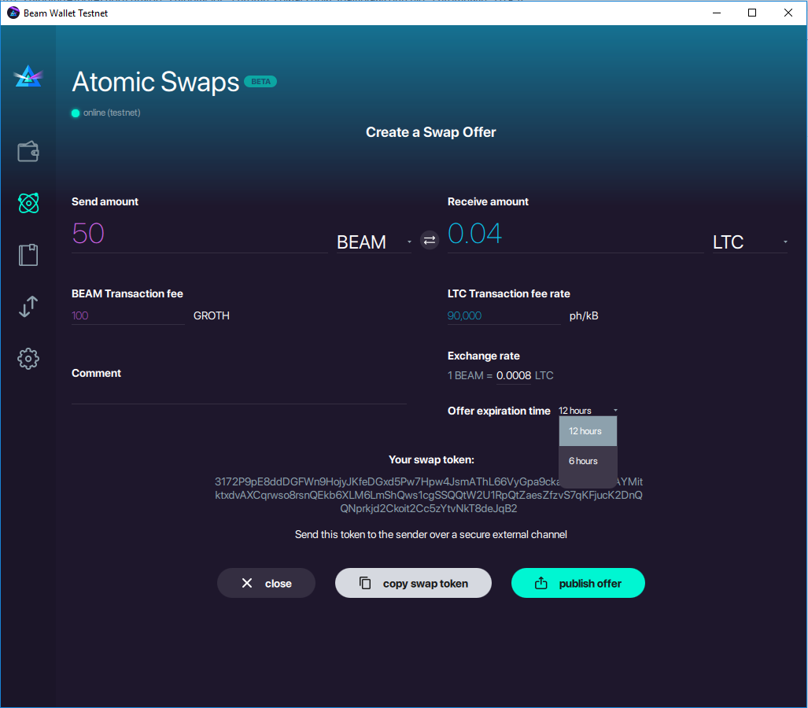
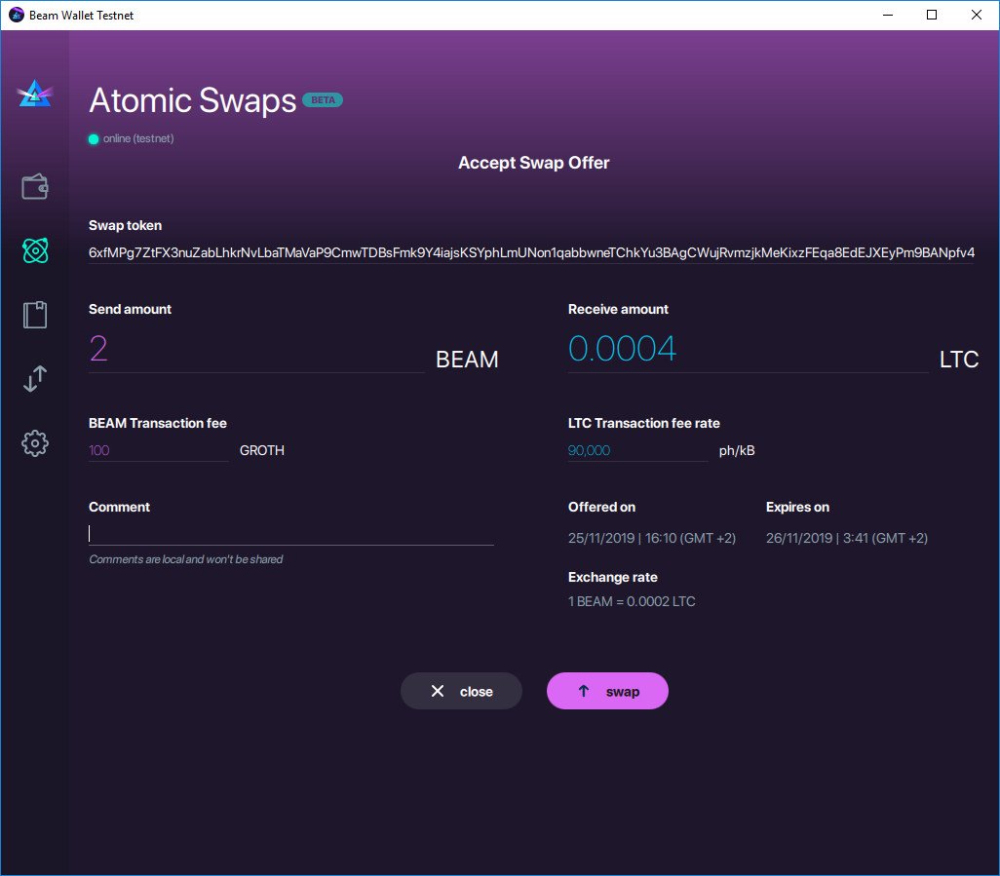
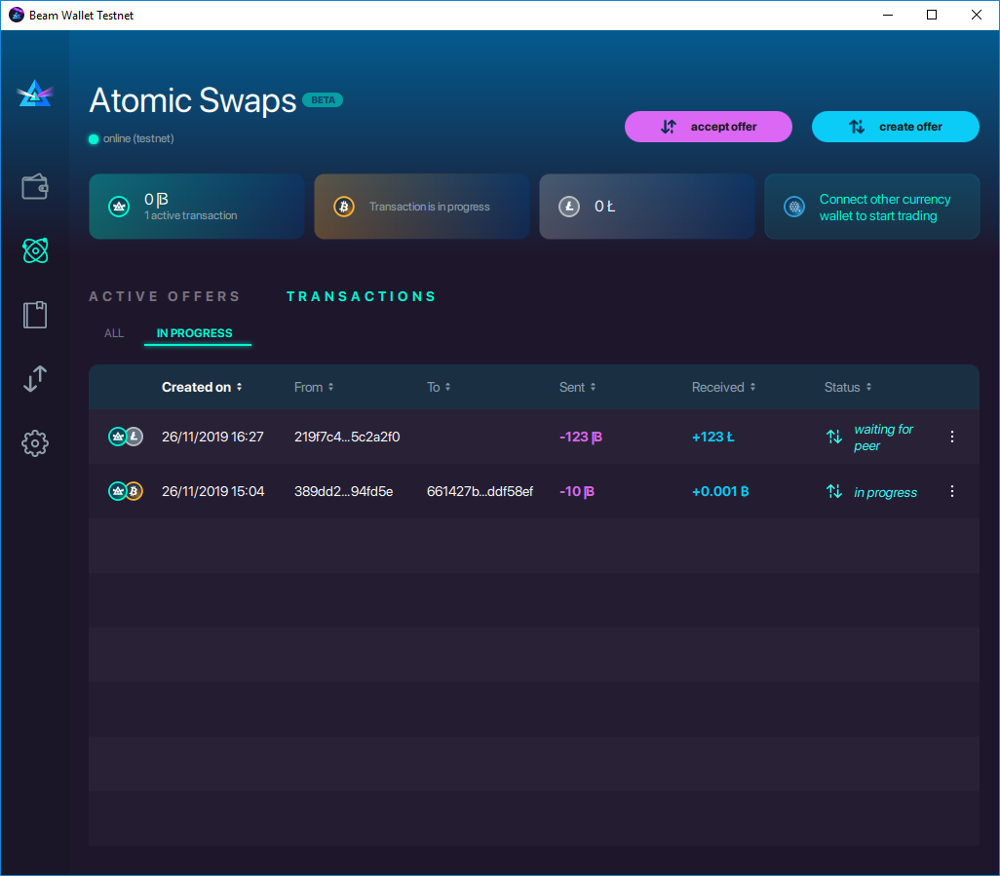

.. _user_atomic_swap:

Atomic Swaps using Desktop Wallet
=================================

.. note::

  Atomic Swaps is an advanced feature, currently in beta. 

  DO NOT USE SWAPS FOR LARGE AMOUNTS OF MONEY  
  
  For Electrum we support only Legacy seed and SSL connection type

  For Bitcoin use version `Bitcoin Core v0.17.1 <https://bitcoin.org/en/download>`_ .

  For Litecoin use version `Litecoin v0.17.1 <https://litecoin.org/#download>`_ .

Introduction to Atomic Swap
---------------------------

The idea of atomic swap was presented as solution for the next problem: two parties (Alice and Bob) want to exchange their coins without having to trust а third party.

In a simplified way non-atomic approach consists of four steps:

1. Alice send her A Coins to Bob.
2. Bob receives A Coins.
3. Bob sends his B Coins to Alice.
4. Alice receives B Coins. 

The weakest part of this such approach is lurking in step #3. By malicious intent, Bob can avoid following his part of the agreement.
Atomic swap is provided to guarantee compliance of the agreement.

The way this really works in practice is as follows

1. Alice and Bob create three transactions between their wallets: Lock Transaction, Redeem transaction and Refund transaction.

2. Both parties lock their coins on the respective chain using the Lock Tx. In this state the coins belong to both parties and can not be spent.

3. Once the lock is confirmed, the parties exchange secret used to lock funds and send the Redeem Tx to the chain, effectively getting the swapped coins.

4. If the swap fails for any reason, Refund Tx can be sent to the network after some significant period of time to get the locked coin back for each party. 

Configuring swaps in Desktop wallet
-----------------------------------

To enable swap functionality Beam wallet should first connect to the node and wallet of the other currency. This can be done using either your own instance of a full node via RPC or by using an Electrum service.

Connecting to BTC / LTC / QTUM full node
----------------------------------------

To connect to your own node perform the following steps (Litecoin example shown, for additional information and settings please use original documentation for Bitcoin, Litecoin and QTUM respectively)

1. Configure the litecoind to run with JSON RPC using the following commands in litecoin.conf configuration file

::

  # server=1 tells litecoin-QT to accept JSON-RPC commands.
  server=1

  rpcport=9432
  
  # You must set rpcuser and rpcpassword to secure the JSON-RPC api
  rpcuser=liteuser
  rpcpassword=123

.. note:
  If you are connecting to testnet network, the rpcport setting should be put in the 'test' section

  [test]
  rpcport=9432

Make sure the node is running and fully synchronised

2. Connect Beam Wallet to the node

Open Settings tab in the Beam Wallet and open the Swap section using the 'Swap' toggle in the top right corner of the screen

In the Litecoin section, fill in the node details, including ip:port of the node and the RPC username and password. The default fee parameter specifies the fee paid on the respective chain per Kb of transaction size and can be left at the default value.

.. note: Add description on how to calculate fees

Once the settings for the node are specified click 'Apply' and than 'Connect'

If the connection is successful the green light will be shown near the section title

Connecting using Electrum Wallet
--------------------------------

Another, simpler option to connect to a remote node would be using Electrum wallet service. First you need to find an address of an Electrum node, or run your own. 

.. note:
  It is possible to get an Electrum node by installing the official Electrum wallet and clicking on the 'Network' menu.

To connect to Electrum you need to turn on the 'Electrum' toggle in the appropriate section and specify the required parameters.

At this point you need to either enter an existing seed phrase for the wallet or create a new one. 

.. note:
  If you create a wallet using official Electrum wallet software make sure you use 'Legacy' mode and not 'Segwit'

You can later edit or create new wallet at any time

Once the seed is set you can connect to the Electrum wallet

Once the wallet is connected, you should be able to see the list of wallet addresses by clicking 'Show wallet addresses'.

Afer you have completed the configuration, you are able to accept swap offers from Atomic Swaps tab

Before we discuss how to create and accept offers we need to understand the concepts of balance and UTXO

Understanding balances and UTXOs
--------------------------------

Since Beam, Bitcoin, Litecoin and QTUM are all UTXO based cryptocurencies, understanding the difference between balance and UTXO is crucial for correct operation of the swap (and also regular) transactions.

Let's say that you see available balance of 200 BEAM in your wallet and decide to swap half of it for a matching amount of Bitcoin. Once you initiate the swap, amount of free coins left in your wallet depends on the UTXOs that you had in the first place before the transcation started. 

For example, if you had one UTXO of 200 BEAM, you will have 0 BEAM left until the swap is completed (even though you are only actually swapping 100). If you had two UTXO, 100 each, then you will have exactly 

Creating swap offer
-------------------

Click on 'Create offer' button in the top right corner of the swaps screen to create a new offer. 

You can specify what amount and of which currency you want to trade to which amount of another currency. If you want to use the rate instead of explicitly setting the received amount, you can use the rate selector.

Once you have specified the swap details, you can either copy the swap token and send it to the specific opposite party using secure communication channel, alternatively you can publish the swap offer in the wallet so that it can be accepted by anyone.

If you choose to publish the offer you can cancel it at any time before it was accepted by clicking Cancel on the offer. To view only your offers, click 'Only my offers' checkbox.

Accepting swap offer
--------------------

An Active offers table lists all currently offered swaps. The 'Send' column indicates what amount of which coin you will send in the swap and the 'Receive' column specifies what you will receive in return. 

You can select the coin you want to swap in the dropdown list in the top right part of the list, and then switch 'Send or receive BEAM' toggle to see the matching offers. 

Once you have seen the offer you like, and provided you have enough funds for the swap you can click 'Accept' button near the offer to review the swap details.

Click 'Swap' to accept the conditions and to initiate the swap process.

Understanding swap transactions
-------------------------------

Every time a swap offer is created or accepted a matching swap transaction is created as well. The list of current swap transactions can be seen in the 'Transactions' tab of the Atomic Swaps screen.

Here you can see the current status of the transaction, and by clicking any transaction in the list, you can see its details. 

In case it is still possible to cancel the transaction you can do so by clicking 'Cancel' from the transaction menu (three vertical dots at the end of each line). Once transaction has completed (or expired or failed) you can delete the transaction from the list using the same menu.

