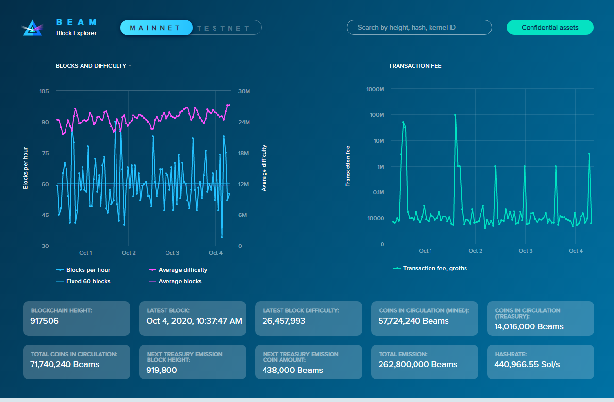
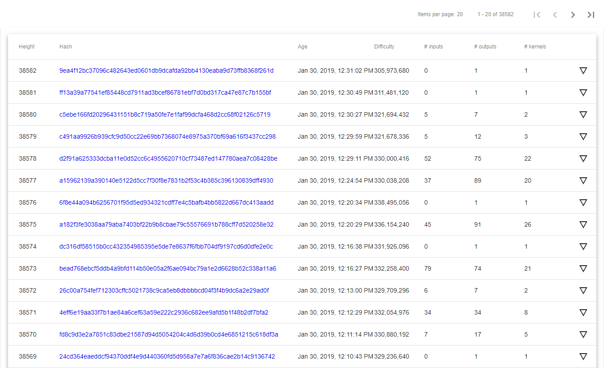
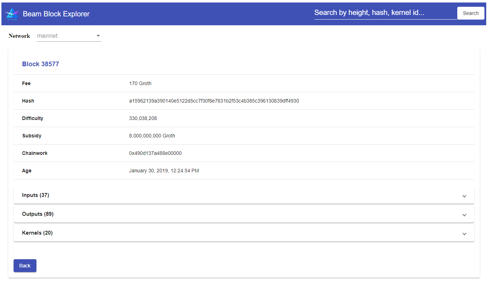

.. _user_blockchain_explorer:

.. _blockchain explorer:

Blockchain Explorer
===================

.. note:: Blockchain Explorer is currently running at https://explorer.beam.mw

Main Screen
-----------

In the top left corner there is a selector to switch between Mainnet and Testnet explorers.

In the top right corner the is a search field that allows searching for blocks by height, hash or a kernel id of the transaction within the block

The two charts on the main page shows two charts: the current average block creation time (red line) and current block difficulty (green line) on the left and the average fee (blue line) on the right

Under the charts there are panes presenting the current status of the blockchain:

Blockchain height - the current height of the blockchain

Latest block - creation time of the last block

Latest block difficulty - the difficulty of the last block

Coins in circulation (mined) - how many Beams were mined so far

Coins in circulation (treasury) - how many Treasury coins are currently in circulation

Total coins in circulation - Total amount of both mined and treasury coins

Next treasury emission block height - Block height of the next treasury burst

Next treasury emission coin amount - Amount of Treasury coins that will be released in the next burst

Total emission - maximum amount of Beam that will ever exist set to 262,800,000

Hashrate - current hashrate of the system (in Sol / sec) calculated as difficulty / 60

Blocks
------

The list of most recent blocks is located at the bottom of the main screen

Clicking on the hash link or the details triangle button on the right allows you to view details of each block

Confidential Assets
-------------------

Starting from 5.0 Hard fork, Beam mainnet supports creation of confidential assets that are displayed in the `asset explorer <https://explorer.beam.mw/assets>`_. 

.. figure:: images/explorer/assets.png
	:alt: Confidential Assets

Creation of new asset is supported in Beam CLI wallet. To generate the string for creation of a new asset we have added a convenient `helper <https://explorer.beam.mw/asset-create>`_ that can be accessed from the Confidential Asset page.

.. figure:: images/explorer/create_assets.png
	:alt: Confidential Asset Helper

