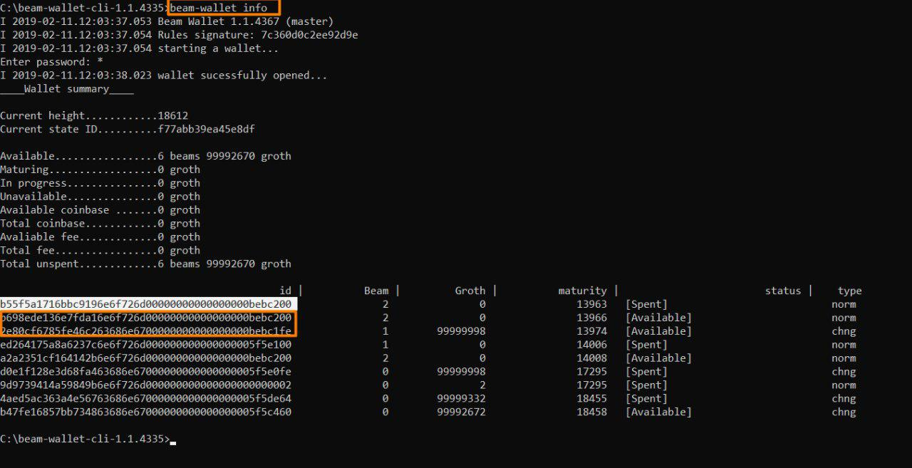
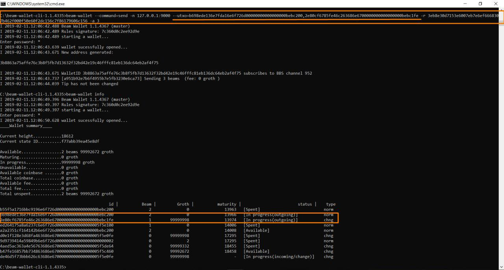
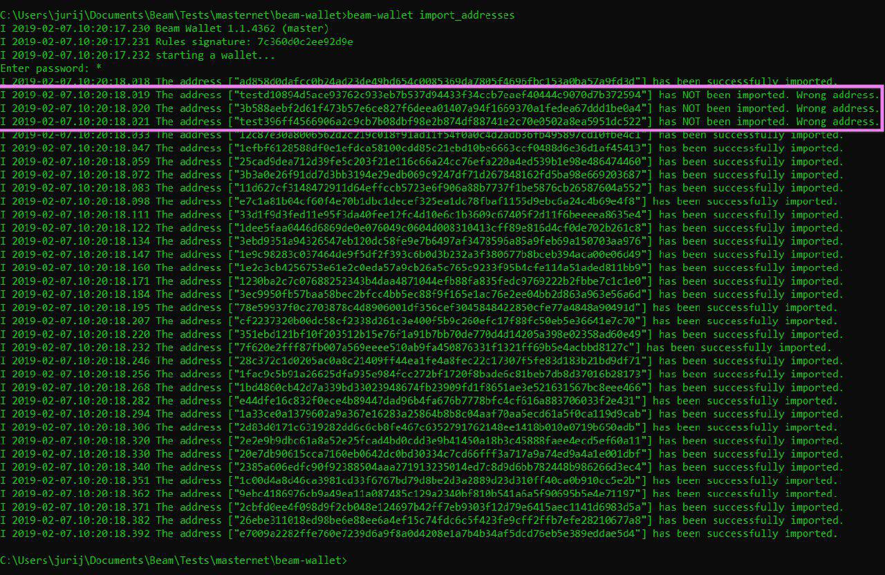

.. _user_cli_wallet_guide:

.. _command line user guide:
.. _command_line_wallet_user_guide:

Command Line Wallet User Guide
==============================

The purpose of this document is to describe the process of setting up Beam node and command line wallet. 

.. attention::

    Beam blockchain does not store transaction history and SBBS addresses. These are only stored in local database inside the wallet data folder. 

    Please follow the guidelines below to avoid problems with sending are receiving Beam transactions.

    1. DO NOT run several wallet processes on the same wallet.db file. 

    2. Do not do listen and send at the same time using CLI wallet

    3. Do not copy the wallet.db to another machine and run another wallet simultaneously using the same wallet database
    
    4. Do not run two different wallets with the same seed at the same time

    5. SBBS messages sent between wallets expire after 12 hours. You have to connect within 12 hours of the transaction initiation to receive or send the funds.

    6. SBBS Addresses by default expire after 24 hours. Always use 'never' expiring addresses with pools and exchanges to make sure you receive payments.

Getting Started
---------------

Beam software runs on all operating systems: Linux, Mac OS and Windows. Before you start please verify that your operating system is supported by reviewing the :ref:`user_supported_platforms`.

All examples in this section are formatted for Linux / Mac platforms. If you are using Windows please substitute ./beam-wallet with beam-wallet.exe and run your commands using Windows Command Prompt.

.. _creating_new_cli_wallet:

Creating new wallet
-------------------

In order to create a new wallet run:

::

    ./beam-wallet init

You will be prompted to enter the Wallet Password, which is used to protect the wallet database 

.. warning:: Choose strong password for the wallet and keep it secret

   Anyone who knows your wallet password and can access your machine the wallet is stored on, will be able to spend **all your funds** and will have an access to all the metadata stored in the wallet, including transaction history!

Sample output for the ``init`` operation will look something like this:

::

    $ ./beam-wallet init
    I 2018-12-23.15:24:29.461 Rules signature: ddccf5d8d0f77bd2
    I 2018-12-23.15:24:29.462 starting a wallet...
    Enter password: ****************
    I 2018-12-23.15:24:32.524 Generating seed phrase...
    
    Generated seed phrase:
    
            despair;evoke;airport;seven;cricket;menu;current;ankle;require;monkey;maple;crawl;
    
            IMPORTANT
    
            Your seed phrase is the access key to all the cryptocurrencies in your wallet.
            Print or write down the phrase to keep it in a safe or in a locked vault.
            Without the phrase you will not be able to recover your money.
    
    I 2018-12-23.15:24:32.728 wallet successfully created...
    I 2018-12-23.15:24:32.750 New address generated:
    
    14a38140d8e66be9b8f1e8d770161fd33e35f7000053147b5a0f6a83178926b956
    
    I 2018-12-23.15:24:32.750 label = default

The ``Rules signature`` is a hash of current node configuration which is used to determine compatibility between different versions of nodes and wallets. 

Generated seed phrase is the :ref:`Seed Phrase <seed phrase>`. 

.. warning:: Copy the seed phrase to a secure location and keep it safe. 

   Seed phrase is the **most important secret** you need to keep to protect your funds. Anyone knowing the seed phrase will be able to control all your funds regardless of any other information. When generating new wallet each and every time, the safest scenario would be to make it on a secure air-gapped machine in a private environment and always keep the seed phrase in a secret and protected place.

The following line indicates that a new temporary :ref:`SBBS<sbbs>` address has been generated. This address is valid for the next 24 hours and can be used to receive coins. To generate new addresses see 'Creating new receive address' section below.

After wallet initialization is succeeded a ``wallet.db`` file is created in the same folder the wallet was run at. ``wallet.db`` is the wallet database file which is encrypted with the Wallet Password and contains the entire transaction history, keys and all the rest of the wallet metadata. If this file is deleted or lost, for any reason, you can always restore your funds using the Seed Phrase, however you will lose all transaction history and any additional metadata stored in the wallet database. To understand how to backup and restore the ``wallet.db`` file please check the :ref:`Backup and Restore` page.

In addition to the ``wallet.db file``, you will see the ``logs`` folder. A new log file is created every time you run the CLI wallet. Please attach logs to any support request you might send. See `Reporting Issues and Getting Support` section, for more details.

Restore a wallet from a Seed Phrase
-----------------------------------

For all the restore procedures see :ref:`Restore CLI wallet from Seed Phrase`

.. _exporting_miner_key:

Exporting miner key
-------------------

To generate a secret key used by the miner to attribute mining rewards to your wallet run the following command:

::

    ./beam-wallet export_miner_key --subkey=<integer miner id, i.e 1,2,3...>

You will be prompted for the wallet password

The sample output for this command should look like this:

::

    $ beam-wallet.exe  export_miner_key --subkey=1
    I 2018-12-23.16:36:04.306 Rules signature: ddccf5d8d0f77bd2
    I 2018-12-23.16:36:04.307 starting a wallet...
    Enter password: *******************
    Secret Subkey 1: OVBSdWQlOV3WuC6bLXRDJqyDfdxWSuzdA4jEGRAZ1zhy4gA3/KcBTEdcmN5wNOv0vQrBWwOlTdIxqyPFzFDFdaVYZPUDoXjqgUE=

It is important to **keep the Miner Key secret** since anyone who knows the miner key will be able to spend all the rewards mined by that miner.

.. _exporting owner key:

Exporting owner key
-------------------

The purpose of the ``Owner Key`` is to allow all nodes mining for you to be aware of all mining rewards mined by other nodes so that you would only need to connect to one node to collect all the rewards into your wallet. While in most other cryptocurrencies this is done by simply mining to a single address you control, in Mimblewimble it is not as simple since there are no addresses and the mining rewards should be coded with unique blinding factors which are deterministically derived from the ``Master Key``, and then tagged by the single ``Owner Key``. 

``Owner Key`` should be kept secret. ``Owner Key`` does not allow to spend coins, however it will allow to see all coins mined for you by all miners that use this ``Owner Кey``.

To export the ``Owner Key`` run the following command:

::

    ./beam-wallet export_owner_key

You will be prompted for the wallet password

Sample output for this command should look like this:

::

    $ ./beam-wallet export_owner_key
    I 2018-12-23.16:53:04.973 Rules signature: ddccf5d8d0f77bd2
    I 2018-12-23.16:53:04.974 starting a wallet...
    Enter password: *
    Owner Viewer key: dmVxtRCM3BH1VakviSB/XY86DsCKuWDLKk51eLDlibgMeL2fZ317Zdqx3E6oXbKtldqZz/lo5stTCSz9M1bDJdYUF4DG/ZaIuHHszi/H9wDmNDVboUdNtC/1Z/haWr9JxeIDtRSDBN+xpUbv

Printing the wallet info
------------------------

To print the current status of your wallet, run the following command:

::

    ./beam-wallet info

You will be prompted for the wallet password

A sample output for this command should look like this:

::

    I 2018-12-23.17:56:19.368 Rules signature: ddccf5d8d0f77bd2                                                                   
    I 2018-12-23.17:56:19.369 starting a wallet...                                                                                
    Enter password: *                                                                                                             
    I 2018-12-23.17:56:21.144 wallet sucessfully opened...                                                                        
    ____Wallet summary____                                                                                                        
                                                                                                                                  
    Current height............8353                                                                                                
    Current state ID..........72329a2efa2ddad4                                                                                    
                                                                                                                                  
    Available.................300 beams                                                                                           
    Maturing..................0 groth                                                                                             
    In progress...............0 groth                                                                                             
    Unavailable...............0 groth                                                                                             
    Available coinbase .......0 groth                                                                                             
    Total coinbase............0 groth                                                                                             
    Avaliable fee.............0 groth                                                                                             
    Total fee.................0 groth                                                                                             
    Total unspent.............300 beams                                                                                           
                                                                                                                                  
                      id |          Beam |         Groth |        height |          maturity |                  status |    type  
        1545571472000001             300               0            8347                8351   [Available]                 norm   

It is also possible to see the transaction history using the --tx_history flag

::

    ./beam-wallet  info --tx_history

Receiving BEAMs
---------------

To receive BEAMs you need to connect to a specific node by running the following command:

::

    ./beam-wallet listen -n <node address and port, ex: 127.0.0.1:10000>

You will be prompted for the wallet password

A sample output for this command should look like:

::

    I 2018-12-23.17:07:55.526 Rules signature: ddccf5d8d0f77bd2                                                                        
    I 2018-12-23.17:07:55.527 starting a wallet...                                                                                     
    Enter password: ***************                                                                                                    
    I 2018-12-23.17:07:58.076 wallet sucessfully opened...                                                                             
    I 2018-12-23.17:07:58.078 WalletID 14a38140d8e66be9b8f1e8d770161fd33e35f7000053147b5a0f6a83178926b956 subscribes to BBS channel 20 
    I 2018-12-23.17:07:59.297 Sync up to 8304-2dc4e5a393d6774b                                                                         
    I 2018-12-23.17:07:59.318 Current state is 8304-2dc4e5a393d6774b                                                                   

Once launched, the wallet will listen to updates from the server and any incoming transactions on the advertise SBBS address.

To receive funds you should send the address to the sending party via any available secure channel (Email, Telegram etc.)

When funds are sent you will see the incoming transaction in the wallet logs and on the screen. It should look similar to:

::

    I 2018-12-23.17:55:08.556 [7997ecd5c59e4865a6d938dbf339567e] Receiving 300 beams  (fee: 10 groth )
    I 2018-12-23.17:55:08.608 [7997ecd5c59e4865a6d938dbf339567e] Invitation accepted
    D 2018-12-23.17:55:09.203 Received PeerSig:     596857beae016ebd
    I 2018-12-23.17:55:09.216 [7997ecd5c59e4865a6d938dbf339567e] Transaction kernel: 95a8e48587c452b3
    D 2018-12-23.17:55:09.346 [7997ecd5c59e4865a6d938dbf339567e] has registered
    D 2018-12-23.17:55:09.367 Received PeerSig:     596857beae016ebd
    I 2018-12-23.17:55:09.428 Get proof for kernel: 95a8e48587c452b3

Sending BEAMs
-------------

To send beams you need to run the following command:

::

    ./beam-wallet send -n <node address and port, ex: 127.0.0.1:10000> -r <sbbs address> -a <amount (in Beams), ex: 11.3> -f <fee (in Groth) , ex: 0.2>

.. note:: 1 Groth equals 10^-8 Beam

The wallet log should look similar to something like:

::

    $ ./beam-wallet send -n 172.104.249.212:8101 -r 14a38140d8e66be9b8f1e8d770161fd33e35f7000053147b5a0f6a83178926b956 -a 10
    I 2018-12-23.18:05:49.037 Rules signature: ddccf5d8d0f77bd2
    I 2018-12-23.18:05:49.038 starting a wallet...
    Enter password: *
    I 2018-12-23.18:05:50.725 wallet sucessfully opened...
    I 2018-12-23.18:05:50.726 WalletID 14a38140d8e66be9b8f1e8d770161fd33e35f7000053147b5a0f6a83178926b956 subscribes to BBS channel 20
    I 2018-12-23.18:05:50.775 [b21f08337dd94603bb038c82c1888eac] Sending 10 beams  (fee: 0 groth )
    I 2018-12-23.18:05:50.986 [b21f08337dd94603bb038c82c1888eac] Invitation accepted
    I 2018-12-23.18:05:51.053 [b21f08337dd94603bb038c82c1888eac] Transaction kernel: 71cf20c4c94f25ce

.. admonition:: Sending transactions to yourself

    It is possible, and sometimes necessary to create a transaction to your own SBBS address to split a large UTXO. To do that just issue a send command with required amounts to your own SBBS address. Please note that you will pay the fee for the transaction.

Sending specific UTXO
---------------------

In some cases you might want to use specific UTXO for your transaction. To send funds using specific UTXO please follow the steps below:

1. Choose UTXOs you want to send using the `info` command

::

    ./beam-wallet info

In the output (as shown in the example below) choose the UTXOs you want to use

2. in the `send` command, add --utxo parameter and specify a comma separated list of utxo ids:

::

    ./beam-wallet send -n <node address and port, ex: 127.0.0.1:10000> -r <sbbs address> -a <amount (in Beams), ex: 11.3> -f <fee (in Groth) , ex: 0.2> --utxo=<comma separated list of utxo ids>

Cancelling and deleting of the transaction
------------------------------------------

Sometimes due to unsuccessful transaction or in different cases you need to cancel transaction. It is possible following the procedure below:

1.	Print the list of transactions using:

::

    ./beam-wallet  info --tx_history

2.	Get the id of the transaction you need and run:

::

    ./beam-wallet cancel_tx --tx_id=<txid, ex: f1e11512141a4f59b1c539ab1386ea84> -n <node address and port, ex: 127.0.0.1:10000>
    
Also you could delete useless transaction via first step and following command:

::

./beam-wallet delete_tx --tx_id=<txid, ex: f1e11512141a4f59b1c539ab1386ea84> -n <node address and port, ex: 127.0.0.1:10000>

Creating new SBBS address
-------------------------

In order to create new SBBS address, run the following command:

::

    ./beam-wallet new_addr --expiration_time=never|24h --comment="some comment"

You will be prompted for the wallet password

Sample output from this command should look like this:

::

    I 2018-12-23.18:16:44.112 Rules signature: ddccf5d8d0f77bd2
    I 2018-12-23.18:16:44.113 starting a wallet...
    Enter password: *
    I 2018-12-23.18:16:45.392 New address generated:

    646a773da4d4651f35fd75ca958b7859e89d8d8382b8155773bd396e2cc49cca

Print list of all addresses
---------------------------

To print the entire list of addresses use the following command:

::

    ./beam-wallet address_list

A sample ouput for this command will look something like this

::

    I 2019-02-25.19:41:26.839 Beam Wallet 1.2.4419 (mainnet)
    I 2019-02-25.19:41:26.839 Rules signature: ed91a717313c6eb0
    I 2019-02-25.19:41:26.841 starting a wallet...
    Enter password: *
    I 2019-02-25.19:41:27.718 wallet sucessfully opened...
    Addresses

     comment         |address                                                               |active  |expiration date     |created
                       14e191aaebace13b14e3ab41382280baff288faa312545eadd1a1bcfa3adaeac6ff    false    2019.02.25 12:34:07  2019.02.24 12:34:07
                       12908d7079a41ca9929ed33b965758f261030e766d3bcf0524ce1d21f55b88dc8ff    false    2019.02.20 12:32:11  2019.02.19 12:32:11
     default           d2fb05822407ca08d2dcc735894b63a26c6d2c1b88d6deddabaee887f6a668b086     false    2019.02.20 10:33:50  2019.02.19 10:33:50

Change address expiration
-------------------------

It is possible to change address expiration period to 'never' using the following command:

::

    ./beam-wallet change_address_expiration --address=14e191aaebace13b14e3ab41382280baff288faa312545eadd1a1bcfa3adaeac6ff

For specific address.

To change all existing addresses in the wallet just omit the `--address` parameter

Export and import SBBS addresses and transaction history
-------------------------------------------------------

Sometimes when upgrading the wallet or restoring from seed phrase you need to reimport the list of SBBS addresses and transaction history (the data) from the previous wallet. To do that use the commands below:

To export the data:

::

    ./beam-wallet export_data --file_location=<full path to addresses file, for example: C:\Users\user\addresses.dat>

To import the data
::

    ./beam-wallet import_data --file_location=<full path to addresses file, for example: C:\Users\user\addresses.dat>

.. note:: It is important that imported addresses were originally created by the wallet with the SAME seed phrase. Only addresses matching the wallet seed phrase will be imported. Other addresse will not be imported as shown in the screenshot below.

.. _proof_of_transaction_cli:

Proof of transaction
--------------------

Starting from 1.1.4194 version, receiver wallet automatically signs proof of received transaction and sends it to the sender. Upon request, sender can generate proof of transaction following the procedure below:

1. Print the list of transactions using:

::

    ./beam-wallet  info --tx_history

2. Get the id of the transaction we need and run:

::

    ./beam-wallet payment_proof_export --tx_id=<txid>

Sample output of the command above should look something like:

::

    I 2019-01-14.14:40:37.464 Payment tx details:
    Sender: 4bd0ca080bd8c3ec4b3061bf5916aa34266f0649a7c151c6777ffe492f15e09768
    Receiver: ebb27b5501213c84eb212ea276e8ced74f540fbcceb0f4c1c2da2c5108188651a1
    Amount: 6 groth
    KernelID: 4ac2f195ce9056c171fd0cd41e8a02dc9c0bb72861b2e03fbbbb5942e5e63d1a

    I 2019-01-14.14:40:37.465 Sender address own ID: 1547460707000004
    I 2019-01-14.14:40:37.465 Exported form: 000000000000004bd0ca080bd8c3ec4b3061bf5
    916aa34266f0649a7c151c6777ffe492f15e0976800000000000000ebb27b5501213c84eb212ea27
    6e8ced74f540fbcceb0f4c1c2da2c5108188651a1864ac2f195ce9056c171fd0cd41e8a02dc9c0bb
    72861b2e03fbbbb5942e5e63d1a7728a2954a10d3bfb9938f0c17509a6a0e870c6bb22ff2d1297f3
    dae7f54592b00e84c6b3c9ea3e3ad9bc43661b6dcf7dbd818ccc92707d1d75b429697e8492653

3. Send the contents of exported form only (proof) to the receiver, our case it will look like this:

::

    I 2019-01-14.14:40:37.465 Exported form: 000000000000004bd0ca080bd8c3ec4b3061bf5
    916aa34266f0649a7c151c6777ffe492f15e0976800000000000000ebb27b5501213c84eb212ea27
    6e8ced74f540fbcceb0f4c1c2da2c5108188651a1864ac2f195ce9056c171fd0cd41e8a02dc9c0bb
    72861b2e03fbbbb5942e5e63d1a7728a2954a10d3bfb9938f0c17509a6a0e870c6bb22ff2d1297f3
    dae7f54592b00e84c6b3c9ea3e3ad9bc43661b6dcf7dbd818ccc92707d1d75b429697e8492653

4. Receiver can verify that proof is correct by running :

::

    ./beam-wallet payment_proof_verify --payment_proof=<proof>

.. note:: Sender can require receiver to always send proof of transaction by using --payment_proof_required=1. Please note that this will prevent working with older wallets.

.. _cold_wallet:

Cold Wallet
-----------

To use the wallet in 'cold' mode you need to initialize it with ``--cold_wallet`` flag.

::

    ./beam-wallet init --cold_wallet

This command will create two databases: wallet.db and wallet.db.private.

.. _sending_from_cold_wallet:

Sending from cold wallet
------------------------

Pre-conditions: Make sure the cold wallet is synced. In order to do so, follow the next steps:

1. Copy the wallet.db file to the "hot" wallet's data folder.
2. Launch the "hot" wallet and wait till it's synced.
3. Stop the "hot" wallet, copy the wallet.db file into the "cold" wallet folder.
4. Launch the "cold" wallet for listening.

::

   ./beam-wallet listen --cold_wallet

Now as the "cold" wallet is synced, proceed with the next steps:

1. In the cold wallet run the command: 
   
::

   ./beam-wallet send -a <amount> -r <receiver address> -f <fee> --cold_wallet

.. note:: Here is no need in node address in this case.

2. Copy wallet.db file to "hot" wallet's data folder.
3. Launch "hot" wallet. It should send encrypted message to the node, also he may get encrypted message back.
4. Stop "hot" wallet, copy wallet.db file into "cold" wallet folder.
5. Launch "cold" wallet for listening beam-wallet listen ``--cold_wallet`` it should create a signed transaction kernel.
6. Copy wallet.db from "cold" to "hot" new transaction should go to the node and got confirmed.
7. Copy wallet.db from "hot" to "cold" "cold" wallet should have actual balance and transactions statuses.

.. _receiving_to_cold_wallet:

Receiving to cold wallet
--------------------------

1. Generate new address in "cold" wallet and send it to the sender.
2. Copy wallet.db to "hot" wallet.
3. Launch "hot" wallet. Note there will be no new transactions, since "hot" wallet cannot decrypt incoming messages.
4. Stop "hot" wallet. copy wallet.db from "hot" to "cold".
5. Launch "cold" wallet for listening, it should get new transaction and accept it.
6. Copy wallet.db from "cold" to "hot".
7. Launch "hot", wait until new transaction becomes completed.
8. Copy wallet.db "hot" to "cold" balance and transactions statuses should be correct.

.. _rescan_cli:

Rescan wallet
-------------

During regular operation the wallet constantly monitors the blockchain and updates the information in the wallet.
However, if you suspect that your balance, transaction or UTXO status is not up to date or invalid, you can always 'rescan' the blockchain and update the information in your wallet with the latest state.

In order to rescan the CLI wallet please follow the steps below:

1. Run a node with your 'owner' key and make sure it has completed the synchronization with the network. See :ref:`exporting owner key`

::

    ./beam-node --peer=<ip or url of the peer> --owner_key=<your owner key>

2. Run 'refresh' command as follows:

::

    ./beam-wallet refresh -n <ip:port of the node with the owner key>

3. Run 'listen' command to get updated information from the node

::

    ./beam-wallet listen -n <ip:port of the node with the owner key>

4. Wait for the wallet to synchronize and check that balance and transactions were update using 'info' command

::

    ./beam-wallet info
