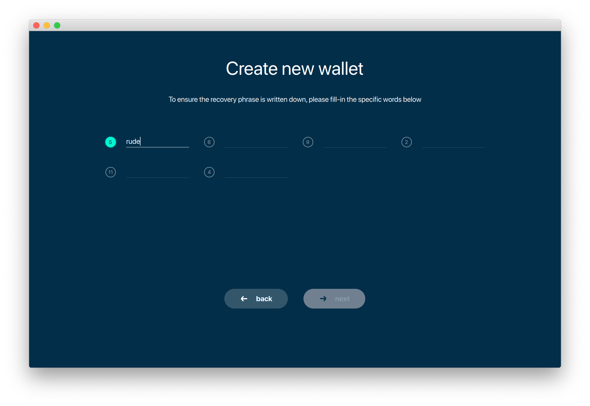

.. _user_desktop_wallet_guide:

.. _desktop_wallet_guide:

Desktop Wallet User Guide
=========================

Using Beam Dekstop Wallet is the simplest way to start using Beam. It is available for Linux, Mac and Windows platforms (see :ref:`supported platforms` for details). 

To download the Desktop Wallet for your platform go to http://beam.mw/downloads and follow instructions there.

Once the wallet is installed on your platform follow this guide 

Creating new wallet
-------------------

One you launch the wallet for the first time, you will be suggested to either create a new wallet or restore from existing seed phrase

.. figure:: images/desktop/1_create_restore_screen.png
   :alt: Choosing between new and restore

Click 'Create new wallet'. 

.. attention:: Restoring flow is covered in :ref:`restore desktop wallet from seed phrase` section of the :ref:`backup and restore` document

Generating seed phrase
----------------------

.. figure:: images/desktop/2_new_wallet_screen.png
   :alt: Before generating seed phrase

.. warning:: <Add seed phrase warning>

.. figure:: images/desktop/3_new_wallet_phrase_screen.png
   :alt: Generating seed phrase

.. warning:: <Add how to store seed phrase warning >

.. figure:: images/desktop/4_new_wallet_phrase_confirm_screen.png
   :alt: Keeping seed phrase safe warning

In order to make sure that you have really wrote down your :ref:`seed phrase<seed phrase>`, the wallet will ask you to enter a selection of words from your phrase in random order.

.. figure:: images/desktop/5_new_wallet_repeat_screen.png
   :alt: Repeat your seed phrase 

As you start typing in the words they will become green, to indicate that your word for this position is correct

When you type all the words correctly you will be allowed to proceed to the next step

.. figure:: images/desktop/7_new_wallet_repeat_screen_3.png
   :alt: Indicate correct words 

Setting Wallet Password
-----------------------

Next thing you need to do is to set Wallet Password

.. figure:: images/desktop/8_new_wallet_password_screen_1.png
   :alt: New wallet password 

.. figure:: images/desktop/9_new_wallet_weak_password_screen.png
   :alt: Example of weak password 

.. figure:: images/desktop/10_new_wallet_strong_password_screen.png
   :alt: Example of strong password

Choosing Wallet Mode
--------------------

.. figure:: images/desktop/11_new_wallet_mode_local_screen.png
   :alt: Start wallet in local mode  

.. figure:: images/desktop/12_new_wallet_mode_random_screen.png
   :alt: Start wallet in random mode  

.. figure:: images/desktop/13_new_wallet_mode_remote_screen.png
   :alt: Start wallet in remote mode  

Wallet Synchronization
----------------------

.. figure:: images/desktop/14_new_wallet_sync_screen.png
   :alt: Start wallet in local mode  

Main Screen
-----------

.. figure:: images/desktop/15_main_screen_empty.png
   :alt: Main screen  

Address Screen
--------------

.. figure:: images/desktop/16_address_screen_default.png
   :alt: Address screen

UTXO Screen
-----------

In Beam, like in most other cryptocurrencies, your balance is constructed as a result of...

.. figure:: images/desktop/17_utxo_screen_empty.png
   :alt: UTXO Screen

Settings screen
---------------

.. figure:: images/desktop/18_settings_local_node.png
   :alt: Address screen