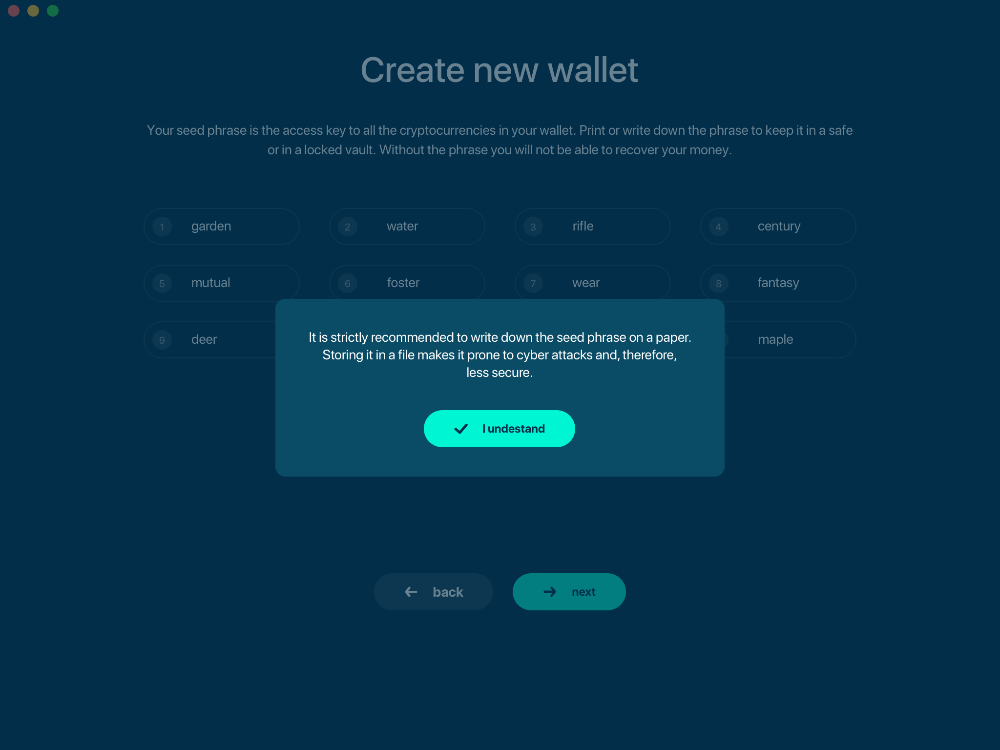
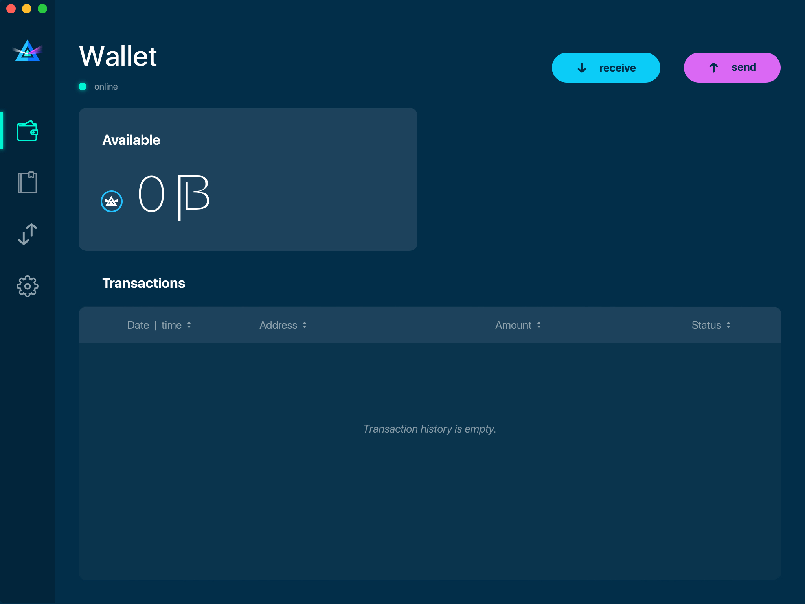

.. _user_desktop_wallet_guide:

.. warning:: The following document is still under construction and is subject to changes

.. _desktop_wallet_guide:

Desktop Wallet User Guide
=========================

Using Beam Dekstop Wallet is the simplest way to start using Beam. It is available for Linux, Mac and Windows platforms (see :ref:`supported platforms` for details). 

Downloading Binaries
--------------------

Proceed to the download page of Beam official website: https://beam.mw/downloads

Ensure that the communication between your browser and Beam official website is encrypted by verifying that the padlock icon is displayed in its locked state  

.. figure:: images/ssl_lock.png
   :scale: 50 %
   :alt: SSL

Download the desktop wallet for your platform (Mac, Linux or Windows):

.. figure:: images/downloads.jpg
   :alt: Downloads page

.. attention:: If you receive a warning from your browser that the downloaded file may be malicious, make sure you are indeed downloading from beam.mw website and then ignore it.

Ensure that you’ve downloaded the untampered Wallet installation file by checking that the value generated by SHA256 is the same as announced on the Beam official site:

On Mac open terminal and run: 

::

   openssl sha256 <file>

On Linux run

On Windows, open Power Shell and type

::

   Get-FileHash 'C:\Users\bigromanov\Downloads\beam-node-1.0.3860.zip'

Substitute your own path instead of the one in the example above

.. warning:: As the wallet will be continuously updated, the actual version numbers and SHA values might be different from the screenshot at the moment of reading.

Installation
------------

Once the application image is downloaded, double-click the icon to start the installation.

Mac
---

When you click on the .dmg file you will see a screen with Disclaimer and End User License Agreement. Please read it carefully

.. figure:: images/mac_install_1.png
   :alt: Mac EULA

On the next screen, drag the Beam Wallet icon into the Applications folder to install

When you will try to open the wallet for the first time, you will receive a security warning stating that Beam Wallet was created by an unrecognized developer. Please follow the steps below to launch the wallet.

1. Open 'System Preferences'

.. figure:: images/mac_install_security_1.png
   :alt: Mac Security

2. Locate and click on the 'Security & Privacy' settings

.. figure:: images/mac_install_security_2.png
   :alt: Mac Security

3. Click on the lock icon in the bottom left corner of the dialog

.. figure:: images/mac_install_security_3.png
   :alt: Mac Security

4. Change the 'Allow apps downloaded from' setting from 'App Store' to 'App Store and identified developers'

.. figure:: images/mac_install_security_4.png
   :alt: Mac Security

5. Launch the Beam Wallet from the Applicatins folder. When notification appears, click 'open'

Where are the files
-------------------

When Desktop Wallet is installed the walelt data files are stored separately from the binaries. 

The locations of all the files are described here: :ref:`files and locations`

Creating new wallet
-------------------

One you launch the wallet for the first time, you will be suggested to either create a new wallet or restore from existing seed phrase

.. figure:: images/desktop/03_creating_new_wallet/01.jpg
   :alt: Choosing between new and restore

Click 'Create new wallet'. You will be prompted to generate the seed phrase.

Generating seed phrase
----------------------

As a part of creating new wallet, the new seed phrase will be generated for you.

.. attention:: Seed phrase is the **most important secret you have to keep**. Knowing the seed phrase enables you (or anyone else) to access all your funds. 

.. attention:: Seed phrase in the Beam wallet is *not* linked to email, phone number or any other identifier. You will need this phrase to restore your wallet, when you lose or reformat your device, or want to access your funds from your mobile phone or from another desktop or laptop. 

.. figure:: images/desktop/03_creating_new_wallet/03.jpg
   :alt: Generating seed phrase

.. attention:: Generating the seed phrase is **for your eyes only**! For the best security always do it on a clean air-gapped machine.

Did you wrote down your seed phrase correctly? Triple-check your handwriting again. The difference between '*f*unnel' and '*t*unnel' can be crucial when trying to restore a wallet with valuable funds in the far or near future.

Did you verified your handwriting? Now go find a safe space for the paper! 

.. note:: Storing the info on your computer makes your funds prone to cyber attacks (read: much less secure). Creative approaches like saving a screenshot of the wallet or your handwriting on your computer may sound like a good idea, but it is not recommended. If someone hacks into your computer, network drive etc; they can steal your recovery phrase. There are programs (called OCR) that can scan pictures and transform them to plain text. 

.. attention:: Always store your seed phrase in a safe and secure location (and better more than one in different geo locations). Write it on a piece of paper. Do not store electronically neither as plain text nor in any other form!

In order to ensure that you have really wrote down your seed phrase, the wallet will ask you to fill in the specific recovery words from your phrase in random order.

.. figure:: images/desktop/03_creating_new_wallet/05.jpg
   :alt: Repeat your seed phrase 

Only when you typed all the selected words correctly you will be allowed to proceed to the next step.

Setting wallet password
-----------------------

To access your Beam Wallet, you will need to create a password. This password is not the same as the recovery phrase. Recovery phrase identifies a wallet and enables the access to all the funds stored in it from any device, wallet password provides with a complementary security layer in case someone gained access to your computer or has stolen your wallet database file. It is important to choose a strong password. 

.. figure:: images/desktop/03_creating_new_wallet/07.jpg
   :alt: Example of a weak password

Wallet Password protects your wallet in case someone has access to your computer or has stolen your wallet database file. It is important to choose strong password that you can remember. The wallet will provide some indication of password strength for your convenience. Do not count on it however. Choose password that is at least 8 symbols long with combination of characters from different types, such as letters numbers and special symbols

Choosing the node connectivity mode
-----------------------------------

Beam Desktop Wallet can be run in one of three modes.

To run an integrated node from within the wallet choose “Run integrated node (recommended)”. The trusted node will automatically verify the blockchain, hence it’s the recommended option. 

.. advanced:: When running behind a firewall you can change the default port the node will be listening on, and in case of CPU mining, set the amount of mining threads. You will be probably provided at least one default peer to connect to but you can always add more peers on the Settings screen. The recommended peers are published in the list of bootstrap nodes in the `downloads page <https://beam.mw/downloads>`_ on `Beam official website <https://beam.mw>`_.

Random mode allows you to automatically connect to random bootstrap node. In this mode Beam Wallet acts like a ‘light client’, it will create transactions but will have to trust the remote node for blockchain verification. It is recommended for lighter devices (with limited CPU power and/or RAM memory).

If you are running your own node somewhere (or maybe even more than one) and want to connect specifically to it, use the third option by providing the IP and port the node is listening on.

.. figure:: images/desktop/03_creating_new_wallet/11.jpg
   :alt: Start wallet with specific remote node  

Synchronizing the wallet
------------------------

Once the Wallet is connected, it synchronizes the current blockchain state from the network. Be patient when running with the integrated node: the data downloading process might take some time. The wallet will first download and validate the latest :ref: `macroblock` and then all the rest of the blockchain.

.. figure:: images/desktop/03_creating_new_wallet/12.jpg
   :alt: Synchronizing the wallet

Main Screen
-----------

Once your wallet is created, the main screen will show up. The screen usually opens up automatically when you enter the application and successfully submit the local password. 

The Main Screen of the wallet shows the current balance of both available and unconfirmed BEAM as well as the transaction history and statuses. On the left, under the Beam logo, there is a toolbar that provides navigation between different wallet screens, currently: Wallet (or Main Screen), Addresses, UTXO and Settings.

In the top left corner of the Main Screen, under the screen title, you see connection status indicator which shows whether the wallet could successfully connect to the node. In brackets, it specifies the network to which the wallet is connected. In the screenshot above it says ‘(master)’ which means the wallet is connected to internal developers network, called “masternet”. In case of Testnet 4, it will say ‘(testnet4)’. For the main (production) network no name will be written. 

Green indicator means that the node is up and running. In case the wallet is unable to connect to the node, red indicator will appear.

Near ``online`` word a blockchain name the node is connected to might appear. In general, there are 3 networks:
* **Mainnet:** the actual production network. 
* **Testnet<number>:** (such as Testnet3, Testnet4 etc): staging environments for trying new features in our wallet, node and miner software. For advanced users only.
* **Masternet:** new features under development, if you see this name in your wallet it means that you are very early adopter or Beam code contributor otherwise you’ve probably arrived to the wrong place.

.. attention:: Since Mainnet is the default network for the vast majority of Beam users, nothing is written by the online status.

.. attention:: Unless you know what you are doing, please verify that nothing is written after ``online``.

.. figure:: images/desktop/desktop/04_main_screen/02.jpg
   :alt: Main screen

In the top left corner of the Main Screen, under the screen title, you see connection indicator which shows whether the wallet could successfully connect to peers. In brackets, it specifies the network to which the wallet is connected. In the screenshot above it says ``(master)`` which means the wallet is connected to internal developers network, called masternet. In case of Testnet 4, it will say ``(testnet4)``. If the wallet is unable to connect to the peer it will be shown by red indicator.

.. figure:: images/desktop/wallet_disconnected.png
   :alt: Wallet disconnected  

'Send' and 'Receive' buttons at the top right corner help us to :ref: `Sending BEAM` and :ref: `Receiving BEAM`. Let's start using the wallet!

Receiving BEAM
--------------

Before starting to receive BEAM for the first time, please read first about what ref :address: is.

In a nutshell, here is how the process of receiving BEAM looks like from a Receiver’s perspective:
* Create an address (unless you’d like to reuse one that already exists, more on that later)
* Send your address to the Sender person **over a secure communication channel**
* Stay online when Sender will initiate the transaction

Create an address
-----------------

Proceed to the Main screen and click the blue 'Receive' button at the top right corner. Receive Dialog will open:

.. figure:: images/desktop/05_receiving_beam/01.jpg
   :alt: Receive BEAM dialog

Copy and paste the newly-generated Beam address to send it to the Sender over a **secure communication channel**. There are three ways to do it:
* By selecting the address and clicking ``Command-C`` or ``Ctrl-C`` (depending on your platform)
* By right-click on the address and choosing 'Copy' from the drop-down menu
* By clicking the 'Copy' button

.. figure:: images/desktop/05_receiving_beam/02.jpg
   :alt: Copy address

Each time the Receive Beam dialog is open, new Beam address is generated. By default, the address is valid for 24 hours. It is best to give the Sender your address closest to the time they will be sending beams so the address does not expire. 

.. figure:: images/desktop/05_receiving_beam/03.jpg
   :alt: Set address expiration

You can explicitly set the expiration time to ‘Never’ by selecting the value in the ‘Expires’ dropdown.

.. warning:: The permanent addresses that never expire are only useful in very limited special cases, like working with exchanges and such. For ultimate privacy, do not use this option for regular transactions, rather always create a new address for each transaction.

.. attention:: You have to click ‘Close’ button in the dialog for the address to become active

QR code
-------

If the Sender uses a mobile app he can scan the QR code directly from your laptop. The feature will be available soon in the upcoming Beam Wallet mobile app. 

.. figure:: images/desktop/05_receiving_beam/04.jpg
   :alt: QR code

Comment
-------

You also add a comment when creating the receiving address. The comment is never sent to the network, it is only visible inside your wallet and is used for internal bookkeeping only. 

The comment can be seen on the :ref: `address screen` and in the extended transaction view.

Sending the address
-------------------

.. attention:: When sending the address make sure you use a secure communication channel.

.. attention:: Make sure the entire address is sent to the Sender as it’s longer than it appears on the screen. Don’t forget to double check the value in whichever messenger app of your choice because viruses and malware on your computer may change your address while it’s in the clipboard. 

Completing the transaction
--------------------------

Once the Sender initiates the transaction, you will see a new Transaction appearing in the transaction list on the Main screen and the sending amount will appear on the 'In progress' panel. 

.. figure:: images/desktop/05_receiving_beam/05.jpg
   :alt: Incoming transaction

Normally, a transaction will pass through the following stages:
* **In Progress** - during the phase when transaction is being created by the wallets
* **Confirming** - after transaction was sent to the nodes but before it was mined
* **Completed** - after transaction was fully mined and confirmed

Once transaction is completed the Available balance will be updated and the 'In Progress' panel will disappear.

.. figure:: images/desktop/05_receiving_beam/05.jpg
   :alt: BEAM received

Sending BEAM
------------

Before starting to send BEAM, please read first about what :ref: `address` is.

In a nutshell, here is how the process of sending BEAM looks like from a Sender’s perspective:
* Receive and address the funds should be sent to
* Send BEAM in the Beam wallet
* Stay online till Receiver confirms the transaction

Receiving the address
---------------------

.. attention:: Make sure that the address is received untampered by using **secure communication channel**.

.. attention:: When copying the address to the Beam Wallet app please verify visually that the address in the wallet looks exactly like the address in the secure messaging app because viruses and malware on your computer may change your address while it’s in the clipboard.

Sending funds
-------------

In order to Send Beams you will need to click the magenta ‘Send’ button at the top right corner. This will open a Send dialog.

Make sure you have the correct address and paste the Receiver’s Beam address in the 'Send To' field. 

To help to identify the transaction you may also choose to fill in the optional Comment field. The comment will remind you what or who the transaction is for. The comment is stored locally, thus it will only be visible only in in your wallet for bookkeeping purposes. 

The comment can be seen on the :ref: `Address screen`:

.. figure:: images/desktop/06_sending_beam/02.jpg
   :alt: Send BEAM dialog

The comment is also displayed in the extended transaction view:

.. figure:: images/desktop/06_sending_beam/03.jpg
   :alt: Extended transaction view

Select the transaction amount in BEAM you want to send. Transaction amount is in BEAM and may contain fractional values such as 1.25 Beam or 11.3 Beam and the like. Keep in mind you also have to pay a transaction fee, hence the amount to send plus the fee must be equal to or less than the available balance. 

.. figure:: images/desktop/06_sending_beam/04.jpg
   :alt: Send BEAM amount

Transaction fees are specified in GROTH (100 millionths of BEAM). Amount of Fees you need to pay depends on the current status of the network and average fee sizes. Simply said, the higher transaction fee will help miners to prioritize your transaction. To determine the current average fee size use Beam `Blockchain Explorer <https://explorer.beam.mw>`.

.. figure:: images/desktop/06_sending_beam/05.jpg
   :alt: Send BEAM transaction fee

You can see the remaining amount of BEAM in your wallet and the change that will be received after the transaction. 

After you click ‘Send’ you will see a confirmation with the most important transaction details:

.. figure:: images/desktop/06_sending_beam/07.jpg
   :alt: Send BEAM confirmation 

Completing the transaction
--------------------------

Once you confirm, the transaction is sent to the Receiver wallet. If Receiver wallet is currently offline or if the network is loaded you might see the transaction appear ‘In Progress’ in your transaction list. When the other party receives the transaction and completes transaction creation, the transaction will be sent to the nodes and shown as ‘Confirming’.

.. note:: While a transaction is in ‘In Progress’ you can cancel it by clicking on the dropdown to the right of the transaction row and then select ‘Cancel’. The other party will receive notification that transaction was either ‘Cancelled’ or ‘Failed’ and funds that were allocated for this transaction will become available again. It is not possible to cancel a transaction in ‘Confirming’ or ‘Completed’ states.

If your transaction appears as In Progress for a notifiably long time, it means the Receiver is not online.

.. attention:: If the transaction was not sent to the nodes, for any reason, it will expire after 1440 blocks, or roughly 24 hours This is done to avoid a situation in which one of the Wallets did not send a created transaction to the nodes and the UTXOs remain locked forever.

Restoring funds
---------------

The operation allows to restore your funds directly from the blockchain. It is useful in the scenarios such as:
* You’ve got a new device and would like to use your wallet on that
* You’ve forgot your local password and can’t access your funds

.. attention:: With Beam, only funds are stored on blockchain. Everything else, such as your active addresses, contacts or transaction history can’t be restored.

.. note:: Very soon exporting transactions history for backup and bookkeeping purposes will be implemented.

To start the restore process, start the wallet from a fresh install and press the 'Restore wallet' button.

.. figure:: images/desktop/07_restoring_funds/01.jpg
   :alt: Restore funds

You will be asked to enter your seed phrase. This is the time to get the phrase out from your safe locker and type the words in:

.. figure:: images/desktop/07_restoring_funds/02.jpg
   :alt: Submit seed phrase

.. attention:: If any wrong word was typed-in or an existing word which was misspelled, your funds will not be restored successfully. *Example:* 'litt_el_' instead of 'litt_le_'. 

Did you checked your spelling? Click 'Restore wallet', the restoring screen will open and restore process will be started:

Upon completion, you’ll see the main screen of the wallet with your restored funds.

.. note:: Please be patient, restoring funds is thorough and time consuming operation. 

.. attention:: in case the available balance is zero, it means that some words from your seed phrase weren’t typed correctly. Remove the wallet files, double-check each and every word and repeat the process.

Address
-------

Let’s define the meaning of address in BEAM ecosystem: BEAM is always sent from one address to another. Both sending and receiving addresses are alphanumeric tokens that uniquely define the transaction endpoints. 

A person can create as many addresses as required. The address creation process will be explained in details in :ref: `Sending BEAM` and :ref: `Receiving BEAM`.

*Example:* Imagine a world with only two wallets. One belongs to you and the other belongs to Alice. You have created one address to receive money from Alice and another address to send money to Alice. Alice will never know that she’s receiving money from the same person she sends the money to. 

*Example:* Imagine a world with only three wallets. One belongs to you, another belongs to Alice and yet another belongs to Bob. You have created one address to receive money from Alice and another address to receive money from Bob. Alice and Bob will never know they send money to the same person.

.. attention:: For the ultimate privacy, it is advised to have a **dedicated address for every transaction** (ie. for both Sending or Receiving). In other cases an address can be reused unless it had reached its expiration time (which is specified when an address is created). 

*Example:* Imagine you’ve created the address with expiration interval of 24 hours and immediately sent it to Alice. In the next 24 hours Alice will be able to send BEAM to you as many times as she likes, reusing the same address of yours. 

.. warning:: Reusing same addresses, created with longer expiration interval, can be convenient yet the tradeoff of decreased privacy should be kept in mind.

Same address can be used for sending and receiving money. 

*Example:* you have created an address to send money to Alice. Alice can see the address the money came from and can send money to the address back to you.

Address screen
--------------

The screen lists all your addresses that were used in all incoming and outgoing transactions. All the data in this screen is only stored locally and is not related to the blockchain in any way.

.. note:: Yes, you heard right! For any incoming transaction dedicated address is created. That address will be seen in your active or expired addresses list (see below).

Initially, a single address is created by default. You can always create a new address using Receive dialog.

.. figure:: images/desktop/08_address_screen/01.jpg
   :alt: Default address

An expired address becomes inactive and won’t be able to be used in any incoming or outgoing transaction. Each address has a default expiration time of 24 hours, including the default address. 

.. figure:: images/desktop/08_address_screen/02.jpg
   :alt: Expired default address

You can manually expire any active address by clicking on the three dots located to the right of the address and choosing ‘Expire address’ from the drop down-menu.

For privacy concerns, you can manually delete any address by clicking the three dots located to the right of the address and choosing ‘Delete address’ from the drop-down menu.

.. figure:: images/desktop/08_address_screen/03.jpg
   :alt: Address screen drop-down menu

Finally, in ‘Contacts’ tab you will see every address that sent you the money or to which you’ve sent the money to.

.. figure:: images/desktop/08_address_screen/04.jpg
   :alt: Contacts

UTXO
----

UTXO, Unspent Transaction (TX) Output is like a bill, banknote or a cheque of a a specific amount. You can have multiple 'bills' in your wallet at one time. Simply said, if BEAM is the currency, any UTXO can be considered as such a 'bill'.

UTXO screen
-----------

On the technical level, in Beam, like in most other cryptocurrencies, your balance emerges as a result of multiple incoming and outgoing transactions. Each Transaction uses some existing inputs and creates new outputs. All the outputs controlled by the wallet are shown in the UTXO screen.

The type of UTXO can be:
* **Coinbase** - UTXO you have mined. It has maturity of 3 hours (240 blocks) and will not be immediately seen in Available tab
* **Regular** - UTXO received as a result of a transaction. It is immediately available for spending
* **Change** - UTXO received as a result as a change from a transaction spending a larger UTXO
* **Transaction fee** - Fees received as a result of mining a block which contained transactions

UTXO in sending BEAM dialog (explained by example)
--------------------------------------------------

Assume that you have 100 BEAM in a single “bill”. So, if you want to send to Alice 10 BEAM, your single 'bill' will be split into one 'bill' of 10 BEAM to send and another 'bill' of 90 BEAM to remain in your wallet, right? Well, almost: we also have to consider the 'bill' of the transaction fee. Let’s say the transaction fee is 10M GROTH (0.1 BEAM), so in that case the 'bill' will be split in 3 as shown on the screenshot:

.. figure:: images/desktop/09_utxo_screen/02.jpg
   :alt: Sending BEAM (UTXO change example)

Why UTXO can be locked
----------------------

.. important:: Desktop Wallet automatically selects which UTXOs will be used for the transaction by trying to minimize the change you should receive as a result. This is important to understand since until transaction is complete, the UTXOs used in the transaction can not be used for any other transaction and do not appear in the list of ‘Available’ funds.

*Example:* Assume that you have two UTXOs: 20 Beam and 10 Beam, and you want to send 9 Beam to someone, the wallet will automatically select the 10 Beam UTXO and create a transaction with 9 Beams sent and 1 Beam change.

.. figure:: images/desktop/09_utxo_screen/03.jpg
   :alt: Sending BEAM (UTXO locked example)

*Example:* If you have one UTXO worth large value of 100 BEAM, and you want to pay 1 BEAM to someone this UTXO will be locked until the 1 BEAM transaction completes and you will have 0 (zero) available BEAM. If Receiving party is offline, it might take a long time during which you will not be able to send BEAM to anyone else. You can, of course, always cancel the transaction in this case.

You can split UTXO by yourself
-------------------------------

One thing you can do is to split the large UTXO into two parts by sending a transaction to yourself (using you own active address). 

.. attention:: You will pay fees for this transaction. 

Settings screen
---------------

.. figure:: images/desktop/10_settings_screen/01.jpg
   :alt: Setting screen

.. note:: At the top right corner of the screen the Desktop Wallet version is displayed. It is always important to specify the version when asking for support or reporting issues.

For integrated and external nodes settings See: `Choosing the node connectivity mode`. Worth mentioning that when running integrated node you should specify the port on which the node will be listening on and the list of node peers. 

General Settings section allows to change wallet password and set the duration, after which wallet will automatically lock to protect the funds from accidental unauthorized access to an active wallet.

The 'Report problem' section allows to create an archive of wallet logs and explains how to report an issue. It also shows the current location of the wallet files. See more details about reporting issues and getting support in the :ref: `Reporting Issues` and :ref: `Troubleshooting` section.

Desktop Wallet troubleshooting
==============================

Where the wallet files are located?
-----------------------------------

When Desktop Wallet is installed the wallet data files are stored separately from the binaries. The locations of all the files are described here: `Files and Locations`

Why my transaction is 'In Progress' for too long?
-------------------------------------------------

Both wallets need to be online to accomplish a transaction. Any active transaction will be expired in 24 hours if the peer doesn't come online.

I had available balance. Why I can’t send any money?
----------------------------------------------------

UTXO can be locked during active outgoing transaction (shown as a change) and the change will become spendable when the transaction is expire on will be completed.

I’ve send my address to someone but the transaction can’t succeed
-----------------------------------------------------------------

The addresses expire in 24 hours by default. Check in the 'Expired addresses' section on the `Address screen`.

I’ve forgot the local password for my wallet
--------------------------------------------

See `Restoring funds`

I’ve restored the wallet but I can’t see the transaction list and/or my active addresses
----------------------------------------------------------------------------------------

As explained in `Restoring funds`, only the funds are kept on the blockchain, hence that’s all that can be restored.

I’ve restored the wallet but I can’t see my balance
---------------------------------------------------

Triple-check that all the words from the seed phrase are typed-in correctly.

My question is not answered here
--------------------------------

See `Reporting issues and getting support`
