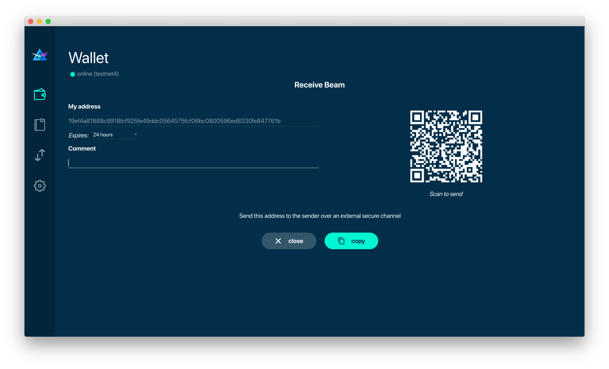
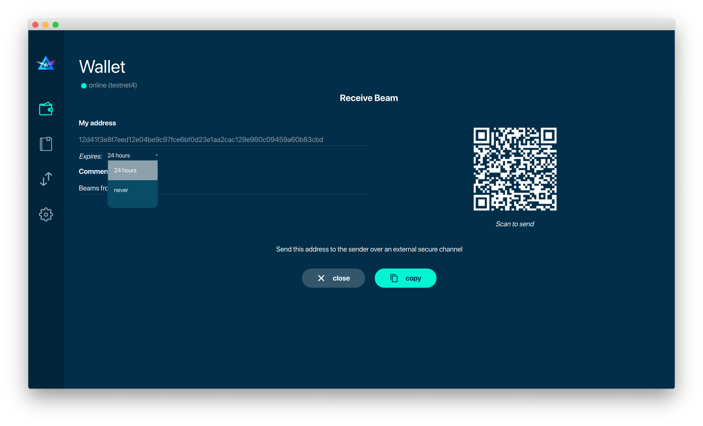
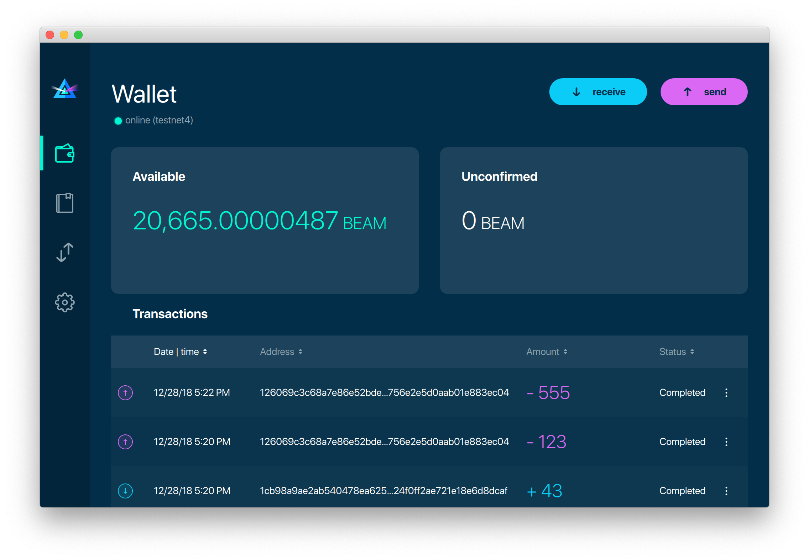
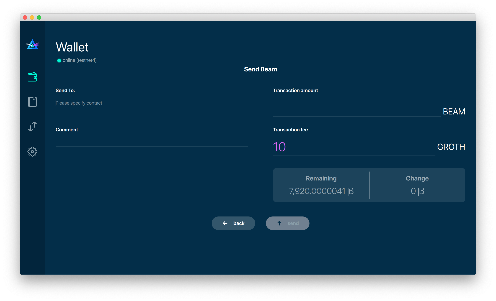
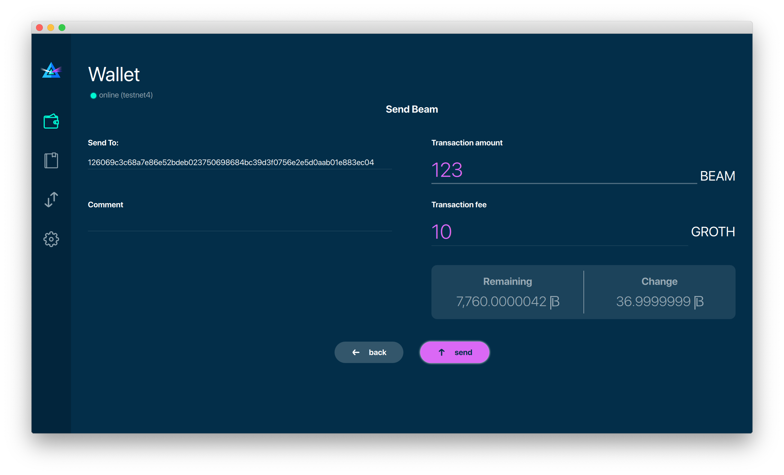
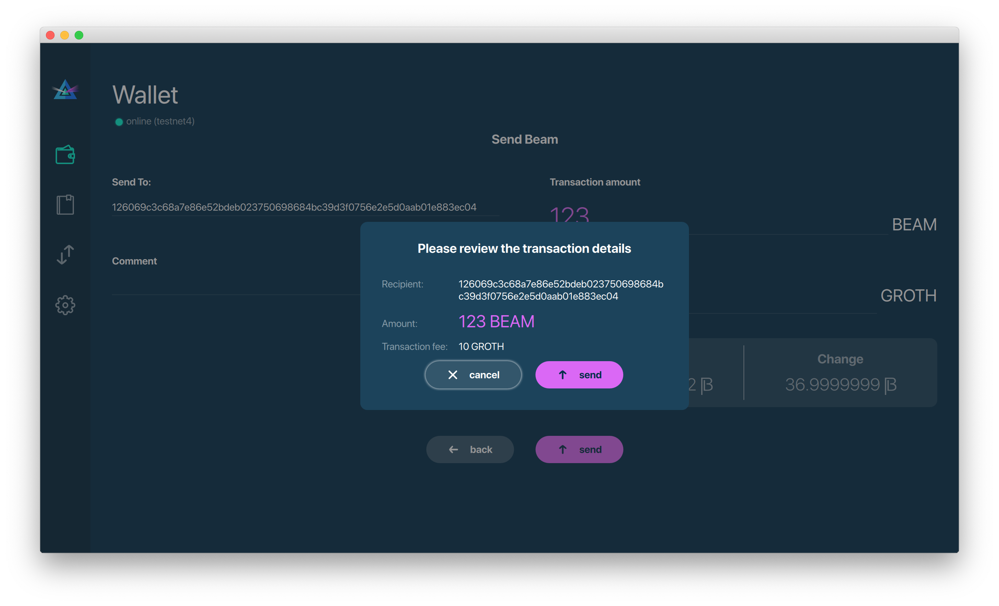
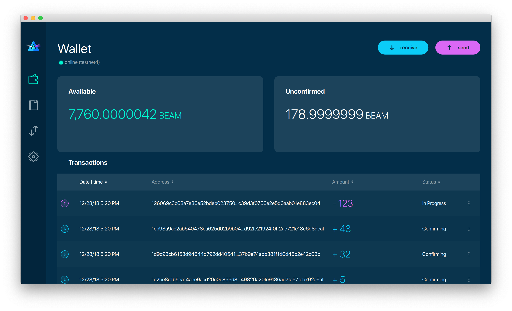
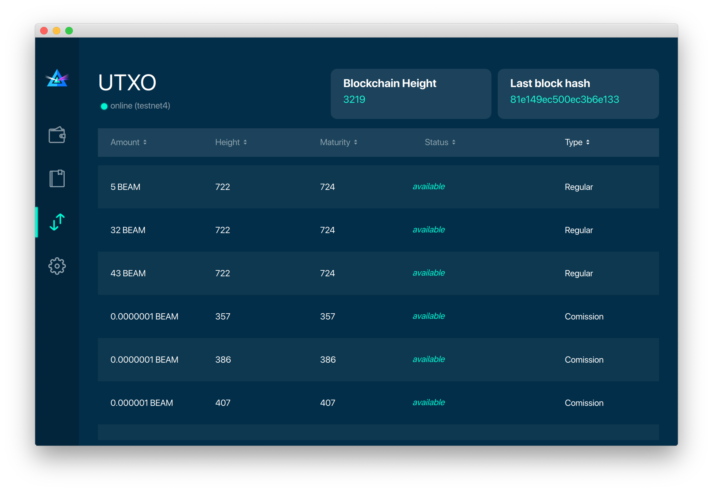

.. _user_desktop_wallet_guide:

.. warning:: The following document is still under construction and is subject to changes

.. _desktop_wallet_guide:

Desktop Wallet User Guide
=========================

Using Beam Dekstop Wallet is the simplest way to start using Beam. It is available for Linux, Mac and Windows platforms (see :ref:`supported platforms` for details). 

To download the Desktop Wallet for your platform go to http://beam.mw/downloads and follow instructions there.

Once the wallet is installed on your platform follow this guide 

Where are the files
-------------------

When Desktop Wallet is installed the walelt data files are stored separately from the binaries. 

The locations of all the files are described here: :ref:`files and locations`

Creating new wallet
-------------------

One you launch the wallet for the first time, you will be suggested to either create a new wallet or restore from existing seed phrase

.. figure:: images/desktop/1_create_restore_screen.png
   :alt: Choosing between new and restore

Click 'Create new wallet'. 

.. attention:: Restoring flow is covered in :ref:`restore desktop wallet from seed phrase` section of the :ref:`backup and restore` document

Generating seed phrase
----------------------

Wallet will generate a new :ref: `seed phrase` for you. Seed phrase is your secret that will allow you to restore your coins. It's the most important secret you have to keep.

.. figure:: images/desktop/2_new_wallet_screen.png
   :alt: Before generating seed phrase

.. warning:: Be careful when generating the seed phrase. It's for your eyes only. Always do it on a clear and air gapped machine.

.. figure:: images/desktop/3_new_wallet_phrase_screen.png
   :alt: Generating seed phrase

.. warning:: Always store your seed phrase in a safe and secure location. Write it on a piece of paper. Do not store electronically as plain text

.. figure:: images/desktop/4_new_wallet_phrase_confirm_screen.png
   :alt: Keeping seed phrase safe warning

In order to make sure that you have really wrote down your :ref:`seed phrase<seed phrase>`, the wallet will ask you to enter a selection of words from your phrase in random order.

When you type all the words correctly you will be allowed to proceed to the next step

Setting Wallet Password
-----------------------

Next thing you need to do is to set Wallet Password

.. figure:: images/desktop/8_new_wallet_password_screen_1.png
   :alt: New wallet password 

Wallet Password protects your wallet in case someone has access to your computer or has stolen your wallet database file. It is important to choose strong password that you can remember. The wallet will provide some indication of password strength for your convenience. Do not count on it however. Choose password that is at least 8 symbols long with combination of characters from different types, such as letters numbers and special symbols

.. figure:: images/desktop/10_new_wallet_strong_password_screen.png
   :alt: Example of strong password

Choosing Wallet Mode
--------------------

Beam Desktop Wallet can be run in one of three modes.

To run a local node from within the wallet choose the first option (recommended)

You can change the default port the node will be listening on, if necessary and, in case of CPU mining, set the amount of mining threads. You will be probably provided at least one default peer to connect to but you can always add more peers from the list of bootstrap nodes published in the `downloads section of Beam website <http://beam.mw/downloads>`_. 

Random mode allows you to automatically connect to random bootstrap node. In this mode Beam Wallet acts like 'light client', it will create transactions but will have to trust the remote node for blockchain verification. It is recommened for weaker devices.

.. figure:: images/desktop/12_new_wallet_mode_random_screen.png
   :alt: Start wallet in random mode  

If you are running your own node somewhere and want to connect specifically to it, use the third option by providing the IP and port the node is listening on.

Wallet Synchronization
----------------------

Once the Wallet is connected, it synchronizes the current blockchain data from the network. In case Beam Wallet is running with local node this process might take some time. The wallet will first download and validate the latest :ref: `macroblock` and then all the rest of the blockchain. 

.. figure:: images/desktop/14_new_wallet_sync_screen.png
   :alt: Start wallet in local mode  

Once synchronization is complete, you will see the Main Screen of the wallet

Main Screen
-----------

Main Screen of the wallet shows the current balance of both available and unconfirmed Beams as well as the transaction history. On the left, under the Beam logo, the is a toolbar that provides navigation between different wallet screens currently: Wallet (or Main Screen), Addresses, UTXO and Settings

Let's first go over them one by one.

In the top left corner of the Main Screen, under the screen title, you see connection indicator which shows whether the wallet could successfully connect to peers. In brackets, it specifies the network to which the wallet is connected. In the screenshot above it says '(master)' which means the wallet is connected to internal developers network, called masternet. In case of Testnet 4, it will say '(testnet4)'. If the wallet is unable to connect to the peer it will be shown by red indicator.

.. figure:: images/desktop/wallet_disconnected.png
   :alt: Wallet disconnected  

Send and Receive buttons are located in the top right corner, we will get back to the later when we will talk about sending and receiving Beam coins. There we wil also explain all the details regarding the difference between the Availble and Unconfirmed funds as well as the meanings of the fields in the Transactions table.

Address Screen
--------------

Addresses screen lists all SBBS addresses that were used in transactions. It's main use is for managing your interactions with other wallets. Add data in this screen is only stored locally and is not related to the blockchain in any way. 

Initially, one default listening address is created. Each address has a default expiration time of 24 hours, including the default address. You can always crete a new address using Receive dialog, as will be explained in the :ref: `Sending and Receiving Beams` section below.

.. attention:: It is highly recommended to create a new address for each transaction

You can explicitly delete the address by clicking on the three dots located to the right of the address and choosing 'Delete address' from the drop down menu

UTXO Screen
-----------

In Beam, like in most other cryptocurrencies, your balance is constructed as a result of transactions. Each Transaction uses some existing inputs and creates new outputs. All the outputs controlled by the wallet are shown in the UTXO screen.

Settings screen
---------------

Settings screen currently consists of four sections

.. figure:: images/desktop/18_settings_local_node.png
   :alt: Address screen

The Remote Node section (top left) is relevant in case the wallet is connected to a remote node and specifies IP address and port of that node.

The Local Node section (bottom left) is relevant in case wallet runs local node. In that section you can enable or disable local node (in case local node is disabled wallet connects to a remote node specified in the Remote Node section). When running local node you should specify the port on which the node will be listening on and the list of node peers. 

General Settings section allows to change walelt password and set the lock screen time, after which wallet will automatically logout to protect against accidental unauthorized access to a running wallet

The Report problem section allows to create an archive of wallet logs and explains how to report an issue. It also shows the current location of the walelt files. See more details about reporting issues and getting support in the :ref: `Reporting Issues and Getting Support` section.

.. attention:: In case the wallet crashes at start or when trying to create the log archive please refer to :ref: `Troubleshooting` section.

In the top right corner of the Settings screen is the wallet version. It is important to always specify the version when asking for support or reporting issues.

Sending and Receiving Beams
---------------------------

Let's start with the Receiving flow.

To receive Beams you shoul go to the Main Wallet screen and click on the blue 'Receive' button in the top right corner. This will open a Receive Dialog.

A new SBBS address is generated each time the dialog is open. You can copy and send the address to the Sending party via any available channel (email, Telegram etc...)

.. attention:: You have to click 'Close' button in the dialog for the address to become active

By default, each address is valid for 24 hours. You can explicitly set the expiration time to 'Never' by clicking on the 'Expires' dropdown.

.. attention:: The permanent addresses that never expire are only useful in very limited special cases, like working with exchanges and such. Never use this option for regular transactions, rather always create a new address for each transaction.

You also add a comment when creating the receiving address. The comment is never sent to the network, it is only visible inside your wallet and is used for internal bookkeeping only. 

Afer you are done, don't forget to click the 'Close' button to activate the address.

When the sending party receives your address and sends Beams, you will see a new Transaction appearing in the transaction list in the Main Wallet screen.

.. figure:: images/desktop/desktop_wallet_transaction_confirming.png
   :alt: Incoming transaction

Transaction will pass through the following stages:

* In Progress - during the phase when transaction is being created by the wallets

* Confirmiing - after transaction was sent to the nodes but before it was mined

* Completed - after transaction was mined 

Once transaction is completed the balance in the availabe tab will be updated

In order to Send Beams you will need to click on 'Send' button in Main Wallet screen. This will open a Send dialog.

In the Send To field you should paste the SBBS Address you have received from the person you want to send funds to. You may also choose to fill in the optional Comment field which will only be stored locally inside your wallet for bookkeeping purposes. 

Transaction amount is in Beam and may contain fractional values such as 1.25 Beam or 11.3 Beam and the like. 

Transaction fees are specified in Groth (100 millionths of a Beam). Amount of Fees you need to pay depends on the current status of the network and average fee sizes. If your fee will be significantly low than average and the network is loaded you will wait longer for your transaction to be mined. To determine the current average fee size you should use Beam :ref:`blockchain explorer`.

An example of such a dialog is shown below:

After you click 'Send' you will see a confirmation with all relevant transaction details

Once you confirm, the transaction is sent to the Receiver wallet. If Receiver wallet is currently offline or if the network is loaded you might see the transaction appear 'In Progress' in your transaction list. When the other party receives the transaction and comletes transaction creation, the transaction will be sent to the nodes and shown as 'Confirming'.

.. note:: While is in 'In Progress' state you can cancel it by clicking on the dropdown menu to the right of the transaction and then 'Cancel'. The other party will receive notification that transaction was either 'Cancelled' or 'Failed' and funds that were allocated for this tranaction will be released and become available again. **It is not possible to cancel a tranasctio in 'Confirming' or 'Completed' states.**

.. important:: Desktop Wallet automatically selects which UTXOs will be used for the transaction by trying to minimize the change you should receive as a result. This is important to understand since until transaction is complete, the UTXOs used in the transaction can not be used for any other transaction and do not appear in the list of 'Available' funds.

	For example if you have two UTXOs: 20 Beam and 10 Beam, and you want to send 9 Beam to someone, the wallet will automatically select the 10 Beam UTXO and create a transaction with 9 Beams sent and 1 Beam change. 

	However, if you have one large UTXO, say 100 Beams, and you want to pay 1 Beam to someone this UTXO will be locked until the 1 Beam transaction completes and you will have 0 (zero) available Beams. If Receiving party is offline, it might take a long time during which you will not be able to send Beams to anyone else. You can, of course, always cancel the transaction in this case. 

	One thing you can do is to split the large UTXO into two parts by sending a transaction to yourself (using you own SBBS address). You will however pay fees for this transaction.

.. attention:: **If the transaction was not sent to the nodes, for any reason, it will expire after 1440 blocks, or roughly 24 hours**

	This is done to avoid a situation in which one of the Wallets did not send a created tranaction to the nodes and the UTXOs remain locked forever

After some time your main wallet screen may look something like that:

The UTXO screen will show you exactly which UTXOs you own and what is their origin

.. figure:: images/desktop/desktop_wallet_utxo_screen_1.png
   :alt: Send dialog confirmation

The types of UTXOs can be either:

* Coinbase  - UTXO you have mined. It has maturity of 3 hours (240 blocks) and will not be immediately seen in Available tab
* Regular   - UTXO received as a result of a transaction. It is immediately available for spending
* Change    - UTXO received as a result as a change from a transaction spending a larger UTXO
* Comission - Fees received as a result of mining a block which contained transactions

Here is another example of UTXO screen with different UTXO types

