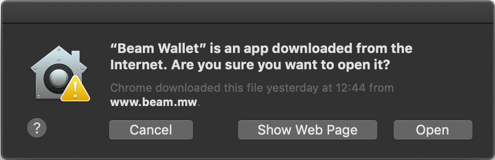
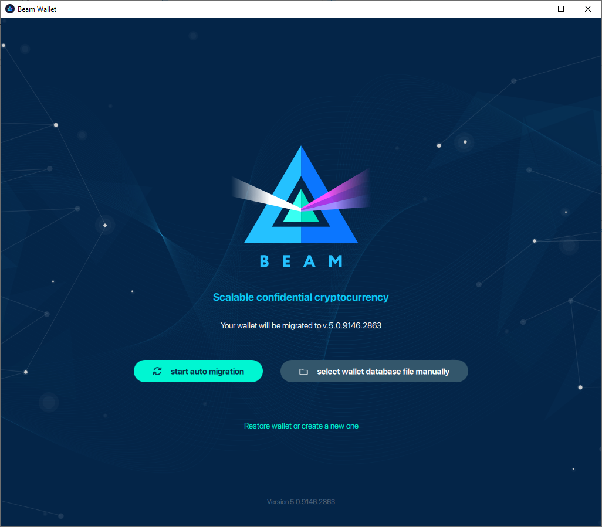
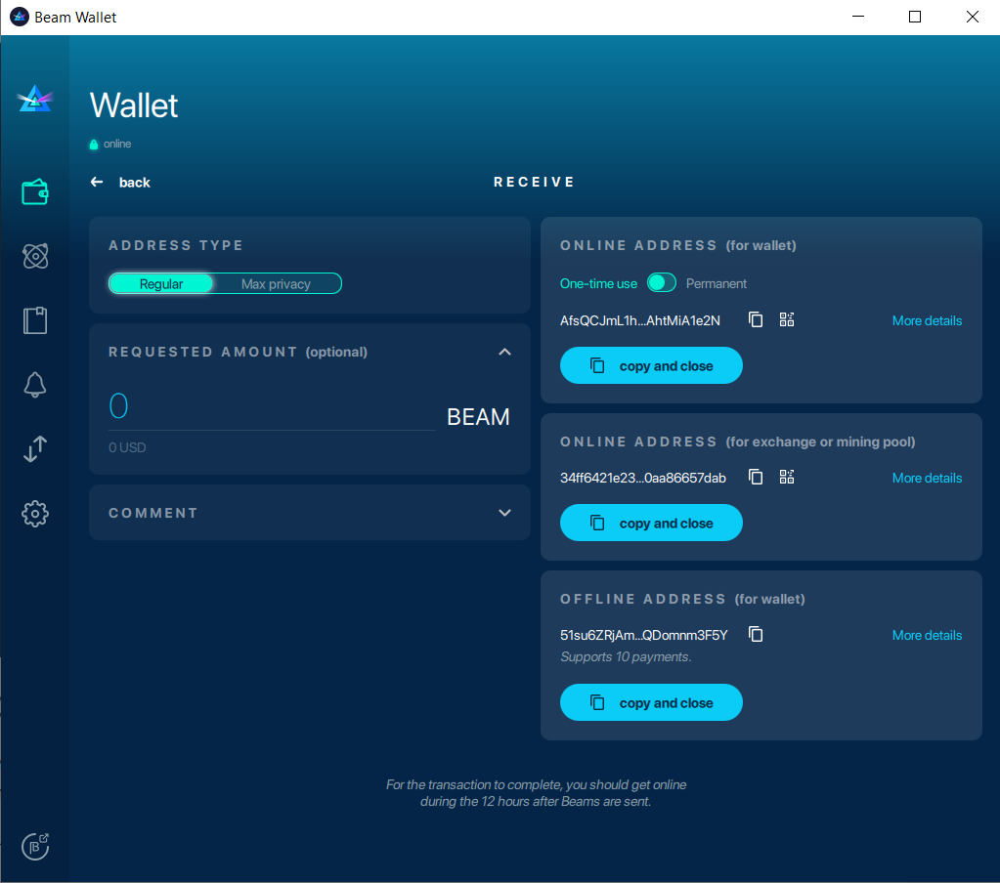
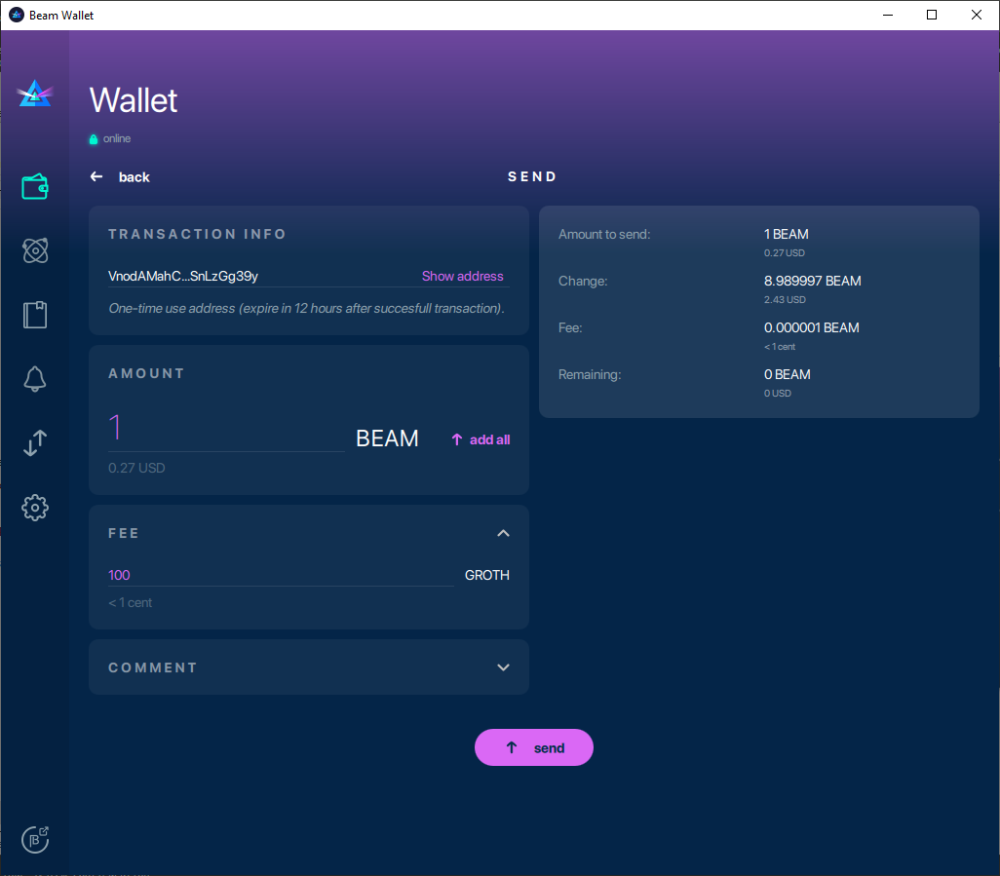
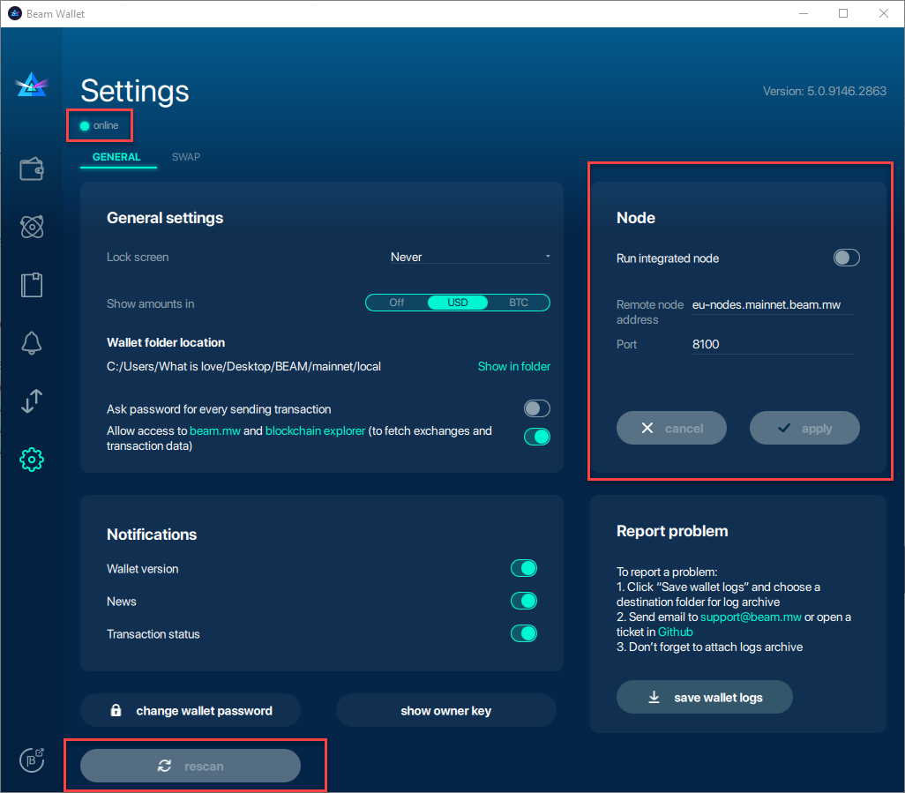

.. _user_desktop_wallet_guide:

.. _desktop_wallet_guide:

Desktop Wallet User Guide
=========================

Beam Desktop Wallet is the simplest way to start using Beam. It is available for Linux, Mac and Windows platforms (see :ref:`supported platforms` for details).

.. attention::

   Beam blockchain does not store transaction history and SBBS addresses. These are only stored in local database inside the wallet data folder.

   Please follow these guidelines below to avoid problems with sending are receiving Beam transactions.

   1. Do not copy the wallet.db to another machine and run another wallet simultaneously using the same wallet database

   2. Do not run two different wallets with the same seed at the same time

   3. SBBS messages sent between wallets expire after 12 hours. You have to connect within 12 hours of the transaction initiation to receive or send the funds.

   4. Always use 'Permanent address' and choose 'ONLINE ADDRESS (for exchanges and mining pools)' with pools and exchanges to make sure you receive payments.

Downloading binaries
--------------------

Start downloading here: https://www.beam.mw/downloads/mainnet

Ensure that the communication between your browser and Beam's official website is encrypted by verifying that the padlock icon is displayed in its locked state on the URL bar.

Download the Beam wallet app for your platform (Mac, Linux or Windows):

.. note::Ensure that you’ve downloaded the untampered Wallet installation file by checking that the value generated by SHA256 is the same as announced on the Beam official site:

* On Mac open terminal and run: ``shasum -a 256 <file>``
* On Linux run: ``sha256sum <file>``
* On Windows, open Power Shell and run: ``Get-FileHash 'C:\Users\<your_user_name>\Downloads\beam-node-1.0.3860.zip``
* Or open Command Prompt and run: ``certutil -hashfile “C:\Users\<your_user_name>\Downloads\Beam-Wallet-5.0.9146.2863.exe” sha256``

Substitute your own path instead of the one in the example above.

.. note:: As the wallet will be continuously updated, the actual version numbers and SHA values might be different from the screenshot at the moment of reading.

Installing the desktop app
--------------------------

Once the application image is downloaded, double-click the icon to start the installation.

Windows
-------

When you click on the .exe file installer will run. On the opened screen you’ll see a default path to wallet, which you can change using action menu. Also it suggests you to read Licenses Terms and conditions. Please read carefully and click ‘agree and install’.

   

Wait until installing will be finished

Press 'run wallet' to start working with wallet

Mac
---

When you click on the .dmg file you will see a screen with Disclaimer and End User License Agreement. Please read carefully and click 'Agree'.

.. figure:: images/desktop/02_installing/01.png
   :alt: Mac EULA

On the next screen, drag the Beam Wallet icon into the Applications folder to install.

When you will try to open the wallet for the first time, you will receive a security warning stating that Beam Wallet was created by an unrecognized developer. We are working to eliminate the warning, meanwhile follow the steps below to launch Beam Wallet app on your Mac.

Open 'System Preferences'.

Locate and click 'Security & Privacy' settings.

.. figure:: images/desktop/02_installing/04.png
   :alt: Mac Security

Click the lock icon in the bottom left corner of the dialog to unlock.

.. figure:: images/desktop/02_installing/05.png
   :alt: Mac Security

Change the 'Allow apps downloaded from' setting from 'App Store' to 'App Store and identified developers'. Click the lock icon again when done making changes.

.. figure:: images/desktop/02_installing/06.png
   :alt: Mac Security

Now, launch the Beam Wallet from the Applications folder. When notification appears, click 'Open'.

Where are the files?
--------------------

Once Beam Wallet desktop app is installed, the wallet data files are stored separately from the binaries.

The locations of all the files are described here: :ref:`Files and locations`

.. note:: When the Beam wallet app is running, right click on it and select *Options | Keep in dock* for easy access of the app in the future.

Creating new wallet
-------------------

Once you launch the wallet for the first time, click 'Create new wallet'

Generating seed phrase
----------------------

As a part of creating a new wallet, a new seed phrase will be generated for you.

.. attention:: Seed phrase is the **most important secret you have to keep**. Knowing the seed phrase enables you (or anyone else) to access all your funds.

.. attention:: Seed phrase in the Beam wallet is *not* linked to email, phone number or any other identifier. You will need this phrase to restore your wallet when you lose or reformat your device, or want to access your funds from another device (your mobile phone or another desktop / laptop).

.. attention:: The seed phrase is **for your eyes only**! Make sure no one is looking over your shoulder. For the best security always generate it on a clean air-gapped machine.

Did you wrote down your seed phrase correctly? Triple-check your handwriting again. The difference between *_F_unnel* and *_T_unnel* can be crucial when trying to restore a wallet with valuable funds in the far or near future.

Did you verified your handwriting? Now go find a safe space for the paper!

.. important:: Storing the seed phrase on your computer makes your funds prone to cyber attacks (read: much *less* secure). 'Creative' approaches like saving a screenshot of the wallet or your handwriting on your computer or in the cloud *may* sound like a good idea, but it is absolutely **not recommended**. If hackers get the access to your computer, network drive etc., they can can potentially steal your seed phrase by using OCR programs (which can scan pictures and transform them into plain text) and, therefore, get access to your funds.

.. attention:: Always store your seed phrase in a safe and secure location (and better more than one in different geo locations). Write it on a piece of paper. Do not store electronically neither as plain text nor in any other form!

In order to ensure that you have really written down your seed phrase, you will be asked to fill in the specific words from your seed phrase in random order.

Only when you typed all the selected words correctly, you will be allowed to proceed to the next step.

Setting wallet password
-----------------------

To access your Beam Wallet, you will need to create a password. This password is not the same as the seed phrase. Seed phrase identifies a wallet and enables access to all the funds stored in it from any device. Your wallet password provides with a second security layer in case someone gains access to your computer or has stolen your wallet database file. It is important to choose a strong password.

The wallet will provide some indication of password strength for your convenience. Do not count on it, however. Choose a password that is at least 8 characters long with a combination of letters, numbers, and symbols.

Choosing the node connectivity mode
-----------------------------------

Beam Desktop Wallet can connect to the network through:

* Integrated node
* Random remote node
* Specific remote node

If you choose to run an integrated node from within the wallet, the trusted node will automatically verify the blockchain. This means you will automatically be connected to a node when you open your wallet.

.. note:: When running behind a firewall you can change the default port the node will be listening on. You will be probably provided at least one default peer to connect to but you can always add more peers on the Settings screen. The recommended peers are published in the list of bootstrap nodes in the `downloads page <https://www.beam.mw/downloads/mainnet>`_ on `Beam official website <https://beam.mw>`_.

Random mode allows you to automatically connect to random bootstrap node. In this mode Beam Wallet acts like a ‘light client’, it will create transactions but will have to trust the remote node for blockchain verification. It is recommended for lighter devices with limited CPU power and/or RAM memory.

If you are running your own node somewhere (or maybe even more than one) and want to connect specifically to it, use the third option by providing the IP and port the node is listening on.

Synchronizing the wallet
------------------------

Once the wallet is connected, it synchronizes with the current blockchain state from the network. Be patient when running with the integrated node: the data downloading process might take some time. The wallet will first download and validate the latest :ref:`macroblock` and then all the rest of the blockchain.

.. _upgrading:

Upgrading from previous version
-------------------------------

If during installation the wallet discovers one or more previous versions installed it will propose to migrate to a new version

If you do not wish to migrate an existing wallet, you can also create a new wallet or choose the location of the wallet database file yourself by clicking ‘Restore wallet or create a new one’

.. note:: Migration will copy the existing wallet database (wallet.db) keeping all the data intact.

If you choose ‘start auto migration’, in the next screen you will be asked to choose which wallet database file you want to migrate. For manually using choose ‘Select wallet database file manually’ option.

Once file is selected, click 'next' to enter database password.

.. figure:: images/desktop/upgrade/03.png
   :alt: Starting the migration

Once you enter the correct password, the migration will complete and the wallet will resume synchronization with the blockchain.

Main screen
-----------

Once your wallet is created, the main screen will show up. The main screen of the wallet shows the current balance in the Amount status field as well as the transaction history and statuses. There several transactions tabs All, In progress, Sent, Receive. Also on the right corner of this tabs there are searching bar, export csv file and payment proof verification buttons. On the left, under the Beam logo, there is a toolbar that provides navigation between different wallet screens such as `Main Screen`, `Atomic Swaps screen`, `Addresses Screen`, `Notifications Screen`, `UTXO Screen` and `Settings Screen`.

Wallet status indicator
-----------------------

In the top left corner of the Main Screen, under 'Wallet', you see connection status indicator.

Green indicator means that the node is up and running connected to peers.

.. figure:: images/desktop/04_main_screen/02.jpg
   :alt: Main screen

.. note:: For integrated node indicator has lock shape.

   
Red means it is either unable to connect to the node or the node has a problem you can help to solve.

.. figure:: images/desktop/04_main_screen/03.jpg
   :alt: Wallet disconnected

In brackets, the indicator also specifies the network to which the wallet is connected:

* **Mainnet:** the network with real money and actual transactions.
* **Testnet:** staging environments for trying new features in our wallet, node and miner software. For advanced users only.
* **Masternet:** new features under development, if you see this name in your wallet it means that you are very early adopter or Beam code contributor otherwise you’ve probably arrived to the wrong place.

.. attention:: Since Mainnet is the default network for the vast majority of Beam users, nothing is written by the online status.

Finally, node connectivity node is displayed (ie. integrated, random remote node or specific node).

Main screen password
--------------------

The main screen will pop-up automatically after you open the application and type in your password on this screen.

Financial transactions
----------------------

‘Send’ and ‘Receive’ buttons at the top right corner help us `Sending BEAM`_ and `Receiving BEAM`_.

Receiving BEAM
--------------

Before starting to receive BEAM for the first time, please read first about what :ref:`address` is.

Here is how the process of receiving BEAM looks like from a Receiver’s perspective:

* Generate an address
* Send your address to the Sender person **over a secure communication channel**

Generate an address
-------------------

Proceed to the main screen and click the blue ‘Receive’ button at the top right corner. This will open the receive screen.

Choose between 'Regular' and 'Max privacy' transaction modes

In the 'Regular' mode: 

If you expect to receive transaction once from another Beam wallet: 

   1. Leave the address type selector in 'One-time use' position. This adddress is good for one transaction only.
   2. Click 'copy and close' in the 'ONLINE ADDRESS (for wallet)' pane on the right.
.. note:: The address will be created with the expiration period ‘24 hours’ from the current time.

If you expect to receive transactions from another Beam wallet on regular basis:

   1. Switch the ONLINE address type selector to the 'Permanent' position. This adderess can be used in multiple transactions.
   2. Click 'copy and close' in the 'ONLINE ADDRESS (for wallet)'  pane on the right. 
.. note:: The address will be created with the expiration period ‘Never’. That means that address will live forever.

If you expect to receive transaction from exchange or pool

   1. Navigate to 'ONLINE ADDRESS (for exchange or mining pool)' pane on the right. This address can be used in multiple transactions.
   2. Click 'copy and close' in the 'ONLINE ADDRESS (for exchange or mining pool)'  pane on the right.

If you expect to receive Offline transactions from another Beam wallet: 

   1. Navigate to 'OFFLINE ADDRESS (for wallet)' pane on the right. This address can be used in multiple transactions.
   2. Click 'copy and close' in the 'OFFLINE ADDRESS (for wallets)' pane on the right
   
  .. note:: Each offline address is good for ten offline payments (aka vouchers). When payments run out, the Sender wallet will automatically send request for more payments to the Receiver wallet using SBBS. If Receiver wallet is online within 12 hours of the request (until the SBBS message expires) it will send 30 more offline payment vouchers to the sender. Otherwise, Sender will receive notification that there are no more vouchers and will have to request another offline address via external channel. 
   
   
PUBLIC OFFLINE ADDRESS

Public Offline is used if you expect to receive offline transactions from another Beam wallets on regular basis.This address can be used in multiple transactions.
Example: Used Public offline addresses for collecting donations while your wallet is completely offline

   1. Navigate to `Settings screen`_. 
   2. Сlick on 'Utilities' to expand the form
   3. Click 'SHOW PUBLIC OFFLINE ADDRESS'
   4. Click 'copy and close' on the openned pop-up OR if the Sender uses a mobile app, he can quickly scan the QR code instead of receiving, copying and pasting the alphanumeric address.
   
.. note:: The address will be created with the expiration period ‘Never’. That means that address will live forever.

.. attention:: To generate and receive Offline funds either to Offline address either to Public offline address make sure that you're connected to the integrated node.
.. attention:: You will pay a fee for this transactions. 1 000 100 GROTH for sending an offline transaction and an additional 1 000 000 GROTH for each Shielded UTXO if sending amount included it 
.. attention:: The sender of funds to a receiver's Public Offline Address might be able to know that those funds are later being used by the receiver. Beam wallet and Beam explorer do not expose such functionality but it's possible to derive this information by analyzing the Blockchain.

In the 'Max privacy' mode: 
...

If you want to view the address before sending it over, click on 'More details' in the relevant pane on the right

Send copied address to the other side via a **secure communication channel**

Each time the Receive Beam dialog is open, a new Beam address is generated. 

QR code
-------

If the Sender uses a mobile app, he can quickly scan the QR code instead of receiving, copying and pasting the alphanumeric address. To do that click on the QR code icon on one of the right pane

Request
-------

When creating an address you can specify the requested amount directly in the Receive dialog. This amount will be embedded in the address and automatically filled into the Send dialog.

Comment
-------

You can add a comment when creating the receiving address. The comment is never sent to the network, it is only visible inside your wallet and is used for internal bookkeeping only.

The comment can be seen on the `Address screen`_ and in the extended transaction view.

Sending the address
-------------------

.. attention:: When sending the address make sure you use a secure communication channel.

.. attention:: Make sure the entire address is sent to the Sender as it’s longer than it appears on the screen. *Don’t forget* to double check the value in whichever messenger app of your choice because viruses and malware on your computer may change your address while it’s in the clipboard.

Completing the transaction
--------------------------

Once Sender initiates the transaction, you will see on the new transaction appear in the transaction list on the main screen. The amount sent will also appear on extended Amount status field. 

Normally, a transaction will pass through the following stages:

* **Waiting for counterparty (receiver, sender)** - the phase when the transaction is being created by the Sending and Receiving wallets.
* **In Progress** - the phase after the transaction was sent to the nodes, but before it is mined.
* **Completed (sent, received)** - the phase after the transaction is fully mined and confirmed.

Once transaction is complete, the available balance will be updated and the Amount status field will be in normal condition.

Sending BEAM
------------

Before starting to send BEAM, please read first about what :ref:`address` is.

Here is how the process of sending BEAM looks like from a Sender’s perspective:

* Receive the address the funds should be sent to
* Send BEAM to Receiver
* Stay online until Receiver confirms the transaction

Receiving the address
---------------------

.. attention:: Make sure that the address is received untampered by using a **secure communication channel**.

.. attention:: When copying the address to the Beam Wallet app please verify visually that the address in the wallet looks exactly like the address in the secure messaging app, because viruses and malware on your computer may change your address while it’s in the clipboard.

Sending funds
-------------

In order to send BEAM, you will need to click the magenta ‘Send’ button at the top right corner. This will open the Send screen.

Make sure you have the correct address and paste the Receiver’s Beam address in the 'Send To' field.

The address type will be automatically recognized by the wallet and displayed in the Send dialog, so that the Sender will immediately see which transaction type was requested.

To help to identify the transaction, you may also choose to fill in the optional Comment field. The comment will remind you what or who the transaction is for. The comment is stored locally, thus it will only be visible in your wallet for bookkeeping purposes.

The comment can be seen on the `Address screen`_ and in transaction details on the main screen.

Select the transaction amount in BEAM you want to send. Transaction amount is in BEAM and may contain fractional values such as 1.25 BEAM or 11.3 BEAM and the like. Keep in mind you also have to pay a transaction fee, hence the amount to send plus the fee must be equal to or less than the available balance.

Transaction fees are specified in GROTH (100 millionths of BEAM).The minimum fee is 100 GROTH and an additional 1 000 000 GROTH for each Shielded UTXO if sending amount included it, it’s set by default but the higher transaction fee will help miners to prioritize your transaction. 

You can see the remaining amount of BEAM in your wallet and the change that will be received after the transaction.

After you click ‘Send’ you will see a confirmation transaction details popup with the most important transaction details:

   
It’s also can require the password if this function was turned on in the settings. 

Completing the transaction
--------------------------

Once you confirm, the transaction is sent to the Receiver's wallet. 

For Regular transactions, if Receiver's wallet is currently offline or if the network is loaded, you might see the transaction appear ‘Waiting for receiver’ accordingly on your transaction list. Once the transaction is starting, it will be sent to the nodes and shown as ‘In progress’.

.. note:: While a transaction is in ‘Waiting for receiver’ you can cancel it by clicking on the dropdown to the right of the transaction row and then select ‘Cancel’. The other party will receive notification that the transaction was either ‘Cancelled’ or ‘Expired,’ and funds plus fee that were allocated for this transaction will become available again. It is not possible to cancel a transaction in ‘In progress’ or ‘Sent’ states. It is also not possible to cancel 'Offline' transactions.

.. warning:: If your transaction appears as ‘Waiting for receiver’ for a long time, it means the Receiver is not online.

.. attention:: If the transaction was not sent to the nodes, for any reason, it will expire after 720 blocks, or roughly 12 hours. This is done to avoid a situation in which UTXO is locked forever.

Restoring funds
---------------

This process allows you to restore your funds directly from the blockchain. It is useful in the scenarios such as:

* You’ve got a new device and would like to use your wallet on it
* You forgot your local password and can’t access your funds

.. attention:: With Beam, only funds are stored on the blockchain. Everything else, such as your active addresses, contacts or transaction history can’t be restored.

.. note:: Very soon exporting transactions history for backup and bookkeeping purposes will be implemented.

Start the BEAM desktop wallet app and press 'Restore wallet' button.

Confirm to continue restore.

You will be asked to enter your seed phrase. Time to get the phrase out from your safe locker and type the words in.

.. warning:: If a wrong word was typed or an existing word was misspelled, your funds will not be restored successfully. Example: ‘litt\_el_’ instead of ‘lit\_le\_.'

Did you checked your spelling? Once you are sure, click 'next'.

.. note:: Read accurately and remember information on all popups which you see. It'll keep you out of any trouble.

Press 'I understand'

.. figure:: images/desktop/07_restoring_funds/07.png
   :alt: Do not simultaneously run two wallets popup
   
.. warning:: For the restore process it’s necessary to run an integrated node. It’s not possible to restore a wallet using a random remote node or specific remote node.

Enter correct port and press 'restore wallet' button 

Upon completion, you’ll see the main screen of the wallet with your restored funds.

.. note:: Please be patient, restoring funds is a thorough and time consuming operation.

.. attention:: If the available balance is zero, it means that one or more words from your seed phrase weren’t typed correctly or are wrong.

Address
-------

BEAM Address is a collection of parameters encoded into an alphanumeric string and used to conveniently pack information needed to send and recive Beam coins and Confidential Assets.

An Address has the following parameters

* SBBS Key (or SBBS Address) - a public key created by Receiver and used by Sender to encrypt the tranasction information in a way that ONLY the Receiver can detect and decrypt this information. SBBS
   * SBBS Keys can be either one time or permanent. 
   * A wallet can generate any amount of keys of either type but the differnce is that 'one time' keys are discarded after the first transaction received for this key, while 'permanent' keys are stored in the wallet forever. 

* Transaction type - Beam wallet currently supports 'Regular' and 'Offline' transactions
* Requested amount - the Receiver can optionally specify a requested transaction amount, which non binding and can be changed by the receiver

.. note:: Both one time and permanent SBBS keys are the same in terms of the privacy they provide. However, the more permanent keys you have the more time it will take to the wallet to decrypt SBBS communications. The only reason to use the 'permanent' keys is for exchanges, pools and other entities where the keys can not be easily updated for each transaction.

Address screen
--------------

The screen lists all the addresses that were used in all incoming and outgoing transactions. All the data in this screen is only stored locally in your wallet and is not related to the blockchain in any way.

.. note:: For your own privacy, a new address is generated for each outgoing transaction. Yes, you heard that right! That address can be seen in your active or expired addresses list.

Upon Beam Wallet desktop app installation, a single address is created by default. The address has a default expiration time of 24 hours.

You can always create a new one by using Receive Screen. You can see all your active addresses in the ‘My Active Addresses’ tab. You can do it on the main screen by clicking the blue ‘Receive’ button at the top right corner, which will open the receive screen. And after closing this screen, address will be added to Addresses Screen.

Once an expired address becomes inactive, it cannot be used in any incoming or outgoing transaction. Each address has a default expiration time of 24 hours, including the default address. An expired address becomes inactive and you won’t be able to be use it again. You can see the expired addresses listed under ‘My Expired Addresses.

When you'll click the three dots located to the right of any address, the menu with additional address actions will open. You can manually edit or delete any address choosing 'Edit' or 'Delete' from the menu.

You can manually expire any active address by choosing ‘Expire address’ from the drop down menu. It opens Edit address popup, where there is an option to expire address, change expiration time or give it a comment. The save button is greyed out by default, after some changes it will be active.

For privacy concerns, you can manually delete any address by clicking the three dots located to the right of the address and choosing ‘Delete address’ from the drop down menu.

In the ‘Contacts’ tab, you can see every address that sent you BEAM or to which you’ve sent BEAM to.

UTXO
----

UTXO (Unspent Transaction (TX) Output) is like a banknote of a specific amount. Simply said, if BEAM is the currency, any UTXO can be considered a ‘bill’. You can have multiple ‘bills’ in your wallet at the same time.

UTXO screen
-----------

On the technical level, in Beam, like in most other cryptocurrencies, your balance emerges as a result of multiple incoming and outgoing transactions. Each transaction uses some existing inputs and creates new outputs. All the outputs controlled by the wallet are shown in the UTXO screen.

.. figure:: images/desktop/09_utxo_screen/01.png
   :alt: UTXO screen

The type of UTXO can be:

* **Regular** - UTXO received as a result of a transaction. It is immediately available for spending
* **Change** - UTXO received as a result of change from a transaction. It is immediately available for spending
* **Transaction fee** - Fees received as a result of mining a block which contain transactions
* **Coinbase** - UTXO you have mined. It has maturity of 3 hours (240 blocks) and will not be immediately seen in Available tab
* **Shielded** - UTXO received as a result of a Offline or Max privacy transaction. Offline is immediately available for spending, meanwhile how to max privacy can be immediately available( no limit) or locked by "Max privacy longest transaction time" parameter on settings screen

UTXO in sending BEAM screen (explained by example)
--------------------------------------------------

Assume that you have 1 BEAM in a single ‘bill’. So, if you want to send to Alice 0.1 BEAM, your single ‘bill’ will be split into one ‘bill’ of 0.1 BEAM to send and another ‘bill’ of 0.9 BEAM to remain in your wallet, right? Well, almost: we also have to consider the transaction fee. Let’s say the transaction fee is default (100 GROTH), so in this case the ‘bill’ will be split into 3 ‘bills’ (0.1 BEAM to send, 0,899999 BEAM to remain in your wallet and 0.000001 BEAM to pay fee).

Why UTXO can be locked
----------------------

.. important:: Beam Wallet app automatically selects which UTXO will be used for the transaction by trying to minimize the change you should receive as a result. This is important to understand since until the transaction is complete, the UTXOs used in the transaction cannot be used for any other transaction and do not appear in the list of ‘Available’ funds.

Example: you have 1 BEAM in two ‘bills’ (UTXO): 0.9 BEAM and 0.1 BEAM. You want to send Alice 0.09 BEAM. The wallet will automatically select the 0.1 Beam UTXO and create a transaction with 0.09 BEAM sent, 0.009999 BEAM to remain in your wallet and 0.000001 BEAM to pay fee.

This 0.1 BEAM UTXO will be locked until the 0.09 BEAM transaction completes. If Alice is currently offline, it might take a time during which you will not be able to send BEAM to anyone else. You can, of course, cancel the transaction and resend when Alice comes online.

You can split UTXO by yourself
-------------------------------

One thing you can do is to split UTXO by sending a transaction to yourself (using you own active address). You may want to do this in the case your UTXO is too large, and you don't want it all locked during a transaction.

.. attention:: You will pay a fee for this transaction.

Settings screen
---------------

.. note:: At the top right corner of the screen the version is displayed. It is always important to specify the version when asking for support or reporting issues.

The ‘General settings’ section allows you to get access to external links, setup additional displaying of amount in other currencies and lock screen time. The Wallet will automatically lock to protect the funds from accidental unauthorized access to an active wallet in the set time you choose. Also, in this section you can see the current location of the wallet files.

The ‘Notifications’ section allows turned in and off some notifications in your wallet.

For integrated and external nodes settings see `Choosing the node connectivity mode`_. When running integrated node you should specify the port on which the node will be listening on and the list of node peers.

The ‘Report problem’ section allows you to create an archive of wallet logs and explains how to report an issue. See more details about reporting issues and getting support in the `Reporting Issues and Getting Support` and `Desktop Wallet Troubleshooting` sections.

Besides all sections, there are three buttons: ‘change wallet password’, ‘show owner key’ and ‘rescan’, which actions described below.

Change wallet password
----------------------

You can change your password using this button, which lead to change password popup. Remember, that password cannot be the same as old. Enter all fields with correct data and press ‘change password’ button to finish this action.

Show owner key
--------------

The purpose of the owner key is to allow all nodes mining for you to be aware of all mining rewards mined by other nodes so that you would only need to connect to one node to collect all the rewards into your wallet. The owner key should be kept secret owner key does not allow to spend coins, however it will allow to see all coins mined for you by all miners that use this owner key.
Pressing 'show owner key' opens popup, which will require to enter password. When you enter correct password you will show popup with owner key, which you can paste to own node.

   

Swap settings
-------------
   
Under the name of this screen at the left corner of the screen you can turn on swap settings. More information about it is in the 'Atomic Swaps using Desktop Wallet' section (see :ref:`atomic swaps` for details).

.. _proof_of_transaction:

Proof of transaction
--------------------

Starting from version 2.0, receiver wallet automatically signs proof of received transaction and sends it to the sender. Proof of transaction will be added to the outcoming transaction that was successfully completed (transaction's status is 'sent'). Proof of transaction is not available for transaction with different status ('expired', 'failed', 'completed', 'received'). Upon request, sender can observe proof of transaction following the procedure below:

1. Click outcoming transaction from the list of transactions:

.. figure:: images/desktop/proof_of_transaction/01.png
   :alt: Proof of transaction (the list of transactions)

2. Click 'Details' button under Payment proof:

3. Send payment proof code to the receiver. Copy it by clicking 'Copy code' button at 'Payment proof' form, or 'Copy' button in transactions details:

Payment proof code:

::

   023e0296feaab9215b0a3ef38fc676a4ca9e37b56ee511da60638cf1a60b5076db82b0020b02accba10ece79c60bf6828ae382b850853ebd67df4cb16bd4ddfcd7e42db86dfe0400e1f50541c1ee5f408f8ce2d590bfccac0a0c5a4bb6a48fa3c9c6a4dac855bb1bf1358757b17c97d3c20de34776a51a0c8ab793b9662018a9568465aeaaebff3d29d491005b9d81958849fc6a60726d051827fa2ad288edf97251617898fabfd2129aff07

4. Receiver can verify that proof is correct by clicking 'Payment proof verification' icon at the top right of the transatctions' list:

5. And pasting payment proof code into the form:

.. _rescan:

Rescan wallet
-------------

During regular operation the wallet constantly monitors the blockchain and updates the information in the wallet.
However, if you suspect that your balance, transaction or UTXO status is not up to date or invalid, you can always 'rescan' the blockchain and update the information in your wallet with the latest state.

.. note:: Rescan is available only for integrated node.

To perform rescan please perform the following steps:

1. In the Settings page, switch to the 'Local node' and click 'Apply settings'

2. Click on the 'Rescan' button and then 'Yes'

.. figure:: images/desktop/rescan/03.png
   :alt: Click on the rescan button

3. Verify that your balance, transaction and UTXO state are up to date.

.. warning:: In most cases the wallet rescanned immediately, so you can check you balance right after you’ve pressed ‘rescan’ button. The rescan speed depends on UTXO value. 

.. note:: If you have just started the node it may take some time for it to download updates from the blockchain and synchronize. This may result in your balance and UTXOs to be gradually updated and the node synchronizes. Please for the sync to complete before drawing any conclusions about the state of your wallet
