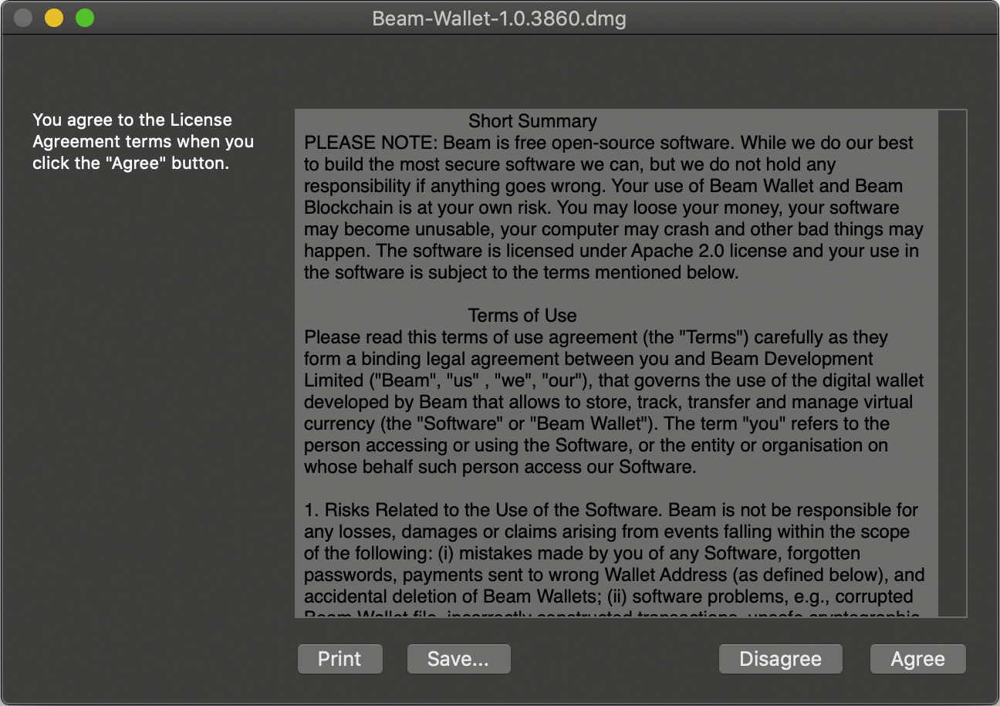

.. _user_desktop_wallet_guide:

.. warning:: The following document is still under construction and is subject to changes.

.. _desktop_wallet_guide:

Desktop Wallet User Guide
=========================

Using Beam Desktop Wallet is the simplest way to start using Beam. It is available for Linux, Mac and Windows platforms (see :ref:`supported platforms` for details).

.. attention::

   Beam blockchain does not store transaction history and SBBS addresses. These are only stored in local database inside the wallet data folder.

   Please follow the guidelines below to avoid problems with sending are receiving Beam transactions.

   1. Do not copy the wallet.db to another machine and run another wallet simultaneously using the same wallet database

   2. Do not run two different wallets with the same seed at the same time

   3. SBBS messages sent between wallets expire after 12 hours. You have to connect within 12 hours of the transaction initiation to receive or send the funds.

   4. SBBS Addresses by default expire after 24 hours. Always use 'never' expiring addresses with pools and exchanges to make sure you receive payments.

Downloading binaries
--------------------

Start downloading here: https://www.beam.mw/downloads/mainnet

Ensure that the communication between your browser and Beam's official website is encrypted by verifying that the padlock icon is displayed in its locked state on the URL bar.

Download the Beam wallet app for your platform (Mac, Linux or Windows):

.. note::Ensure that you’ve downloaded the untampered Wallet installation file by checking that the value generated by SHA256 is the same as announced on the Beam official site:

* On Mac open terminal and run: ``shasum -a 256 <file>``
* On Linux run: ``sha256sum <file>``
* On Windows, open Power Shell and run: ``Get-FileHash 'C:\Users\<your_user_name>\Downloads\beam-node-1.0.3860.zip``

Substitute your own path instead of the one in the example above.

.. note:: As the wallet will be continuously updated, the actual version numbers and SHA values might be different from the screenshot at the moment of reading.

Installing the desktop app
--------------------------

Once the application image is downloaded, double-click the icon to start the installation.

Mac
---

When you click on the .dmg file you will see a screen with Disclaimer and End User License Agreement. Please read carefully and click 'Agree'.

On the next screen, drag the Beam Wallet icon into the Applications folder to install.

.. figure:: images/desktop/02_installing/02.png
   :alt: Mac Install

When you will try to open the wallet for the first time, you will receive a security warning stating that Beam Wallet was created by an unrecognized developer. We are working to eliminate the warning, meanwhile follow the steps below to launch Beam Wallet app on your Mac.

Open 'System Preferences'.

.. figure:: images/desktop/02_installing/03.png
   :alt: Mac Security

Locate and click 'Security & Privacy' settings.

Click the lock icon in the bottom left corner of the dialog to unlock.

Change the 'Allow apps downloaded from' setting from 'App Store' to 'App Store and identified developers'. Click the lock icon again when done making changes.

Now, launch the Beam Wallet from the Applications folder. When notification appears, click 'Open'.

.. figure:: images/desktop/02_installing/07.png
   :alt: Mac Security

Where are the files?
--------------------

Once Beam Wallet desktop app is installed, the wallet data filers are stored separately from the binaries.

The locations of all the files are described here: :ref:`Files and locations`

..note::When the Beam wallet app is running, right click on it and select *Options | Keep in dock* for easy access of the app in the future.

Creating new wallet
-------------------

Once you launch the wallet for the first time, click 'Create new wallet'

Generating seed phrase
----------------------

As a part of creating a new wallet, a new seed phrase will be generated for you.

.. attention:: Seed phrase is the **most important secret you have to keep**. Knowing the seed phrase enables you (or anyone else) to access all your funds.

.. figure:: images/desktop/03_creating_new_wallet/02.jpg
   :alt: Before generating seed phrase

.. attention:: Seed phrase in the Beam wallet is *not* linked to email, phone number or any other identifier. You will need this phrase to restore your wallet when you lose or reformat your device, or want to access your funds from another device (your mobile phone or another desktop / laptop).

.. attention:: The seed phrase is **for your eyes only**! Make sure no one is looking over your shoulder. For the best security always do it on a clean air-gapped machine.

.. figure:: images/desktop/03_creating_new_wallet/04.jpg
   :alt: Keeping seed phrase safe warning

Did you wrote down your seed phrase correctly? Triple-check your handwriting again. The difference between *_F_unnel* and *_T_unnel* can be crucial when trying to restore a wallet with valuable funds in the far or near future.

Did you verified your handwriting? Now go find a safe space for the paper!

.. important:: Storing the seed phrase on your computer makes your funds prone to cyber attacks (read: much *less* secure). 'Creative' approaches like saving a screenshot of the wallet or your handwriting on your computer or in the cloud *may* sound like a good idea, but it is absolutely **not recommended**. If hackers get the access to your computer, network drive etc., they can can potentially steal your seed phrase by using OCR programs (which can scan pictures and transform them into plain text) and, therefore, get access to your funds.

.. attention:: Always store your seed phrase in a safe and secure location (and better more than one in different geo locations). Write it on a piece of paper. Do not store electronically neither as plain text nor in any other form!

In order to ensure that you have really written down your seed phrase, you will be asked to fill in the specific words from your seed phrase in random order.

Only when you typed all the selected words correctly, you will be allowed to proceed to the next step.

.. figure:: images/desktop/03_creating_new_wallet/06.jpg
   :alt: Indicate correct words

Setting wallet password
-----------------------

To access your Beam Wallet, you will need to create a password. This password is not the same as the seed phrase. Seed phrase identifies a wallet and enables access to all the funds stored in it from any device. Your wallet password provides with a second security layer in case someone gains access to your computer or has stolen your wallet database file. It is important to choose a strong password.

.. figure:: images/desktop/03_creating_new_wallet/07.jpg
   :alt: Example of a weak password

The wallet will provide some indication of password strength for your convenience. Do not count on it, however. Choose a password that is at least 8 characters long with a combination of letters, numbers, and symbols.

.. figure:: images/desktop/03_creating_new_wallet/08.jpg
   :alt: Example of a stronger password

Choosing the node connectivity mode
-----------------------------------

Beam Desktop Wallet can connect to the network through:

* Integrated node
* Random remote node
* Specific remote node

If you choose to run an integrated node from within the wallet, the trusted node will automatically verify the blockchain. This means you will automatically be connected to a node when you open your wallet.

.. note:: When running behind a firewall you can change the default port the node will be listening on, and in case of CPU mining, set the amount of mining threads. You will be probably provided at least one default peer to connect to but you can always add more peers on the Settings screen. The recommended peers are published in the list of bootstrap nodes in the `downloads page <https://www.beam.mw/downloads/mainnet>`_ on `Beam official website <https://beam.mw>`_.

.. figure:: images/desktop/03_creating_new_wallet/09.jpg
   :alt: Start wallet with integrated node

Random mode allows you to automatically connect to random bootstrap node. In this mode Beam Wallet acts like a ‘light client’, it will create transactions but will have to trust the remote node for blockchain verification. It is recommended for lighter devices with limited CPU power and/or RAM memory.

.. figure:: images/desktop/03_creating_new_wallet/10.jpg
   :alt: Start wallet with random mode

If you are running your own node somewhere (or maybe even more than one) and want to connect specifically to it, use the third option by providing the IP and port the node is listening on.

Synchronizing the wallet
------------------------

Once the Wallet is connected, it synchronizes with the current blockchain state from the network. Be patient when running with the integrated node: the data downloading process might take some time. The wallet will first download and validate the latest :ref:'macroblock' and then all the rest of the blockchain.

Main Screen
-----------

Once your wallet is created, the main screen will show up. In the future, the screen will pop-up automatically after you open the application and type in your password.

Wallet status indicator
-----------------------

.. figure:: images/desktop/04_main_screen/01.jpg
   :alt: Main screen

The main screen of the wallet shows the current balance as well as the transaction history and statuses. On the left, under the Beam logo, there is a toolbar that provides navigation between different wallet screens such as `Main Screen`, `Addresses Screen`, `UTXO Screen` and `Settings Screen`.

In the top left corner of the Main Screen, under 'Wallet', you see connection status indicator.

Green indicator means that the node is up and running connected to peers.

Red means it is either unable to connect to the node or the node has a problem you can help to solve.

In brackets, the indicator also specifies the network to which the wallet is connected:

* **Mainnet:** the network with real money and actual transactions.
* **Testnet<number>** (such as Testnet3, Testnet4 etc) **:** staging environments for trying new features in our wallet, node and miner software. For advanced users only.
* **Masternet:** new features under development, if you see this name in your wallet it means that you are very early adopter or Beam code contributor otherwise you’ve probably arrived to the wrong place.

.. attention:: Since Mainnet is the default network for the vast majority of Beam users, nothing is written by the online status.

Finally, node connectivity node is displayed (ie. integrated, random remote node or specific node).

Financial transactions
----------------------

‘Send’ and ‘Receive’ buttons at the top right corner help us to `Sending BEAM` and `Receiving BEAM`. Let’s start using the wallet!

Receiving BEAM
--------------

Before starting to receive BEAM for the first time, please read first about what :ref:'address' is.

Here is how the process of receiving BEAM looks like from a Receiver’s perspective:

* Generate an address
* Send your address to the Sender person **over a secure communication channel**
* Both Sender and Receiver’s Wallet must be online at the same time to complete a transaction.

It's possible to reuse an address that already exists, more on that later.

Generate an address
-------------------

Proceed to the main screen and click the blue ‘Receive’ button at the top right corner. This will open the receive screen.

.. figure:: images/desktop/05_receiving_beam/01.jpg
   :alt: Receive BEAM screen

Copy and paste the newly generated Beam address to send to Sender over a **secure communication channel**. There are three ways to do it:

* By selecting the address and clicking ``Command-C`` or ``Ctrl-C`` (depending on your platform)
* By right-click on the address and choosing 'Copy' from the drop-down menu
* By clicking the 'Copy' button

.. figure:: images/desktop/05_receiving_beam/02.jpg
   :alt: Copy address

A new Beam address is generated every time the 'Receive' screen is opened.  By default, the address is valid for 24 hours. It is best to give the Sender your address closest to the time they will be sending BEAM so the address does not expire.

.. figure:: images/desktop/05_receiving_beam/03.jpg
   :alt: Set address expiration

You can set the expiration time to ‘Never’ for this address only by selecting the value in the ‘Expires’ drop down.

.. warning:: The permanent addresses that never expire are only useful in limited special cases, like working with mining pools or exchanges. For ultimate privacy, do not use this option for regular transactions, rather always create a new address for each transaction.

.. attention:: You have to click ‘Close’ button in the screen for the address to become active.

QR code
-------

If the Sender uses a mobile app, he can quickly scan the QR code instead of  receiving, copying and pasting the alphanumeric address. This feature will be available soon in the upcoming Beam Wallet mobile app.

.. figure:: images/desktop/05_receiving_beam/04.jpg
   :alt: QR code

Comment
-------

You can add a comment when creating the receiving address. The comment is never sent to the network, it is only visible inside your wallet and is used for internal bookkeeping only.

The comment can be seen on the :ref:'Address screen' and in the extended transaction view.

Sending the address
-------------------

.. attention:: When sending the address make sure you use a secure communication channel.

.. attention:: Make sure the entire address is sent to the Sender as it’s longer than it appears on the screen. Don’t forget to double check the value in whichever messenger app of your choice because viruses and malware on your computer may change your address while it’s in the clipboard.

Completing the transaction
--------------------------

Once Sender initiates the transaction, you will see on the new transaction appear in the transaction list on the main screen.The amount sent will also appear on the ‘In progress’ box.

.. figure:: images/desktop/05_receiving_beam/05.jpg
   :alt: Incoming transaction

Normally, a transaction will pass through the following stages:

* **In Progress** - the phase when the transaction is being created by the Sending and Receiving wallets.
* **Confirming** - the phase after the transaction was sent to the nodes, but before it is mined.
* **Completed** - the phase after the transaction is fully mined and confirmed.

Once transaction is complete, the available balance will be updated and the ‘In Progress’ box will disappear.

.. figure:: images/desktop/05_receiving_beam/06.jpg
   :alt: BEAM received

Sending BEAM
------------

Before starting to send BEAM, please read first about what :ref:'Address' is.

Here is how the process of sending BEAM looks like from a Sender’s perspective:

* Receive the address the funds should be sent to
* Send BEAM to Receiver
* Stay online until Receiver confirms the transaction

Receiving the address
---------------------

.. attention:: Make sure that the address is received untampered by using a **secure communication channel**.

.. attention:: When copying the address to the Beam Wallet app please verify visually that the address in the wallet looks exactly like the address in the secure messaging app, because viruses and malware on your computer may change your address while it’s in the clipboard.

Sending funds
-------------

In order to send BEAM, you will need to click the magenta ‘Send’ button at the top right corner. This will open the Send screen.

.. figure:: images/desktop/06_sending_beam/01.jpg
   :alt: Send BEAM screen

Make sure you have the correct address and paste the Receiver’s Beam address in the 'Send To' field.

To help to identify the transaction, you may also choose to fill in the optional Comment field. The comment will remind you what or who the transaction is for. The comment is stored locally, thus it will only be visible in your wallet for bookkeeping purposes.

The comment can be seen on the :ref:'Address screen':

The comment is also displayed in the extended transaction view:

Select the transaction amount in BEAM you want to send. Transaction amount is in BEAM and may contain fractional values such as 1.25 BEAM or 11.3 BEAM and the like. Keep in mind you also have to pay a transaction fee, hence the amount to send plus the fee must be equal to or less than the available balance.

Transaction fees are specified in GROTH (100 millionths of BEAM). Amount of fees you need to pay depends on the current status of the network and average fee sizes. Simply said, the higher transaction fee will help miners to prioritize your transaction. To determine the current average fee size use `Beam Blockchain Explorer <https://explorer.beam.mw>`_.

You can see the remaining amount of BEAM in your wallet and the change that will be received after the transaction.

.. figure:: images/desktop/06_sending_beam/06.jpg
   :alt: Send BEAM change and remaining amounts

After you click ‘Send’ you will see a confirmation with the most important transaction details:

Completing the transaction
--------------------------

Once you confirm, the transaction is sent to the Receiver's wallet. If Receiver's wallet is currently offline or if the network is loaded, you might see the transaction appear ‘In Progress’ on your transaction list. Once the transaction is complete, it will be sent to the nodes and shown as 'Confirming'.

.. note:: While a transaction is in ‘In Progress’ you can cancel it by clicking on the dropdown to the right of the transaction row and then select ‘Cancel’. The other party will receive notification that the transaction was either ‘Canceled’ or ‘Failed,’ and funds plus fee that were allocated for this transaction will become available again. It is not possible to cancel a transaction in ‘Confirming’ or ‘Completed’ states.

.. figure:: images/desktop/06_sending_beam/08.jpg
   :alt: Canceling outgoing transaction

.. warning:: If your transaction appears as 'In Progress' for a long time, it means the Receiver is not online.

.. attention:: If the transaction was not sent to the nodes, for any reason, it will expire after 1440 blocks, or roughly 24 hours. This is done to avoid a situation in which UTXO is locked forever.

Restoring funds
---------------

This process allows you to restore your funds directly from the blockchain. It is useful in the scenarios such as:

* You’ve got a new device and would like to use your wallet on it
* You forgot your local password and can’t access your funds

.. attention:: With Beam, only funds are stored on the blockchain. Everything else, such as your active addresses, contacts or transaction history can’t be restored.

.. note:: Very soon exporting transactions history for backup and bookkeeping purposes will be implemented.

Before restoring funds on a machine the wallet was already installed, manually remove the wallet database file as described in `Files and Locations`. No action is required on a new machine.

Start the BEAM desktop wallet app and press 'Restore wallet' button.

.. figure:: images/desktop/07_restoring_funds/01.jpg
   :alt: Restore funds

You will be asked to enter your seed phrase. Time to get the phrase out from your safe locker and type the words in.

.. warning:: If a wrong word was typed or an existing word was misspelled, your funds will not be restored successfully. Example: ‘litt\_el_’ instead of ‘lit\_le\_.'

.. figure:: images/desktop/07_restoring_funds/03.jpg
   :alt: Fully submitted seed phrase

Did you checked your spelling? Once you are sure, click ‘Restore wallet.'

.. figure:: images/desktop/07_restoring_funds/04.jpg
   :alt: Restoring funds

Upon completion, you’ll see the main screen of the wallet with your restored funds.

.. note:: Please be patient, restoring funds is a thorough and time consuming operation.

.. attention:: If the available balance is zero, it means that one or more words from your seed phrase weren’t typed correctly or are wrong.

Address
-------

Let’s define the meaning of address in the BEAM ecosystem: BEAM is always sent from one address to another. Both sending and receiving addresses are alphanumeric tokens that uniquely define the transaction endpoints.

A person can create as many addresses as required. The address creation process is explained in `Receiving BEAM`.

*Example:* There are two wallets: one belongs to you and the other belongs to Alice. You have created one address to receive money from Alice and another address to send money to Alice. Since you can generate multiple addresses, Alice will never know that she’s receiving money from the same person that she is sending the money to (unless you want her to know).

*Example:* There are three wallets: one belongs to you, one belongs to Alice and another belongs to Bob. You have created one address to receive money from Alice and another address to receive money from Bob. Alice and Bob will never know that they are sending money to the same person.

Same address can be used for sending and receiving money.

*Example:* you have created an address to send money to Alice. Alice can see the address the money came from and can send money to the address back to you.

.. attention:: For ultimate privacy, it is advised to have a **dedicated address for every transaction** (ie. for both Sending or Receiving).

.. attention:: Although not recommended, an address can be reused until it had reached its expiration (24 hours since when it was generated).

*Example:* Imagine you’ve created the address with expiration interval of 24 hours and immediately sent it to Alice. In the next 24 hours, Alice will be able to send BEAM to you as many times as she likes, reusing the same address of yours.

.. warning:: Reusing same addresses, created with longer expiration interval, can be convenient yet the tradeoff of decreased privacy should be kept in mind.

Address screen
--------------

The address screen lists all your incoming and outgoing transactions. It includes the address, comments, date address was created and date address expired of each transaction. All the data in this screen is only stored locally in your wallet and is not related to the blockchain in any way.

.. note:: A new address is generated for each transaction. Yes, you heard that right! That address can be seen in your active or expired addresses list.

Upon Beam Wallet desktop app installation, a single address is created by default. The address has a default expiration time of 24 hours. You can always create a new one by going to the Receive screen. You can see all your active addresses in the 'My Active Addresses' tab.

Each address has a default expiration time of 24 hours. An expired address becomes inactive and you won’t be able to be use it again. You can see the expired addresses listed under 'My Expired Addresses.'

When you'll click the three dots located to the right of any address, the menu with additional address actions will open. You can manually edit or delete any address choosing 'Edit' or 'Delete' from the menu.

In the ‘Contacts’ tab, you can see every address that sent you BEAM or to which you’ve sent BEAM to.

UTXO
----

UTXO (Unspent Transaction (TX) Output) is like a banknote of a specific amount. Simply said, if BEAM is the currency, any UTXO can be considered a ‘bill’. You can have multiple ‘bills’ in your wallet at the same time.

UTXO screen
-----------

On the technical level, in Beam, like in most other cryptocurrencies, your balance emerges as a result of multiple incoming and outgoing transactions. Each transaction uses some existing inputs and creates new outputs. All the outputs controlled by the wallet are shown in the UTXO screen.

.. figure:: images/desktop/09_utxo_screen/01.jpg
   :alt: UTXO screen

The type of UTXO can be:

* **Regular** - UTXO received as a result of a transaction. It is immediately available for spending
* **Change** - UTXO received as a result of change from a transaction. It is immediately available for spending
* **Transaction fee** - Fees received as a result of mining a block which contain transactions
* **Coinbase** - UTXO you have mined. It has maturity of 3 hours (240 blocks) and will not be immediately seen in Available tab

UTXO in sending BEAM screen (explained by example)
--------------------------------------------------

Assume that you have 100 BEAM in a single 'bill'. So, if you want to send to Alice 10 BEAM, your single 'bill' will be split into one 'bill' of 10 BEAM to send and another 'bill' of 90 BEAM to remain in your wallet, right? Well, almost: we also have to consider the transaction fee. Let’s say the transaction fee is 10M GROTH (0.1 BEAM), so in this case the ‘bill’ will be split into 3 'bills' (10 BEAM to send, 89.9 BEAM to remain in your wallet and 0.1 BEAM to pay fee).

Why UTXO can be locked
----------------------

.. important:: Beam Wallet app automatically selects which UTXO will be used for the transaction by trying to minimize the change you should receive as a result. This is important to understand since until the transaction is complete, the UTXOs used in the transaction cannot be used for any other transaction and do not appear in the list of ‘Available’ funds.

Example: you have 100 BEAM in two 'bills' (UTXO): 90 BEAM and 10 BEAM. You want to send Alice 9 BEAM. The wallet will automatically select the 10 Beam UTXO and create a transaction with 9 BEAM sent, 0.9 BEAM to remain in your wallet and 0.1 BEAM to pay fee.

This 10 BEAM UTXO will be locked until the 9 BEAM transaction completes. If Alice is currently offline, it might take a time during which you will not be able to send BEAM to anyone else. You can, of course, cancel the transaction and resend when Alice comes online.

You can split UTXO by yourself
-------------------------------

One thing you can do is to split UTXO by sending a transaction to yourself (using you own active address). You may want to do this in the case your UTXO is too large, and you don't want it all locked during a transaction.

.. attention:: You will pay a fee for this transaction.

Settings screen
---------------

.. figure:: images/desktop/10_settings_screen/01.jpg
   :alt: Setting screen

.. note:: At the top right corner of the screen the version is displayed. It is always important to specify the version when asking for support or reporting issues.

For integrated and external nodes settings see `Choosing the node connectivity mode`. When running integrated node you should specify the port on which the node will be listening on and the list of node peers.

The 'General settings' section allows you to change your wallet password and lock screen time. The Wallet will automatically lock to protect the funds from accidental unauthorized access to an active wallet in the set time you choose.

The ‘Report problem’ section allows you to create an archive of wallet logs and explains how to report an issue. It also shows the current location of the wallet files. See more details about reporting issues and getting support in the `Reporting Issues and Getting Support` and `Desktop Wallet Troubleshooting` sections.

Desktop Wallet troubleshooting
==============================

Where are the wallet files located?
-----------------------------------

When Beam Wallet desktop app is installed, the wallet data files are stored separately from the binaries. The locations of all the files are described here: :ref:'Files and Locations'

Why is my transaction 'In Progress' for so long?
------------------------------------------------

Both Sender and Receiver Wallets need to be online to complete a transaction. All active addresses expires after 24 hours since creation (unless specified otherwise). If Sender / Receiver both do not come online within 12 hours the transaction will be canceled automatically.

Why is my available balance lower than expected while I'm sending BEAM?
---------------------------------------------------------------------------------------------------

UTXO can be locked during active outgoing transaction. The locked amount is displayed as a change in 'Sending screen'. The change will become spendable when the transaction expires or completes.

I’ve transfered BEAM to someone, but the transaction is stuck 'In Progress'
---------------------------------------------------------------------------

The most common reasons are listed here:

* Addresses expire in 12 hours by default. Check to see if it's expired in the :ref:'Expired addresses' section on the :ref:'Address screen'.
* Address might be misspelled. Check to see if the address is complete. Are there any letters or number missing or misspelled?
* Receiver has not come online.
* Receiver's Wallet was restored between the time the address was created and the time it was sent.

I’ve forgot the local password for my wallet
--------------------------------------------

See :ref:'Restoring funds'

I’ve restored the wallet but I can’t see my transaction list and/or my active addresses
-----------------------------------------------------------------------------------------

As explained in `Restoring funds`, only your available balance (i.e. your UTXO) is kept on the blockchain, hence that’s all that can be restored.

I’ve restored the wallet but my balance is zero
-----------------------------------------------

One or more the of the words is wrong or misspelled. Triple-check that all the words from the seed phrase are typed in correctly. You will need to repeate the :ref:'Restoring funds' procedure.

I’ve restored the wallet using my seed phrase - can someone still send me money to the addresses created in the previous wallet?
--------------------------------------------------------------------------------------------------------------------------------

When a wallet is restored, *only the balance (UTXO) is restored*. Addresses (active and expired), contacts and transaction history are only stored locally, so they can't be restored from the blockchain. Each wallet is aware of only the active and expired addresses it displays. Therefore, all transactions sent to the addresses no wallet is aware of anymore will fail by timeout and the funds will be automatically released in Sender's wallet.

I've forgot my password
-----------------------

If you lost your password and cannot get into your wallet, you will have to remove ``wallet.db`` file and to `Restore funds` using your seed phrase to create a new password.

Why is the seed phrase the only thing connecting me to my funds?
----------------------------------------------------------------

To ensure the utmost privacy, the only information we can use to link you to your wallet is your seed phrase. So, if you lose it we cannot recover it for you.

I've lost my seed phrase
------------------------

By design, the only way to access your funds (UTXO) is to have the seed phrase. If you still have access to your wallet, create another wallet with new seed phrase on another device and transfer funds to there. Any solution that would allow you to access your funds without the seed phrase would severely compromise the privacy of BEAM. Therefore, in case you don't have any active access to your funds there is nothing to do (the funds will be stored in the blockchain forever and no one will be able to access or spend them).

I've copied my ``wallet.db`` file to the new machine and I'd like to run wallets on both new and old machines simultaneously
----------------------------------------------------------------------------------------------------------------------------

At the current implementation each ``wallet.db`` file should be managed by only a single wallet instance. Any case involving manual transfer of the wallet database **is not supported**.

My question is not answered here
--------------------------------

See `Reporting issues and getting support`
