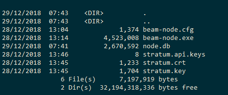

.. _user_mining_beam:

.. warning:: The following document is still under construction and is subject to changes

Mining Beam
===========

Alike most cryptocurrencies, Beam relies on miners to add transactions to the blockchain. While all nodes in the Beam network confirm the validity of transactions, Beam counts on miners to take on the massive heavy lifting to guard the network.

Beam is a Mimblewimble implementation. We use classic Proof-of-Work (PoW) consensus.

We welcome everyone to join our mining community to support the network and earn Beam coins.

Mining Algorithm
----------------

To secure the network, Beam uses the `Equihash <https://www.cryptolux.org/index.php/Equihash>`_ proof-of-work mining algorithm). Miners compete against each other using their computing power produce a new block on the chain. The first miner that gets to complete the precise computation for each block is granted with a network standard block reward and any fees for transactions added to that block.

At Mainnet launch, we will use the following Equihash parameters: n=150, k=5. In addition, we will introduce a small change to the datapath to further reduce the chance of zero-day ASICs.

.. note:: Testnet 3 is still using n=144, k=5

The minimal memory requirement for the GPU will be 4 GB. The most up-to-date list of supported GPUs will be available here.

Block Size and Time
-------------------

A Beam block will be generated approximately every minute and contain about 1000 transactions. Block size will be roughly 1MB.

Miner Rewards
-------------

During the first year of Beam existence, miner reward will be 80 coins per block. In years 2-5 the reward will be 40 coins per block. In year 6 the reward will be to 25 coins, and then halving will occur every 4 years until year 129. After year 133, Beam emission will stop.

Mining reward (coinbase UTXO) has 4 hours maturity, meaning that it will be available for spending 4 hours after it was mined.

Treasury
--------

In the first five years of existence, additional coins will be issued to Beam Treasury with each newly mined Beam block.

In the first year, the Treasury will receive additional 20 Beams per block, and in the years 2-5 the Treasury will receive 10 coins per block.

The Treasury will be used to repay Beam investors, Incentivize the Core Team and to support the Beam Foundation (largest single beneficiary of the Treasury).

The distribution of the Treasury Coins is performed on a quarterly basis in the following proportion:

* Investors: 40%
* Core Team: 40%
* Beam Foundation: 20% (Biggest single beneficiary)

ASIC Resistance
---------------

To ensure better decentralization, Beam plans to stay ASIC resistance in the first 12-18 months. To achieve this, we plan to perform one or two hard forks – first after approximately 6 months of existence and another one after approximately 12 months. Each hard fork will change the mining algorithm. The exact modifications will be revealed several weeks before the actual hard fork.

Mining Guide
-------------

The following section describes how to set up mining for Beam Network

Mining using Desktop Wallet
---------------------------

Our official Desktop Wallet supports both CPU and GPU mining.

.. attention:: Testnet 4 does not support built in GPU miner. It will be added back for Mainnet release

To mine Beam using the Wallet, go to the Settings screen, select “Run Local Node” and set the number of Mining Threads to a value that is greater than zero. Note: the more threads you dedicate to mining, the more strain on your CPU. If you have a supported GPU, turn the “Use GPU” switch to On. If you have a supported GPU, you can also choose “Use GPU” in the Wallet settings. Thread count is not relevant for GPU. Make sure your GPU has the latest drivers installed.

Please bear in mind that since GPUs are much more capable of parallel computations than CPUs, mining with GPUs is much more efficient.

If you want to setup a stand alone mining node and use either built in or external miner, follow sections below.

Mining using external miner
---------------------------

This is a step by step guide on how to setup mining using stand alone Beam Node with Stratum Server and a mining client.

1. Download CLI Wallet archive for your platform from `Beam Website <https://beam.mw/downloads>`_

2. Extract the CLI Wallet to any folder on your machine (we will call it Wallet Folder)

3. Open a Terminal window (on Mac / Linux) or Command Prompt (on Windows) and change directory to Walelt Folder

.. attention:: The following steps involve seed phrase and should be done in secure environment to avoid someone stealing your seed phrase

4. If you want to create a new wallet (with new seed phrase) run the following command:

::

	./beam-wallet init

If you have already created a wallet run the following command:

::

	./beam-wallet restore --seed_phrase=<semicolon separated list of 12 seed phrase words>;

.. attention:: Remember your wallet password, you will need it in step 11 to run Stratum server

5. Export miner key by running the following command

::

    ./beam-wallet export_miner_key --subkey=1

.. note:: If you want to run several different mining nodes with different keys you can run the command again with different subkeys.
	
	Example:
		For second node, run:
		./beam-wallet export_miner_key --subkey=2 

		For third node, run:
		./beam-wallet export_miner_key --subkey=3

		and so on

Save the exported mining key in some text file, you will need it later

6. Export owner key by running the following command:

::

    ./beam-wallet export_owner_key

Save the exported owner key in some text file, you will need it later

7. Download Beam Node archive for your platform from `Beam Website <https://beam.mw/downloads>`_

8. Extract Beam Node to any folder on your machine (from now on we will call it Node Folder)

9. Create certificate and API key for Stratum server

.. note:: If you are only testing you can download the sample certificate and key files from here:

	:download:`Certificate File<stratum/stratum.crt>`

	:download:`Certificate Secret Key File<stratum/stratum.key>`

	:download:`API Keys file <stratum/stratum.api.keys>`

	API Keys file currently contains one key: aaaa1234. You will need to provide it later in the ``--key=aaaa1234`` parameter for miner client.

	You should copy these files to the Beam Node folder (same folder as beam-node binary)

	You can now jump to step 10

.. attention:: For production setup please read the following section carefully

Beam node implements Stratum protocol for connecting external miner clients. Clients open a TCP connection to the node though which they receive jobs to mine blocks using Equihash mining protocol.

Stratum server connections are protected using Transport Layer Security (TLS) protocol and require TLS certificates in order to work properly. You can either buy the certificates or create self signed certificates on your local machine. Instructions on how to do this are outside the scope of this guide. You should receive two files: one for certificate and one with the certificate secret key. For testing purposes you can always use sample files provided in the note above.
	
In addition you should create a file 'stratum.api.keys' which will contain one or more lines. Each line represents one *API key* - random strings of 8 characters or more. You should generate these keys yourself and put each one in new line. These keys are then used by the miner client via --key flag.

As a result you will have three files:

+-------------------------+----------------------------------------------------------------------------------+
| stratum.crt             | TLS certificate                                                                  |
+-------------------------+----------------------------------------------------------------------------------+
| stratum.key             | Private key for TLS certificate                                                  |
+-------------------------+----------------------------------------------------------------------------------+
| stratum.api.keys        | Text file with list of allowed API keys                                          |
|                         |                                                                                  |
|                         | Each key should have 8 symbols or more. example: abcd1234                        |
+-------------------------+----------------------------------------------------------------------------------+

All three files should be copied into the same folder. The path to this folder will be provided via --stratum_secrets_folder parameter. By default the path points to the same folder as the node binary.

At this point Node Folder should look something like this:

10. Open a Terminal window (on Mac / Linux) or Command Prompt (on Windows) and change directory to Node Folder

11. Run Beam Node with stratum server using the following command:

::

	./beam-node 
		--port=10001 
		--peer=3.0.115.1:8100 
		--stratum_port=10002
		--stratum_secrets_path=. 
		--key_mine=<mining key you got in step 5 > 
		--key_owner=<owner key you got in step 6> 
		--pass=<your wallet password (not seed phrase) >

.. note:: Parameters in the example above are good for testing. You can always change them if necessary. You can also change the beam-node.cfg file and set all these parameters there instead of the command line.

The following table describes all parameters in more details

+-------------------------+----------------------------------------------------------------------------------------------------------+
|**Parameter**            | **Description & Example**                                                                                |
+-------------------------+----------------------------------------------------------------------------------------------------------+
| port                    | Port to start the server on                                                                              |
|                         |                                                                                                          |
|                         | .. code-block:: bash                                                                                     |
|                         |                                                                                                          |
|                         |    port=10000                                                                                            |
+-------------------------+----------------------------------------------------------------------------------------------------------+
| stratum_port            | Port the stratum server is listening for incoming connections                                            |
|                         |                                                                                                          |
|                         | .. code-block:: bash                                                                                     |
|                         |                                                                                                          |
|                         |    --stratum_port=10002                                                                                  |
+-------------------------+----------------------------------------------------------------------------------------------------------+
| peer                    | Comma separated list of peer ip:port (must have at least one peer)                                       |
|                         |                                                                                                          |
|                         | Peer should be a machine on the network you want to connect to (for example Testnet 4)                   |
|                         |                                                                                                          |
|                         | List of peers is published on the downloads page at https://beam.mw/downloads                            |
|                         |                                                                                                          |
|                         | .. code-block:: bash                                                                                     |
|                         |                                                                                                          |
|                         |    --peer=3.1.46.96:8100                                                                                 |
+-------------------------+----------------------------------------------------------------------------------------------------------+
| stratum_secrets_path    | Path to a folder which holds TLS Certificate and API keys files described above.                         |
|                         |                                                                                                          |
|                         | .. code-block:: bash                                                                                     |
|                         |                                                                                                          |
|                         |    --stratum_secrets_path=.                                                                              |
+-------------------------+----------------------------------------------------------------------------------------------------------+
| key_mine                | Miner key, exported by CLI wallet (see :ref: `Creating CLI wallet for mining rewards`)                   |
|                         |                                                                                                          |
|                         | .. code-block:: bash                                                                                     |
|                         |                                                                                                          |
|                         |    --key_mine=c3C9TVdEgza7w8p9na/B9rNeC8FvQAbJSPBfLZpW0sw                                                |
+-------------------------+----------------------------------------------------------------------------------------------------------+
| key_owner               | Owner key, exported by CLI wallet                                                                        |
|                         |                                                                                                          |
|                         | .. code-block:: bash                                                                                     |
|                         |                                                                                                          |
|                         |    --key_owner=mW9ItV9dUsSY9hN/dH19GEbzIUHQPw6VgDaCPYZiAsNL1LU                                           |
+-------------------------+----------------------------------------------------------------------------------------------------------+
| pass                    | Wallet password.                                                                                         |
|                         |                                                                                                          |
|                         | .. code-block:: bash                                                                                     |
|                         |                                                                                                          |
|                         |    --pass=1234                                                                                           |
+-------------------------+----------------------------------------------------------------------------------------------------------+

12. Downloads miner client archive for your GPU and platform from `Beam Website <https://beam.mw/downloads>`_

Beam provides two mining clients for Equihash 150,5 with data path change: one for OpenCL and one for CUDA

.. attention:: Only OpenCL mining client is currently available in Testnet 4

.. note:: Mining clients are only supported on Linux and Windows platforms

13. Extract miner client to a folder on your mining machine (from now on we wil call it Miner Folder)

14. Open a Terminal window (on Mac / Linux) or Command Prompt (on Windows) and change directory to Miner Folder

15. Run the following command (example on Windows):

::

	 beamMiner.exe --server 127.0.0.1:10002 --key aaaa1234

If your node runs on different machine than the miner, change IP address above to the IP of the node machine

If you have set a different API key than 'aaa1234' from the example set your key in the --key parameter.

Detailed explanation about mining client parameters is provided in the table below:

+-------------------------+----------------------------------------------------------------------------------------------------------+
|**Parameter**            | **Description & Example**                                                                                |
+-------------------------+----------------------------------------------------------------------------------------------------------+
| server                  | IP and port of the Stratum server to connect to                                                          |
|                         |                                                                                                          |
|                         | .. code-block:: bash                                                                                     |
|                         |                                                                                                          |
|                         |    --server 127.0.0.1:10001                                                                              |
+-------------------------+----------------------------------------------------------------------------------------------------------+
| key                     | API key you have set in your Stratum server (In stratum.api.keys file)                                   |
|                         |                                                                                                          |
|                         |                                                                                                          |
|                         | .. code-block:: bash                                                                                     |
|                         |                                                                                                          |
|                         |    --key abcd1234                                                                                        |
+-------------------------+----------------------------------------------------------------------------------------------------------+
| devices                 | Only specify this flag to use specific GPU                                                               |
|                         |                                                                                                          |
|                         | By default, miner will use all available GPUs                                                            |
|                         |                                                                                                          |
|                         | .. code-block:: bash                                                                                     |
|                         |                                                                                                          |
|                         |    --devices 0                                                                                           |
+-------------------------+----------------------------------------------------------------------------------------------------------+

Your mining should start now.

To see your mining rewards use one of two options below:

1. Run Beam Desktop Wallet with the same seed phrase using built in node.

2. Run either CLI or Desktop wallet and connect it to *Your* node which was started with your owner key parameter (via --key_owner flag). It could be the same node as the miner, or another node - as long as it has your owner key

.. warning:: You will NOT be able to see your mining rewards if you connect to a node which does not know your owner key.

GPU Support
-----------

Here are some performance stats reported by our community

OpenCL Miner

+--------------------+-----------------+----------------------------------------------------------------+
| **GPU**            | **Supported**   | **Reported Sol/s rate**                                        |
+--------------------+-----------------+----------------------------------------------------------------+
| AMD RX560          |   Yes           | ~4                                                             |
+--------------------+-----------------+----------------------------------------------------------------+
| AMD RX570          |   Yes           | ~7-8                                                           |
+--------------------+-----------------+----------------------------------------------------------------+
| AMD RX580          |   Yes           | ~8-9                                                           |
+--------------------+-----------------+----------------------------------------------------------------+
| AMD Rx Vega 56     |   Yes           | ~13                                                            |
+--------------------+-----------------+----------------------------------------------------------------+
| nVidia GTX 1066    |   Yes           | ~5.25                                                          |
+--------------------+-----------------+----------------------------------------------------------------+
| nVidia GTX 1050Ti  |   Yes           | ~2.2-4.8                                                       |
+--------------------+-----------------+----------------------------------------------------------------+
| nVidia GTX 1060 6Gb|   Yes           | ~5                                                             |
+--------------------+-----------------+----------------------------------------------------------------+
| nVidia GTX 1070    |   Yes           | ~7                                                             |
+--------------------+-----------------+----------------------------------------------------------------+
| nVidia GTX 1080    |   Yes           | ~8-9                                                           |
+--------------------+-----------------+----------------------------------------------------------------+
| nVidia GTX 1080Ti  |   Yes           | ~10-11                                                         |
+--------------------+-----------------+----------------------------------------------------------------+
| nVidia GTX 2080    |   Yes           | ~10-11                                                         |
+--------------------+-----------------+----------------------------------------------------------------+

CUDA Miner

.. note:: CUDA Mining client is still in development. 