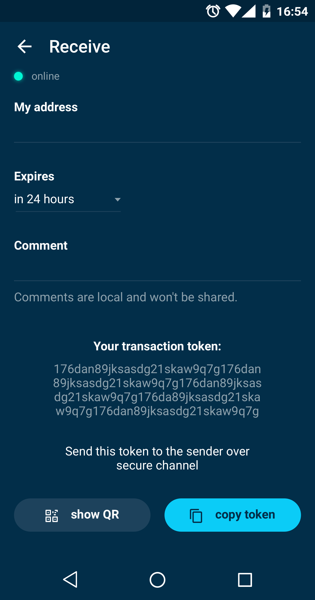
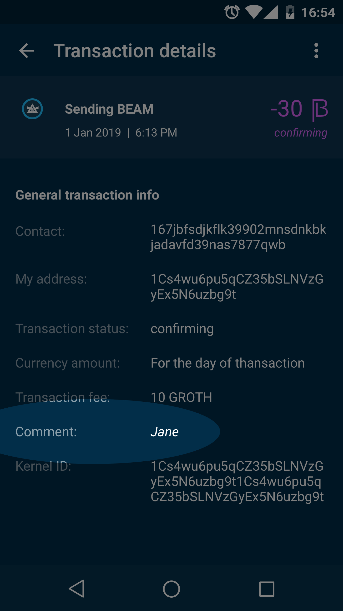
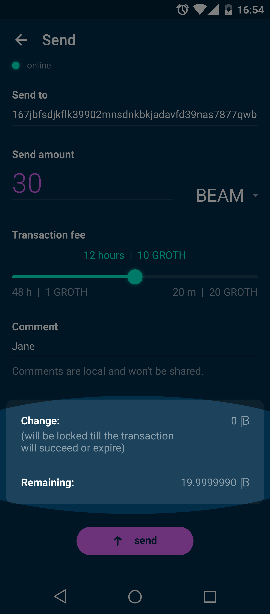
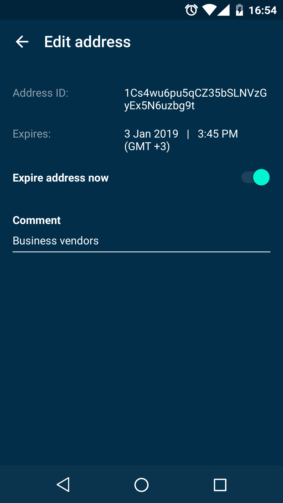
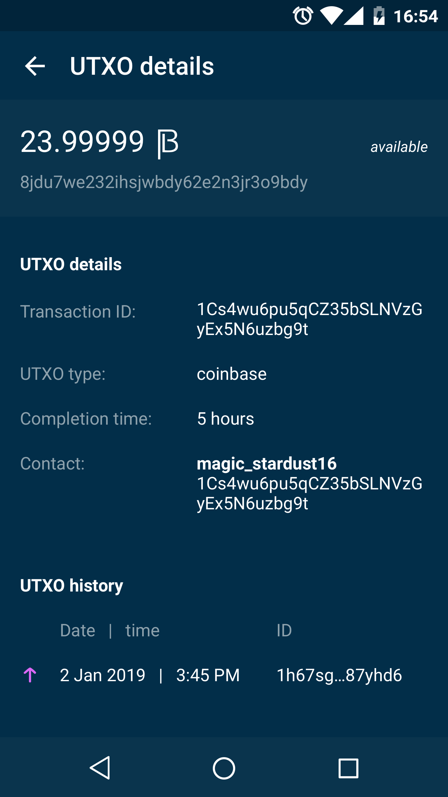
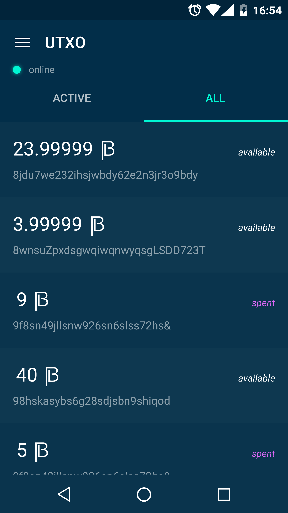

.. _user_mobile_wallet_guide:

.. warning:: The following document is still under construction and is subject to changes.

.. _mobile_wallet_guide:

Mobile Wallet User Guide
=========================

Beam Mobile Wallet is the simplest way to start using Beam. It is currently available for Android, the iOS app is planned to be developed later on.

.. attention::

   Beam blockchain does not store transaction history and SBBS addresses. These are only stored in local database inside the wallet data folder.

   Please follow the guidelines below to avoid problems with sending are receiving Beam transactions.

   1. Do not run two different wallets with the same seed at the same time

   2. SBBS messages sent between wallets expire after 12 hours. You have to connect within 12 hours of the transaction initiation to receive or send the funds.

   3. SBBS Addresses by default expire after 24 hours. Always use 'never' expiring addresses with pools and exchanges to make sure you receive payments.

Downloading and Installing
--------------------------

Proceed to install Beam Wallet Mobile App by going to the `Google Play store <https://play.google.com/store/apps/details?id=com.mw.beam.beamwallet>`_.

Download the mobile wallet. Once it's done installing, open the app and agree to the Terms of use.

Creating new wallet
-------------------

Once you launch the wallet for the first time you will be suggested to create a new wallet.

Generating seed phrase
----------------------

As a part of creating a new wallet, a new seed phrase will be generated for you.

.. attention:: Seed phrase is the **most important secret you have to keep**. Knowing the seed phrase enables you (or anyone else) to access all your funds.

.. attention:: Seed phrase in the Beam wallet is *not* linked to email, phone number or any other identifier. You will need this phrase to restore your wallet when you lose or reformat your device, or want to access your funds from another device (your mobile phone or another desktop / laptop).

.. attention:: The seed phrase is **for your eyes only**! Make sure no one is looking over your shoulder. For the best security always generate it on a clean air-gapped machine.

Did you wrote down your seed phrase correctly? Triple-check your handwriting again. The difference between *_F_unnel* and *_T_unnel* can be crucial when trying to restore a wallet with valuable funds in the far or near future.

Did you verified your handwriting? Now go find a safe space for the paper!

.. important:: Storing the seed phrase on your computer makes your funds prone to cyber attacks (read: much *less* secure). 'Creative' approaches like saving a screenshot of the wallet or your handwriting on your computer or in the cloud *may* sound like a good idea, but it is absolutely **not recommended**. If hackers get the access to your computer, network drive etc., they can can potentially steal your seed phrase by using OCR programs (which can scan pictures and transform them into plain text) and, therefore, get access to your funds.

.. attention:: Always store your seed phrase in a safe and secure location (and better more than one in different geo locations). Write it on a piece of paper. Do not store electronically neither as plain text nor in any other form!

In order to ensure that you have really written down your seed phrase, you will be asked to fill in the specific words from your seed phrase in random order.

Only when you typed all the selected words correctly, you will be allowed to proceed to the next step.

Setting wallet password
-----------------------

To access your Beam Wallet, you will need to create a password. This password is not the same as the seed phrase. Seed phrase identifies a wallet and enables access to all the funds stored in it from any device. Your wallet password provides with a second security layer in case someone gains access to your computer or has stolen your wallet database file. It is important to choose a strong password.

The wallet will provide some indication of password strength for your convenience. Do not count on it, however. Choose a password that is at least 8 characters long with a combination of letters, numbers, and symbols.

Choosing the node connectivity mode
-----------------------------------

Beam Mobile Wallet can connect to the network through:

* Random remote node
* Specific remote node

.. note:: When running behind a firewall you can change the default port the node will be listening on, and in case of CPU mining, set the amount of mining threads. You will be probably provided at least one default peer to connect to but you can always add more peers on the Settings screen. The recommended peers are published in the list of bootstrap nodes in the `downloads page <https://www.beam.mw/downloads/mainnet>`_ on `Beam official website <https://beam.mw>`_.

Random mode allows you to automatically connect to random bootstrap node. The wallet wil have to trust the remote node for blockchain verification.

Specific remote node will automatically verify the blockchain for your wallet. If you are running your own node somewhere (or maybe even more than one) and want to connect specifically to it, use the option by providing the IP and port the node is listening on.

Synchronizing the wallet
------------------------

Once the wallet is connected, it synchronizes with the current blockchain state from the network. Be patient when running with the integrated node: the data downloading process might take some time. The wallet will first download and validate the latest :ref:`macroblock` and then all the rest of the blockchain.

Main screen
-----------

Once your wallet is created, the main screen will show up.

On the top left, the hamburger button (the three lines) provides navigation between different wallet screens, currently: Wallet (or Main Screen), Address book, UTXO, Dashboard, Notification, Help and Settings.

Wallet status indicator
-----------------------

The main screen of the wallet shows the current balance as well as the transaction history and statuses. On the left, under the Beam logo, there is a toolbar that provides navigation between different wallet screens such as `Main Screen`, `Addresses Screen`, `UTXO Screen` and `Settings Screen`.

In the top left corner of the Main Screen, under 'Wallet', you see connection status indicator.

Green indicator means that the node is up and running connected to peers.

Red means it is either unable to connect to the node or the node has a problem you can help to solve.

In brackets, the indicator also specifies the network to which the wallet is connected:

* **Mainnet:** the network with real money and actual transactions.
* **Testnet<number>** (such as Testnet3, Testnet4 etc) **:** staging environments for trying new features in our wallet, node and miner software. For advanced users only.
* **Masternet:** new features under development, if you see this name in your wallet it means that you are very early adopter or Beam code contributor otherwise you’ve probably arrived to the wrong place.

.. attention:: Since Mainnet is the default network for the vast majority of Beam users, nothing is written by the online status.

Finally, node connectivity node is displayed (ie. random remote node or specific node).

Financial transactions
----------------------

‘Send’ and ‘Receive’ buttons at the top right corner help us with `Sending BEAM`_ and `Receiving BEAM`_.

Main screen password
--------------------

In the future, the screen will pop-up automatically after you open the application and type in your password.

Receiving BEAM
--------------

Before starting to receive BEAM for the first time, please read first about what :ref:`address` is.

Here is how the process of receiving BEAM looks like from a Receiver’s perspective:

* Generate an address
* Send your address to the Sender person **over a secure communication channel**
* Both Sender and Receiver’s Wallet must be online at the same time to complete a transaction.

It's possible to reuse an address that already exists, more on that later.

Generate an address
-------------------

Proceed to the main screen and click the blue ‘Receive’ button at the top right corner.

This will open the receive screen.

Copy and paste the newly generated Beam address to send to Sender over a **secure communication channel**.

A new Beam address is generated every time the 'Receive' screen is opened. By default, the address is valid for 24 hours. It is best to give the Sender your address closest to the time they will be sending BEAM so the address does not expire.

You can explicitly set the expiration time to ‘Never’ for this address only by selecting the value in the ‘Expires’ drop down.

.. warning:: The permanent addresses that never expire are only useful in limited special cases, like working with mining pools or exchanges. For ultimate privacy, do not use this option for regular transactions, rather always create a new address for each transaction.

.. attention:: You have to click ‘Copy address button in the screen for the address to become active.

QR code
-------

If the Sender uses a mobile app, he can quickly scan the QR code from your mobile instead of receiving, copying and pasting the alphanumeric address.

Comment
-------

You can add a comment when creating the receiving address. The comment is never sent to the network, it is only visible inside your wallet and is used for internal bookkeeping only.

The comment can be seen on the `Address screen`_ and in the extended transaction view.

Sending the address
-------------------

.. attention:: When sending the address make sure you use a secure communication channel.

.. attention:: Make sure the entire address is sent to the Sender as it’s longer than it appears on the screen. *Don’t forget* to double check the value in whichever messenger app of your choice because viruses and malware on your computer may change your address while it’s in the clipboard.

Completing the transaction
--------------------------

Once Sender initiates the transaction, you will see on the new transaction appear in the transaction list on the main screen. The amount sent will also appear on the ‘In progress’ box.

Normally, a transaction will pass through the following stages:

* **In Progress** - the phase when the transaction is being created by the Sending and Receiving wallets.
* **Confirming** - the phase after the transaction was sent to the nodes, but before it is mined.
* **Completed** - the phase after the transaction is fully mined and confirmed.

Once transaction is complete, the available balance will be updated and the ‘In Progress’ box will disappear.

Sending BEAM
------------

Before starting to send BEAM, please read first about what :ref:'Address' is.

Here is how the process of sending BEAM looks like from a Sender’s perspective:

* Receive the address the funds should be sent to
* Send BEAM to Receiver
* Stay online until Receiver confirms the transaction

Receiving the address
---------------------

.. attention:: Make sure that the address is received untampered by using a **secure communication channel**.

.. attention:: When copying the address to the Beam Wallet app please verify visually that the address in the wallet looks exactly like the address in the secure messaging app, because viruses and malware on your computer may change your address while it’s in the clipboard.

Sending funds
-------------

In order to send BEAM, you will need to click the magenta ‘Send’ button at the top right corner. This will open the Send screen.

Make sure you have the correct address and paste the Receiver’s Beam address in the 'Send To' field.

To help to identify the transaction, you may also choose to fill in the optional Comment field. The comment will remind you what or who the transaction is for. The comment is stored locally, thus it will only be visible in your wallet for bookkeeping purposes.

The comment can be seen on the `Address screen`_:

The comment is also displayed in the extended transaction view on Main Screen:

Select the transaction amount in BEAM you want to send. Transaction amount is in BEAM and may contain fractional values such as 1.25 BEAM or 11.3 BEAM and the like. Keep in mind you also have to pay a transaction fee, hence the amount to send plus the fee must be equal to or less than the available balance.

Transaction fees are specified in GROTH (100 millionths of BEAM). Amount of fees you need to pay depends on the current status of the network and average fee sizes. Simply said, the higher transaction fee will help miners to prioritize your transaction. To determine the current average fee size use `Beam Blockchain Explorer <https://explorer.beam.mw>`_.

You can see the remaining amount of BEAM in your wallet and the change that will be received after the transaction.

After you click ‘Send’ you will see a confirmation with the most important transaction details:

Completing the transaction
--------------------------

Once you confirm, the transaction is sent to the Receiver's wallet. If Receiver's wallet is currently offline or if the network is loaded, you might see the transaction appear ‘In Progress’ on your transaction list. Once the transaction is complete, it will be sent to the nodes and shown as 'Confirming'.

.. note:: While a transaction is in ‘In Progress’ you can cancel it by clicking on the dropdown to the right of the transaction row and then select ‘Cancel’. The other party will receive notification that the transaction was either ‘Canceled’ or ‘Failed,’ and funds plus fee that were allocated for this transaction will become available again. It is not possible to cancel a transaction in ‘Confirming’ or ‘Completed’ states.

.. warning:: If your transaction appears as 'In Progress' for a long time, it means the Receiver is not online.

.. attention:: If the transaction was not sent to the nodes, for any reason, it will expire after 1440 blocks, or roughly 24 hours. This is done to avoid a situation in which UTXO is locked forever.

Restoring funds
---------------

This process allows you to restore your funds directly from the blockchain. It is useful in the scenarios such as:

* You’ve got a new device and would like to use your wallet on it
* You forgot your local password and can’t access your funds

.. attention:: With Beam, only funds are stored on the blockchain. Everything else, such as your active addresses, contacts or transaction history can’t be restored.

.. attention:: In the current mobile wallet implementation restoring funds is only implemented in the Beam Desktop Wallet App. Here is what you need to do:

   * Proceed to your desktop wallet app
   * Restore your funds on desktop usingt the mobile wallet seed phrase
   * Create the new wallet on mobile
   * Transfer the restored funds to you newly created mobile wallet

Address
-------

Let’s define the meaning of address in the BEAM ecosystem: BEAM is always sent from one address to another. Both sending and receiving addresses are alphanumeric tokens that uniquely define the transaction endpoints.

A person can create as many addresses as required. The address creation process is explained in `Receiving BEAM`.

*Example:* There are two wallets: one belongs to you and the other belongs to Alice. You have created one address to receive money from Alice and another address to send money to Alice. Since you can generate multiple addresses, Alice will never know that she’s receiving money from the same person that she is sending the money to (unless you want her to know).

*Example:* There are three wallets: one belongs to you, one belongs to Alice and another belongs to Bob. You have created one address to receive money from Alice and another address to receive money from Bob. Alice and Bob will never know that they are sending money to the same person.

Same address can be used for sending and receiving money.

*Example:* you have created an address to send money to Alice. Alice can see the address the money came from and can send money to the address back to you.

.. attention:: For ultimate privacy, it is advised to have a **dedicated address for every transaction** (ie. for both Sending or Receiving).

.. attention:: Although not recommended, an address can be reused until it had reached its expiration (24 hours since when it was generated).

*Example:* Imagine you’ve created the address with expiration interval of 24 hours and immediately sent it to Alice. In the next 24 hours, Alice will be able to send BEAM to you as many times as she likes, reusing the same address of yours.

.. warning:: Reusing same addresses, created with longer expiration interval, can be convenient yet the tradeoff of decreased privacy should be kept in mind.

Address screen
--------------

The screen lists all the addresses that were used in all incoming and outgoing transactions. All the data in this screen is only stored locally in your wallet and is not related to the blockchain in any way.

.. note:: For your own privacy, a new address is generated for each outgoing transaction. Yes, you heard that right! That address can be seen in your active or expired addresses list.

Upon Beam Wallet mobile app installation, a single address is created by default. The address has a default expiration time of 24 hours.

.. figure:: images/mobile/06_address_screen/01.jpg
   :scale: 30
   :alt: Default address

You can always create a new one by using Receive Screen. You can see all your active addresses in the 'My Active Addresses' tab.

Once an expired address becomes inactive, it cannot be used in any incoming or outgoing transaction. Each address has a default expiration time of 24 hours, including the default address. An expired address becomes inactive and you won’t be able to be use it again. You can see the expired addresses listed under 'My Expired Addresses.'

.. figure:: images/mobile/06_address_screen/03.jpg
   :scale: 30
   :alt: Expired address

When you'll click the three dots located to the right of any address, the menu with additional address actions will open. You can manually edit or delete any address choosing 'Edit' or 'Delete' from the menu.

You can manually expire any active address by choosing ‘Expire address’ from the drop down menu.

For privacy concerns, you can manually delete any address by clicking the three dots located to the right of the address and choosing ‘Delete address’ from the drop down menu.

In the ‘Contacts’ tab, you can see every address that sent you BEAM or to which you’ve sent BEAM to.

UTXO
----

UTXO (Unspent Transaction (TX) Output) is like a banknote of a specific amount. Simply said, if BEAM is the currency, any UTXO can be considered a ‘bill’. You can have multiple ‘bills’ in your wallet at the same time.

UTXO screen
-----------

On the technical level, in Beam, like in most other cryptocurrencies, your balance emerges as a result of multiple incoming and outgoing transactions. Each transaction uses some existing inputs and creates new outputs. All the outputs controlled by the wallet are shown in the UTXO screen.

The type of UTXO can be:

* **Regular** - UTXO received as a result of a transaction. It is immediately available for spending
* **Change** - UTXO received as a result of change from a transaction. It is immediately available for spending
* **Transaction fee** - Fees received as a result of mining a block which contain transactions
* **Coinbase** - UTXO you have mined. It has maturity of 3 hours (240 blocks) and will not be immediately seen in Available tab

UTXO details
------------

Click on the specific UTXO you want to see more details of.

UTXO in sending BEAM screen (explained by example)
--------------------------------------------------

Assume that you have 100 BEAM in a single 'bill'. So, if you want to send to Alice 10 BEAM, your single 'bill' will be split into one 'bill' of 10 BEAM to send and another 'bill' of 90 BEAM to remain in your wallet, right? Well, almost: we also have to consider the transaction fee. Let’s say the transaction fee is 10M GROTH (0.1 BEAM), so in this case the ‘bill’ will be split into 3 'bills' (10 BEAM to send, 89.9 BEAM to remain in your wallet and 0.1 BEAM to pay fee).

Why UTXO can be locked
----------------------

.. important:: Beam Wallet app automatically selects which UTXO will be used for the transaction by trying to minimize the change you should receive as a result. This is important to understand since until the transaction is complete, the UTXOs used in the transaction cannot be used for any other transaction and do not appear in the list of ‘Available’ funds.

Example: you have 100 BEAM in two 'bills' (UTXO): 90 BEAM and 10 BEAM. You want to send Alice 9 BEAM. The wallet will automatically select the 10 Beam UTXO and create a transaction with 9 BEAM sent, 0.9 BEAM to remain in your wallet and 0.1 BEAM to pay fee.

This 10 BEAM UTXO will be locked until the 9 BEAM transaction completes. If Alice is currently offline, it might take a time during which you will not be able to send BEAM to anyone else. You can, of course, cancel the transaction and resend when Alice comes online.

You can split UTXO by yourself
-------------------------------

One thing you can do is to split UTXO by sending a transaction to yourself (using you own active address). You may want to do this in the case your UTXO is too large, and you don't want it all locked during a transaction.

.. attention:: You will pay a fee for this transaction.
