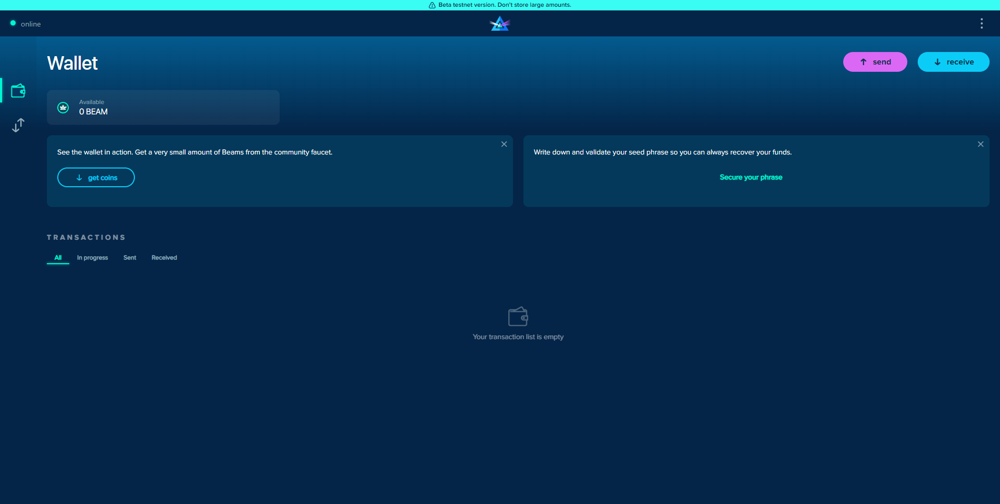

.. _web_wallet:

.. _web wallet:

Web Wallet (Testnet) User Guide
===============================

.. note::

  Known limitations:

  * Web Wallet is used only for Testnet.
  * Web Wallet doesn’t support old SBBS addresses for transactions, only new type of  addresses.
  * The restore from seed phrase is yet to be implemented
  * Only single-use addresses are supported: once issued, the address will remain active for 12 hours.

How to install Beam Web Wallet
------------------------------

User can download Web wallet from [Chrome Webstore] (https://chrome.google.com/webstore/detail/beam-web-wallet-testnet/ilhaljfiglknggcoegeknjghdgampffk?utm_source=chrome-ntp-icon) 

or load unpacked extension here chrome://extensions/ (to download packed extension, please, check our [Github] (https://github.com/BeamMW/web-wallet/releases) ) 

      

Creating new wallet
-------------------

There are two ways of how user can create new wallet: ::ref:`Easy onboarding` and ::ref:`Create a new wallet with seed phrase`

.. _easy_onboarding: 

Easy onboarding
---------------

The easiest way. After installation and clicking on the button “Create new wallet”, a user can skip the step about verifying seed by clicking on “I will do it later”. Take a look at the following screenshots. 

For the extension view:

   

For the extension view:

   

.. attention:: Seed phrase in the Beam wallet is *not* linked to email, phone number or any other identifier. You will need this phrase to restore your wallet when you lose or reformat your device, or want to access your funds from another device.

.. figure:: images/web_wallet/easy_onboarding/03.png
   :alt:  Generating seed phrase

For the extension view:

   
On the next step user needs to enter a password for his wallet and confirm it. This password is not the same as the seed phrase. Seed phrase identifies a wallet and enables access to all the funds stored in Beam blockchain from any device. Your wallet password provides with a second security layer in case someone gains access to your computer or has stolen your wallet database file. 

For the extension view:

   

It is important to choose a strong password. The wallet will provide some indication of password strength for your convenience. Do not count on it, however. Choose a password that is at least 8 characters long with a combination of letters, numbers, and symbols.

.. figure:: images/web_wallet/easy_onboarding/05.png
   :alt:  Creating with a strong password
   

It takes several seconds to create a new wallet.

.. figure:: images/web_wallet/easy_onboarding/06.png
   :alt:  Creating screen with loading bar

For the extension view:

.. figure:: images/web_wallet/easy_onboarding/extension_view/05.png
   :alt: Creating screen with loading bar
   

Once your wallet is created, the main screen will show up.

For the extension view:

   

